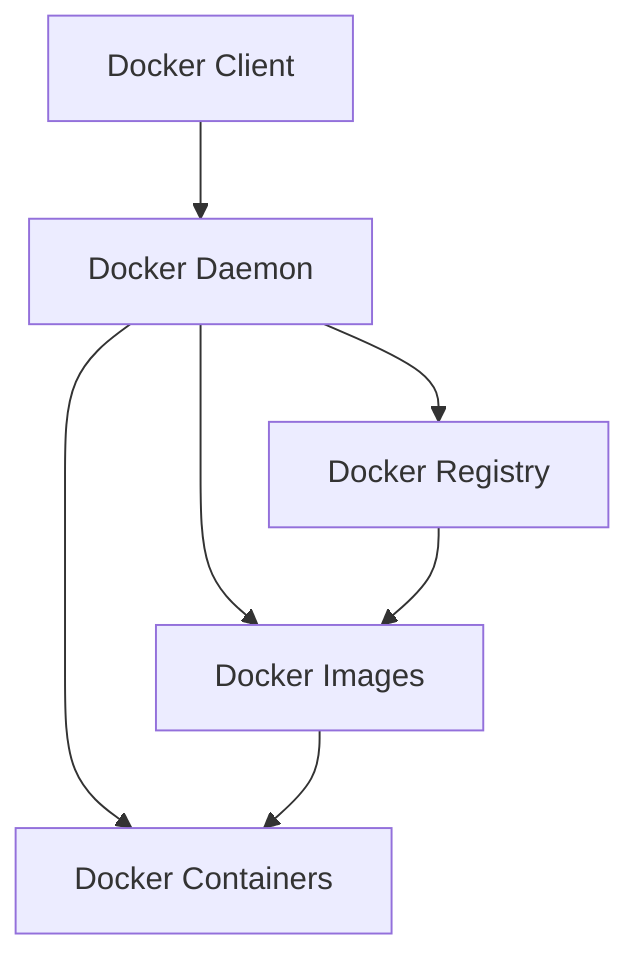

# Day 78: Docker Fundamentals - Containerization Basics

## Learning Objectives
- Understand containerization concepts and Docker architecture
- Learn Docker image creation and management
- Master Docker commands and best practices
- Containerize Java applications effectively
- Implement multi-stage builds and optimization techniques

## What is Docker?

### Containerization Overview
Docker is a platform that uses OS-level virtualization to deliver software in packages called containers. Containers are isolated from one another and bundle their own software, libraries, and configuration files.

```bash
# Key Docker concepts
# Image: Read-only template used to create containers
# Container: Running instance of an image
# Dockerfile: Text file with instructions to build an image
# Registry: Storage and distribution system for Docker images
```

### Docker vs Virtual Machines

```yaml
# Virtual Machines
Host OS -> Hypervisor -> Guest OS -> App
- Heavy resource usage
- Slower startup
- Full OS isolation

# Docker Containers  
Host OS -> Docker Engine -> Container -> App
- Lightweight
- Fast startup
- Process-level isolation
```

## Docker Architecture

### Core Components



### Docker Engine Components

```java
// Conceptual representation of Docker components
public class DockerArchitecture {
    
    // Docker Daemon (dockerd)
    public class DockerDaemon {
        private ImageManager imageManager;
        private ContainerManager containerManager;
        private NetworkManager networkManager;
        private VolumeManager volumeManager;
        
        public void handleApiRequest(DockerApiRequest request) {
            switch (request.getType()) {
                case BUILD_IMAGE:
                    imageManager.buildImage(request.getDockerfile());
                    break;
                case RUN_CONTAINER:
                    containerManager.runContainer(request.getImageName());
                    break;
                case CREATE_NETWORK:
                    networkManager.createNetwork(request.getNetworkConfig());
                    break;
            }
        }
    }
    
    // Docker Client
    public class DockerClient {
        private RestTemplate restTemplate;
        
        public void executeCommand(String command) {
            DockerApiRequest request = parseCommand(command);
            restTemplate.postForObject("/api/v1/docker", request, String.class);
        }
    }
    
    // Container Runtime
    public class ContainerRuntime {
        public Container createContainer(Image image, ContainerConfig config) {
            // Create isolated process namespace
            Namespace processNamespace = createProcessNamespace();
            
            // Create isolated network namespace
            Namespace networkNamespace = createNetworkNamespace();
            
            // Create isolated filesystem
            FileSystem containerFs = createLayeredFileSystem(image.getLayers());
            
            // Apply resource constraints
            CGroup cgroup = applyCGroupLimits(config.getResourceLimits());
            
            return new Container(processNamespace, networkNamespace, 
                               containerFs, cgroup);
        }
    }
}
```

## Docker Installation and Setup

### Installation Commands

```bash
# Ubuntu/Debian
curl -fsSL https://get.docker.com -o get-docker.sh
sudo sh get-docker.sh

# Add current user to docker group
sudo usermod -aG docker $USER
newgrp docker

# Verify installation
docker --version
docker run hello-world

# Check Docker system information
docker system info
docker system df  # Show disk usage
```

### Docker Desktop Configuration

```yaml
# ~/.docker/daemon.json
{
  "builder": {
    "gc": {
      "enabled": true,
      "defaultKeepStorage": "20GB"
    }
  },
  "experimental": true,
  "features": {
    "buildkit": true
  },
  "insecure-registries": ["localhost:5000"],
  "log-driver": "json-file",
  "log-opts": {
    "max-size": "10m",
    "max-file": "3"
  }
}
```

## Essential Docker Commands

### Image Management

```bash
# Search for images
docker search openjdk
docker search --filter stars=100 java

# Pull images
docker pull openjdk:17-jdk-slim
docker pull maven:3.8.6-openjdk-17

# List images
docker images
docker images --format "table {{.Repository}}\t{{.Tag}}\t{{.Size}}"

# Remove images
docker rmi image_name:tag
docker image prune  # Remove unused images
docker image prune -a  # Remove all unused images

# Image inspection
docker inspect openjdk:17-jdk-slim
docker history openjdk:17-jdk-slim  # Show image layers
```

### Container Lifecycle

```bash
# Run containers
docker run hello-world
docker run -it ubuntu:latest bash  # Interactive mode
docker run -d nginx:latest  # Detached mode
docker run --name my-container nginx:latest  # Named container

# Container with port mapping
docker run -d -p 8080:80 --name web-server nginx:latest

# Container with volume mounting
docker run -d -v /host/path:/container/path nginx:latest

# Container with environment variables
docker run -d -e ENV_VAR=value -e DB_HOST=localhost app:latest

# List containers
docker ps  # Running containers
docker ps -a  # All containers
docker ps --format "table {{.Names}}\t{{.Status}}\t{{.Ports}}"

# Container operations
docker start container_name
docker stop container_name
docker restart container_name
docker pause container_name
docker unpause container_name

# Execute commands in running container
docker exec -it container_name bash
docker exec container_name ls -la /app

# View container logs
docker logs container_name
docker logs -f container_name  # Follow logs
docker logs --tail 100 container_name  # Last 100 lines

# Remove containers
docker rm container_name
docker container prune  # Remove stopped containers
```

### System Management

```bash
# Docker system information
docker version
docker info
docker system df  # Disk usage
docker system events  # Real-time events

# Cleanup commands
docker system prune  # Remove unused data
docker system prune -a  # Remove all unused data
docker system prune --volumes  # Include volumes

# Resource monitoring
docker stats  # Live resource usage
docker stats container_name  # Specific container
```

## Dockerfile Fundamentals

### Basic Dockerfile Structure

```dockerfile
# day78-examples/basic-java-app/Dockerfile
FROM openjdk:17-jdk-slim

# Set metadata
LABEL maintainer="developer@example.com"
LABEL version="1.0"
LABEL description="Basic Java Application"

# Set working directory
WORKDIR /app

# Copy application files
COPY target/app.jar app.jar
COPY config/ config/

# Set environment variables
ENV JAVA_OPTS="-Xmx512m -Xms256m"
ENV PROFILE=production

# Expose port
EXPOSE 8080

# Create non-root user
RUN groupadd -r appuser && useradd -r -g appuser appuser
RUN chown -R appuser:appuser /app
USER appuser

# Health check
HEALTHCHECK --interval=30s --timeout=3s --start-period=5s --retries=3 \
  CMD curl -f http://localhost:8080/health || exit 1

# Default command
CMD ["java", "-jar", "app.jar"]
```

### Multi-stage Build Example

```dockerfile
# day78-examples/multi-stage-build/Dockerfile
# Build stage
FROM maven:3.8.6-openjdk-17 AS builder

WORKDIR /app

# Copy pom.xml first for dependency caching
COPY pom.xml .
RUN mvn dependency:resolve

# Copy source code and build
COPY src ./src
RUN mvn clean package -DskipTests

# Runtime stage
FROM openjdk:17-jdk-slim AS runtime

# Install required packages
RUN apt-get update && apt-get install -y \
    curl \
    && rm -rf /var/lib/apt/lists/*

WORKDIR /app

# Copy only the built JAR from builder stage
COPY --from=builder /app/target/*.jar app.jar

# Create non-root user
RUN groupadd -r appuser && useradd -r -g appuser appuser
RUN chown -R appuser:appuser /app
USER appuser

EXPOSE 8080

HEALTHCHECK --interval=30s --timeout=10s --start-period=30s --retries=3 \
  CMD curl -f http://localhost:8080/actuator/health || exit 1

ENTRYPOINT ["java", "-jar", "app.jar"]
```

### Dockerfile Best Practices

```dockerfile
# day78-examples/optimized-dockerfile/Dockerfile
FROM openjdk:17-jdk-slim

# Use specific versions and update packages
RUN apt-get update && apt-get install -y \
    curl=7.* \
    && apt-get clean \
    && rm -rf /var/lib/apt/lists/*

# Set working directory
WORKDIR /app

# Copy requirements first for better caching
COPY pom.xml .
COPY maven-wrapper.properties .
COPY .mvn .mvn

# Create application user early
RUN groupadd -r -g 1001 appuser && \
    useradd -r -u 1001 -g appuser appuser

# Set proper permissions
RUN mkdir -p /app/logs && \
    chown -R appuser:appuser /app

# Copy application files
COPY --chown=appuser:appuser target/app.jar app.jar
COPY --chown=appuser:appuser config/ config/

# Switch to non-root user
USER appuser

# Configure JVM for containers
ENV JAVA_OPTS="-XX:+UseContainerSupport \
               -XX:MaxRAMPercentage=75.0 \
               -XX:+UseG1GC \
               -XX:+UseStringDeduplication"

EXPOSE 8080

# Use exec form for better signal handling
ENTRYPOINT ["sh", "-c", "java $JAVA_OPTS -jar app.jar"]
```

## Containerizing Spring Boot Applications

### Simple Spring Boot Application

```java
// day78-examples/spring-boot-app/src/main/java/com/example/Application.java
package com.example;

import org.springframework.boot.SpringApplication;
import org.springframework.boot.autoconfigure.SpringBootApplication;
import org.springframework.web.bind.annotation.GetMapping;
import org.springframework.web.bind.annotation.RestController;

@SpringBootApplication
public class Application {
    public static void main(String[] args) {
        SpringApplication.run(Application.class, args);
    }
}

@RestController
class HealthController {
    
    @GetMapping("/health")
    public Map<String, String> health() {
        return Map.of(
            "status", "UP",
            "timestamp", Instant.now().toString()
        );
    }
    
    @GetMapping("/")
    public Map<String, String> home() {
        return Map.of(
            "message", "Hello from Docker!",
            "version", "1.0.0"
        );
    }
}
```

### Dockerfile for Spring Boot

```dockerfile
# day78-examples/spring-boot-app/Dockerfile
FROM openjdk:17-jdk-slim

# Add labels for better organization
LABEL org.opencontainers.image.title="Spring Boot Docker App"
LABEL org.opencontainers.image.description="Containerized Spring Boot application"
LABEL org.opencontainers.image.version="1.0.0"

# Install dependencies
RUN apt-get update && apt-get install -y \
    curl \
    && rm -rf /var/lib/apt/lists/*

# Create app directory
WORKDIR /app

# Create user for security
RUN groupadd -r spring && useradd -r -g spring spring

# Copy the built JAR file
COPY target/docker-demo-*.jar app.jar

# Change ownership
RUN chown spring:spring app.jar

# Switch to non-root user
USER spring

# JVM configuration for containers
ENV JAVA_OPTS="-XX:+UseContainerSupport \
               -XX:MaxRAMPercentage=75.0 \
               -XX:+UseG1GC \
               -Djava.security.egd=file:/dev/./urandom"

EXPOSE 8080

# Health check
HEALTHCHECK --interval=30s --timeout=10s --start-period=30s --retries=3 \
  CMD curl -f http://localhost:8080/health || exit 1

# Use shell form to allow variable expansion
ENTRYPOINT sh -c "java $JAVA_OPTS -jar app.jar"
```

### Build and Run Commands

```bash
# Build the Docker image
docker build -t spring-boot-app:1.0.0 .

# Tag for different environments
docker tag spring-boot-app:1.0.0 spring-boot-app:latest
docker tag spring-boot-app:1.0.0 spring-boot-app:dev

# Run the container
docker run -d \
  --name spring-app \
  -p 8080:8080 \
  -e SPRING_PROFILES_ACTIVE=production \
  -e JAVA_OPTS="-Xmx1g" \
  spring-boot-app:1.0.0

# Check application health
curl http://localhost:8080/health

# View application logs
docker logs -f spring-app

# Scale application (multiple instances)
docker run -d --name spring-app-1 -p 8081:8080 spring-boot-app:1.0.0
docker run -d --name spring-app-2 -p 8082:8080 spring-boot-app:1.0.0
docker run -d --name spring-app-3 -p 8083:8080 spring-boot-app:1.0.0
```

## Docker Volumes and Data Persistence

### Volume Types and Usage

```bash
# Named volumes
docker volume create app-data
docker volume ls
docker volume inspect app-data

# Run container with named volume
docker run -d \
  --name spring-app \
  -v app-data:/app/data \
  -p 8080:8080 \
  spring-boot-app:1.0.0

# Bind mounts (host directory)
docker run -d \
  --name spring-app \
  -v /host/path/config:/app/config:ro \
  -v /host/path/logs:/app/logs \
  -p 8080:8080 \
  spring-boot-app:1.0.0

# Temporary filesystem (tmpfs)
docker run -d \
  --name spring-app \
  --tmpfs /app/temp:rw,noexec,nosuid,size=100m \
  -p 8080:8080 \
  spring-boot-app:1.0.0
```

### Database Container with Persistence

```yaml
# day78-examples/docker-compose-volumes.yml
version: '3.8'

services:
  postgres:
    image: postgres:15
    environment:
      POSTGRES_DB: appdb
      POSTGRES_USER: appuser
      POSTGRES_PASSWORD: apppass
    volumes:
      - postgres_data:/var/lib/postgresql/data
      - ./init-scripts:/docker-entrypoint-initdb.d:ro
    ports:
      - "5432:5432"
    healthcheck:
      test: ["CMD-SHELL", "pg_isready -U appuser -d appdb"]
      interval: 30s
      timeout: 10s
      retries: 3

  app:
    build: .
    depends_on:
      postgres:
        condition: service_healthy
    environment:
      SPRING_DATASOURCE_URL: jdbc:postgresql://postgres:5432/appdb
      SPRING_DATASOURCE_USERNAME: appuser
      SPRING_DATASOURCE_PASSWORD: apppass
    volumes:
      - app_logs:/app/logs
      - ./config:/app/config:ro
    ports:
      - "8080:8080"

volumes:
  postgres_data:
    driver: local
  app_logs:
    driver: local
```

## Docker Networking

### Network Types and Configuration

```bash
# List networks
docker network ls

# Create custom networks
docker network create --driver bridge app-network
docker network create --driver bridge --subnet=172.20.0.0/16 custom-network

# Inspect network
docker network inspect bridge
docker network inspect app-network

# Run containers in custom network
docker run -d --name db --network app-network postgres:15
docker run -d --name app --network app-network -p 8080:8080 spring-boot-app:1.0.0

# Connect existing container to network
docker network connect app-network existing-container

# Test connectivity between containers
docker exec app ping db
docker exec app nslookup db
```

### Advanced Network Configuration

```java
// day78-examples/network-config/NetworkExample.java
@Component
public class NetworkConfigExample {
    
    @Value("${database.host:localhost}")
    private String databaseHost;
    
    @Value("${redis.host:localhost}")
    private String redisHost;
    
    @Bean
    public DataSource dataSource() {
        HikariConfig config = new HikariConfig();
        config.setJdbcUrl("jdbc:postgresql://" + databaseHost + ":5432/appdb");
        config.setUsername("appuser");
        config.setPassword("apppass");
        config.setMaximumPoolSize(20);
        return new HikariDataSource(config);
    }
    
    @Bean
    public RedisConnectionFactory redisConnectionFactory() {
        LettuceConnectionFactory factory = new LettuceConnectionFactory(
            new RedisStandaloneConfiguration(redisHost, 6379)
        );
        factory.setValidateConnection(true);
        return factory;
    }
}
```

```bash
# Create multi-container application with networking
docker network create app-tier

# Database container
docker run -d \
  --name postgres-db \
  --network app-tier \
  -e POSTGRES_DB=appdb \
  -e POSTGRES_USER=appuser \
  -e POSTGRES_PASSWORD=apppass \
  postgres:15

# Redis container
docker run -d \
  --name redis-cache \
  --network app-tier \
  redis:7-alpine

# Application container
docker run -d \
  --name spring-app \
  --network app-tier \
  -p 8080:8080 \
  -e DATABASE_HOST=postgres-db \
  -e REDIS_HOST=redis-cache \
  spring-boot-app:1.0.0
```

## Docker Image Optimization

### Layer Optimization Strategies

```dockerfile
# day78-examples/optimized-layers/Dockerfile
FROM openjdk:17-jdk-slim

# Group similar operations to reduce layers
RUN apt-get update && apt-get install -y \
    curl \
    wget \
    && apt-get clean \
    && rm -rf /var/lib/apt/lists/*

# Use .dockerignore to exclude unnecessary files
WORKDIR /app

# Copy dependencies first (changes less frequently)
COPY pom.xml ./
RUN mvn dependency:resolve

# Copy source code last (changes most frequently)
COPY src ./src
RUN mvn package -DskipTests

# Multi-stage build for smaller final image
FROM openjdk:17-jre-slim AS runtime
COPY --from=0 /app/target/*.jar app.jar

# Use specific user ID for security
USER 1001:1001

EXPOSE 8080
ENTRYPOINT ["java", "-jar", "app.jar"]
```

### .dockerignore File

```gitignore
# day78-examples/.dockerignore
# Build outputs
target/
build/
*.jar
*.war

# IDE files
.idea/
.vscode/
*.iml
*.iws

# Version control
.git/
.gitignore

# Documentation
README.md
docs/

# Test files
src/test/

# OS generated files
.DS_Store
Thumbs.db

# Logs
*.log
logs/

# Temporary files
tmp/
temp/
```

### Image Size Optimization

```dockerfile
# day78-examples/size-optimized/Dockerfile
# Use Alpine for smaller base image
FROM openjdk:17-jre-alpine

# Install only required packages
RUN apk add --no-cache curl

# Use multi-stage build
FROM maven:3.8.6-openjdk-17-slim AS builder
WORKDIR /app
COPY pom.xml .
RUN mvn dependency:go-offline
COPY src ./src
RUN mvn package -DskipTests

# Final stage with minimal image
FROM openjdk:17-jre-alpine
RUN apk add --no-cache curl
WORKDIR /app
COPY --from=builder /app/target/*.jar app.jar

# Use exec form and specific user
USER 1001
EXPOSE 8080
ENTRYPOINT ["java", "-jar", "app.jar"]
```

## Docker Security Best Practices

### Security-focused Dockerfile

```dockerfile
# day78-examples/security-focused/Dockerfile
FROM openjdk:17-jre-slim

# Update packages and install security updates
RUN apt-get update && apt-get upgrade -y && \
    apt-get install -y --no-install-recommends curl && \
    apt-get clean && \
    rm -rf /var/lib/apt/lists/*

# Create non-root user with specific UID/GID
RUN groupadd -r -g 1001 appuser && \
    useradd -r -u 1001 -g appuser -m -d /app appuser

WORKDIR /app

# Copy files with proper ownership
COPY --chown=appuser:appuser target/*.jar app.jar

# Set proper file permissions
RUN chmod 755 /app && \
    chmod 644 /app/app.jar

# Switch to non-root user
USER appuser

# Configure JVM security
ENV JAVA_OPTS="-Djava.security.egd=file:/dev/./urandom \
               -Djava.awt.headless=true \
               -XX:+UnlockExperimentalVMOptions \
               -XX:+UseContainerSupport"

# Use non-privileged port
EXPOSE 8080

# Health check with timeout
HEALTHCHECK --interval=30s --timeout=5s --start-period=30s --retries=3 \
  CMD curl -f http://localhost:8080/actuator/health || exit 1

ENTRYPOINT ["sh", "-c", "java $JAVA_OPTS -jar app.jar"]
```

### Container Security Commands

```bash
# Scan image for vulnerabilities
docker scan spring-boot-app:1.0.0

# Run container with security options
docker run -d \
  --name secure-app \
  --read-only \
  --tmpfs /tmp \
  --user 1001:1001 \
  --cap-drop ALL \
  --cap-add NET_BIND_SERVICE \
  --no-new-privileges \
  --security-opt no-new-privileges:true \
  -p 8080:8080 \
  spring-boot-app:1.0.0

# Limit container resources
docker run -d \
  --name limited-app \
  --memory="512m" \
  --cpus="0.5" \
  --restart=unless-stopped \
  -p 8080:8080 \
  spring-boot-app:1.0.0
```

## Practical Examples

### Example 1: Microservice with Health Checks

```java
// day78-examples/microservice-health/HealthService.java
@RestController
@RequestMapping("/actuator")
public class HealthController {
    
    @Autowired
    private DataSource dataSource;
    
    @GetMapping("/health")
    public ResponseEntity<Map<String, Object>> health() {
        Map<String, Object> health = new HashMap<>();
        
        try {
            // Check database connectivity
            try (Connection conn = dataSource.getConnection()) {
                health.put("database", "UP");
            }
        } catch (Exception e) {
            health.put("database", "DOWN");
            health.put("error", e.getMessage());
            return ResponseEntity.status(503).body(health);
        }
        
        health.put("status", "UP");
        health.put("timestamp", Instant.now());
        health.put("version", getClass().getPackage().getImplementationVersion());
        
        return ResponseEntity.ok(health);
    }
    
    @GetMapping("/metrics")
    public Map<String, Object> metrics() {
        Runtime runtime = Runtime.getRuntime();
        return Map.of(
            "memory.used", runtime.totalMemory() - runtime.freeMemory(),
            "memory.free", runtime.freeMemory(),
            "memory.total", runtime.totalMemory(),
            "memory.max", runtime.maxMemory(),
            "processors", runtime.availableProcessors()
        );
    }
}
```

### Example 2: Database Migration Container

```dockerfile
# day78-examples/db-migration/Dockerfile
FROM openjdk:17-jre-slim

RUN apt-get update && apt-get install -y \
    postgresql-client \
    && rm -rf /var/lib/apt/lists/*

WORKDIR /app

COPY target/flyway-*.jar flyway.jar
COPY src/main/resources/db/migration/ migrations/

# Create migration script
COPY docker/migrate.sh /app/migrate.sh
RUN chmod +x /app/migrate.sh

USER 1001

ENTRYPOINT ["/app/migrate.sh"]
```

```bash
#!/bin/bash
# day78-examples/db-migration/migrate.sh
set -e

echo "Starting database migration..."

# Wait for database to be ready
until pg_isready -h "$DB_HOST" -p "$DB_PORT" -U "$DB_USER"; do
  echo "Waiting for database..."
  sleep 2
done

# Run migrations
java -jar flyway.jar \
  -url="jdbc:postgresql://$DB_HOST:$DB_PORT/$DB_NAME" \
  -user="$DB_USER" \
  -password="$DB_PASSWORD" \
  -locations="filesystem:/app/migrations" \
  migrate

echo "Migration completed successfully!"
```

## Debugging and Troubleshooting

### Common Docker Issues

```bash
# Check container logs
docker logs --details container_name
docker logs -f --tail 100 container_name

# Inspect container configuration
docker inspect container_name
docker inspect --format='{{.State.Health}}' container_name

# Debug container networking
docker exec container_name netstat -tlnp
docker exec container_name cat /etc/hosts
docker exec container_name nslookup service_name

# Check resource usage
docker stats container_name
docker exec container_name ps aux
docker exec container_name df -h

# Debug startup issues
docker run -it --entrypoint sh image_name
docker run --rm -it image_name bash

# Check image layers
docker history image_name
docker dive image_name  # Using dive tool
```

### Performance Monitoring

```java
// day78-examples/monitoring/MonitoringConfiguration.java
@Configuration
@EnableWebMvc
public class MonitoringConfiguration {
    
    @Bean
    public ServletRegistrationBean<MetricsServlet> metricsServlet() {
        MetricRegistry registry = new MetricRegistry();
        
        // JVM metrics
        registry.register("jvm.memory", new MemoryUsageGaugeSet());
        registry.register("jvm.gc", new GarbageCollectorMetricSet());
        registry.register("jvm.threads", new ThreadStatesGaugeSet());
        
        return new ServletRegistrationBean<>(
            new MetricsServlet(registry), "/metrics/*"
        );
    }
    
    @EventListener
    public void handleContainerStartup(ApplicationReadyEvent event) {
        log.info("Container startup metrics:");
        log.info("Memory: {} MB", 
                Runtime.getRuntime().totalMemory() / 1024 / 1024);
        log.info("Processors: {}", 
                Runtime.getRuntime().availableProcessors());
        log.info("Java version: {}", System.getProperty("java.version"));
    }
}
```

## Summary

### Key Concepts Covered
- **Docker Architecture**: Understanding containers, images, and Docker Engine
- **Dockerfile Creation**: Best practices for writing efficient Dockerfiles
- **Container Management**: Lifecycle, networking, and volume management
- **Java Application Containerization**: Spring Boot specific considerations
- **Security**: Best practices for secure container deployment
- **Optimization**: Image size and layer optimization techniques
- **Monitoring**: Health checks and performance monitoring

### Docker Commands Cheat Sheet

```bash
# Image commands
docker build -t name:tag .
docker pull image:tag
docker push image:tag
docker images
docker rmi image:tag

# Container commands
docker run [options] image
docker start/stop/restart container
docker exec -it container bash
docker logs -f container
docker rm container

# System commands
docker system info
docker system prune
docker stats
docker network ls
docker volume ls
```

### Next Steps
- Day 79: Docker Compose & Multi-Container Applications
- Learn container orchestration with Docker Compose
- Implement service discovery and load balancing
- Configure development and production environments

---

## Exercises

### Exercise 1: Basic Containerization
Create a simple Spring Boot application and containerize it with proper health checks and security configurations.

### Exercise 2: Multi-stage Build
Implement a multi-stage Dockerfile that builds a Java application and creates an optimized runtime image.

### Exercise 3: Container Networking
Set up a multi-container application with database connectivity and custom networking.

### Exercise 4: Performance Optimization
Optimize a Docker image for size and startup time, implementing proper caching strategies.

### Exercise 5: Security Hardening
Create a security-focused container configuration with proper user management and resource limits.