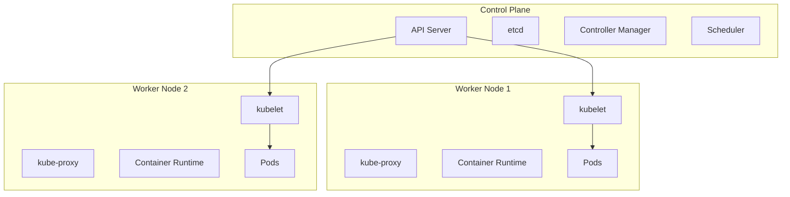

# Day 80: Kubernetes Fundamentals - Container Orchestration

## Learning Objectives
- Understand Kubernetes architecture and core concepts
- Learn Pod, Deployment, and Service management
- Master kubectl commands and YAML configurations
- Implement ConfigMaps, Secrets, and persistent storage
- Deploy Java applications with proper resource management

## Introduction to Kubernetes

### What is Kubernetes?
Kubernetes (K8s) is an open-source container orchestration platform that automates the deployment, scaling, and management of containerized applications across clusters of hosts.

```yaml
# Core Kubernetes concepts
# Cluster: Set of worker nodes that run containerized applications
# Node: Worker machine in Kubernetes, can be physical or virtual
# Pod: Smallest deployable unit, contains one or more containers
# Service: Abstraction that defines logical set of Pods
# Deployment: Manages Pods and ReplicaSets
# Namespace: Virtual clusters within a physical cluster
```

### Kubernetes vs Docker Compose

```yaml
# Docker Compose (Single Host)
services:
  web:
    image: myapp:latest
    replicas: 3
    ports:
      - "8080:8080"

# Kubernetes (Multi-Host Cluster)
apiVersion: apps/v1
kind: Deployment
metadata:
  name: web
spec:
  replicas: 3
  selector:
    matchLabels:
      app: web
  template:
    metadata:
      labels:
        app: web
    spec:
      containers:
      - name: web
        image: myapp:latest
        ports:
        - containerPort: 8080
```

## Kubernetes Architecture

### Cluster Components



### Control Plane Components

```yaml
# Control Plane responsibilities
kube-apiserver:
  purpose: "Frontend to Kubernetes control plane"
  functions:
    - "REST API for cluster management"
    - "Authentication and authorization"
    - "Data validation and configuration"

etcd:
  purpose: "Distributed key-value store"
  functions:
    - "Store cluster configuration data"
    - "Service discovery information"
    - "Cluster state persistence"

kube-controller-manager:
  purpose: "Runs controller processes"
  controllers:
    - "Node Controller: Node lifecycle management"
    - "Replication Controller: Pod replication"
    - "Endpoints Controller: Service endpoints"
    - "Service Account Controller: Default accounts"

kube-scheduler:
  purpose: "Pod placement decisions"
  functions:
    - "Resource availability assessment"
    - "Constraint satisfaction"
    - "Performance optimization"
```

### Worker Node Components

```yaml
# Worker Node responsibilities
kubelet:
  purpose: "Node agent that communicates with control plane"
  functions:
    - "Pod lifecycle management"
    - "Container health monitoring"
    - "Resource reporting"

kube-proxy:
  purpose: "Network proxy on each node"
  functions:
    - "Service load balancing"
    - "Network routing rules"
    - "Connection forwarding"

container-runtime:
  purpose: "Runs containers"
  options:
    - "Docker"
    - "containerd"
    - "CRI-O"
```

## Kubernetes Installation and Setup

### Local Development Setup

```bash
# Install kubectl
curl -LO "https://dl.k8s.io/release/$(curl -L -s https://dl.k8s.io/release/stable.txt)/bin/linux/amd64/kubectl"
chmod +x kubectl
sudo mv kubectl /usr/local/bin/

# Verify installation
kubectl version --client

# Install Minikube for local development
curl -Lo minikube https://storage.googleapis.com/minikube/releases/latest/minikube-linux-amd64
chmod +x minikube
sudo mv minikube /usr/local/bin/

# Start Minikube cluster
minikube start --memory=4096 --cpus=2 --disk-size=20g
minikube status

# Install Docker Desktop with Kubernetes (Alternative)
# Enable Kubernetes in Docker Desktop settings

# Install kind (Kubernetes in Docker)
curl -Lo ./kind https://kind.sigs.k8s.io/dl/v0.20.0/kind-linux-amd64
chmod +x ./kind
sudo mv ./kind /usr/local/bin/kind

# Create kind cluster
kind create cluster --name dev-cluster
kind get clusters
```

### Cluster Configuration

```yaml
# day80-examples/cluster-config/kind-config.yaml
kind: Cluster
apiVersion: kind.x-k8s.io/v1alpha4
name: development-cluster
nodes:
- role: control-plane
  kubeadmConfigPatches:
  - |
    kind: InitConfiguration
    nodeRegistration:
      kubeletExtraArgs:
        node-labels: "ingress-ready=true"
  extraPortMappings:
  - containerPort: 80
    hostPort: 8080
    protocol: TCP
  - containerPort: 443
    hostPort: 8443
    protocol: TCP
- role: worker
  labels:
    node-type: application
- role: worker
  labels:
    node-type: database
```

```bash
# Create cluster with configuration
kind create cluster --config=kind-config.yaml

# Verify cluster
kubectl cluster-info
kubectl get nodes
kubectl get namespaces
```

## Core Kubernetes Objects

### Pods - The Smallest Deployable Unit

```yaml
# day80-examples/basic-objects/pod.yaml
apiVersion: v1
kind: Pod
metadata:
  name: spring-boot-pod
  namespace: default
  labels:
    app: spring-boot-app
    version: v1.0.0
    environment: development
  annotations:
    description: "Spring Boot application pod"
    maintainer: "developer@example.com"
spec:
  containers:
  - name: spring-app
    image: spring-boot-app:1.0.0
    ports:
    - containerPort: 8080
      name: http
      protocol: TCP
    env:
    - name: SPRING_PROFILES_ACTIVE
      value: "kubernetes"
    - name: DATABASE_URL
      value: "jdbc:postgresql://postgres-service:5432/appdb"
    resources:
      requests:
        memory: "256Mi"
        cpu: "250m"
      limits:
        memory: "512Mi"
        cpu: "500m"
    livenessProbe:
      httpGet:
        path: /actuator/health
        port: 8080
      initialDelaySeconds: 30
      periodSeconds: 10
      timeoutSeconds: 5
      failureThreshold: 3
    readinessProbe:
      httpGet:
        path: /actuator/health/readiness
        port: 8080
      initialDelaySeconds: 10
      periodSeconds: 5
      timeoutSeconds: 3
      failureThreshold: 3
    volumeMounts:
    - name: app-config
      mountPath: /app/config
      readOnly: true
    - name: app-logs
      mountPath: /app/logs
  volumes:
  - name: app-config
    configMap:
      name: app-config
  - name: app-logs
    emptyDir: {}
  restartPolicy: Always
  nodeSelector:
    node-type: application
```

### ReplicaSets - Pod Replication

```yaml
# day80-examples/basic-objects/replicaset.yaml
apiVersion: apps/v1
kind: ReplicaSet
metadata:
  name: spring-boot-rs
  labels:
    app: spring-boot-app
spec:
  replicas: 3
  selector:
    matchLabels:
      app: spring-boot-app
      version: v1.0.0
  template:
    metadata:
      labels:
        app: spring-boot-app
        version: v1.0.0
    spec:
      containers:
      - name: spring-app
        image: spring-boot-app:1.0.0
        ports:
        - containerPort: 8080
        resources:
          requests:
            memory: "256Mi"
            cpu: "250m"
          limits:
            memory: "512Mi"
            cpu: "500m"
        env:
        - name: SPRING_PROFILES_ACTIVE
          value: "kubernetes"
        livenessProbe:
          httpGet:
            path: /actuator/health
            port: 8080
          initialDelaySeconds: 30
          periodSeconds: 10
        readinessProbe:
          httpGet:
            path: /actuator/health/readiness
            port: 8080
          initialDelaySeconds: 10
          periodSeconds: 5
```

### Deployments - Declarative Updates

```yaml
# day80-examples/basic-objects/deployment.yaml
apiVersion: apps/v1
kind: Deployment
metadata:
  name: spring-boot-deployment
  namespace: default
  labels:
    app: spring-boot-app
    component: backend
spec:
  replicas: 3
  strategy:
    type: RollingUpdate
    rollingUpdate:
      maxUnavailable: 1
      maxSurge: 1
  selector:
    matchLabels:
      app: spring-boot-app
  template:
    metadata:
      labels:
        app: spring-boot-app
        version: v1.0.0
      annotations:
        prometheus.io/scrape: "true"
        prometheus.io/path: "/actuator/prometheus"
        prometheus.io/port: "8080"
    spec:
      containers:
      - name: spring-app
        image: spring-boot-app:1.0.0
        imagePullPolicy: IfNotPresent
        ports:
        - containerPort: 8080
          name: http
        - containerPort: 8081
          name: management
        env:
        - name: SPRING_PROFILES_ACTIVE
          value: "kubernetes"
        - name: SERVER_PORT
          value: "8080"
        - name: MANAGEMENT_SERVER_PORT
          value: "8081"
        - name: DATABASE_URL
          valueFrom:
            secretKeyRef:
              name: app-secrets
              key: database-url
        - name: DATABASE_USERNAME
          valueFrom:
            secretKeyRef:
              name: app-secrets
              key: database-username
        - name: DATABASE_PASSWORD
          valueFrom:
            secretKeyRef:
              name: app-secrets
              key: database-password
        resources:
          requests:
            memory: "512Mi"
            cpu: "500m"
          limits:
            memory: "1Gi"
            cpu: "1000m"
        livenessProbe:
          httpGet:
            path: /actuator/health/liveness
            port: 8081
          initialDelaySeconds: 60
          periodSeconds: 30
          timeoutSeconds: 10
          failureThreshold: 3
        readinessProbe:
          httpGet:
            path: /actuator/health/readiness
            port: 8081
          initialDelaySeconds: 20
          periodSeconds: 10
          timeoutSeconds: 5
          failureThreshold: 3
        startupProbe:
          httpGet:
            path: /actuator/health
            port: 8081
          initialDelaySeconds: 30
          periodSeconds: 10
          timeoutSeconds: 5
          failureThreshold: 6
        volumeMounts:
        - name: app-config
          mountPath: /app/config
          readOnly: true
        - name: temp-storage
          mountPath: /tmp
      volumes:
      - name: app-config
        configMap:
          name: spring-boot-config
      - name: temp-storage
        emptyDir:
          sizeLimit: 1Gi
      securityContext:
        runAsNonRoot: true
        runAsUser: 1001
        fsGroup: 1001
      affinity:
        podAntiAffinity:
          preferredDuringSchedulingIgnoredDuringExecution:
          - weight: 100
            podAffinityTerm:
              labelSelector:
                matchExpressions:
                - key: app
                  operator: In
                  values:
                  - spring-boot-app
              topologyKey: kubernetes.io/hostname
```

### Services - Network Abstraction

```yaml
# day80-examples/networking/service.yaml
apiVersion: v1
kind: Service
metadata:
  name: spring-boot-service
  labels:
    app: spring-boot-app
  annotations:
    service.beta.kubernetes.io/aws-load-balancer-type: nlb
spec:
  type: ClusterIP
  selector:
    app: spring-boot-app
  ports:
  - name: http
    port: 80
    targetPort: 8080
    protocol: TCP
  - name: management
    port: 8081
    targetPort: 8081
    protocol: TCP
  sessionAffinity: ClientIP
  sessionAffinityConfig:
    clientIP:
      timeoutSeconds: 300

---
apiVersion: v1
kind: Service
metadata:
  name: spring-boot-nodeport
  labels:
    app: spring-boot-app
spec:
  type: NodePort
  selector:
    app: spring-boot-app
  ports:
  - name: http
    port: 80
    targetPort: 8080
    nodePort: 30080
    protocol: TCP

---
apiVersion: v1
kind: Service
metadata:
  name: spring-boot-loadbalancer
  labels:
    app: spring-boot-app
spec:
  type: LoadBalancer
  selector:
    app: spring-boot-app
  ports:
  - name: http
    port: 80
    targetPort: 8080
    protocol: TCP
  loadBalancerSourceRanges:
  - 10.0.0.0/8
  - 192.168.0.0/16
```

## Essential kubectl Commands

### Cluster Management

```bash
# Cluster information
kubectl cluster-info
kubectl get nodes
kubectl describe node <node-name>
kubectl top nodes

# Namespace management
kubectl get namespaces
kubectl create namespace development
kubectl config set-context --current --namespace=development

# Context management
kubectl config get-contexts
kubectl config current-context
kubectl config use-context <context-name>
```

### Resource Management

```bash
# Create resources
kubectl apply -f deployment.yaml
kubectl apply -f https://raw.githubusercontent.com/example/config.yaml
kubectl apply -k ./overlays/production  # Kustomize

# Get resources
kubectl get pods
kubectl get pods -o wide
kubectl get pods --show-labels
kubectl get pods -l app=spring-boot-app
kubectl get all
kubectl get events --sort-by=.metadata.creationTimestamp

# Describe resources
kubectl describe pod <pod-name>
kubectl describe deployment <deployment-name>
kubectl describe service <service-name>

# Resource monitoring
kubectl top pods
kubectl top pods --containers
kubectl top nodes

# Logs and debugging
kubectl logs <pod-name>
kubectl logs -f <pod-name>  # Follow logs
kubectl logs <pod-name> -c <container-name>  # Specific container
kubectl logs --previous <pod-name>  # Previous container instance

# Execute commands in pods
kubectl exec -it <pod-name> -- bash
kubectl exec <pod-name> -- curl http://localhost:8080/health
kubectl exec <pod-name> -c <container-name> -- env

# Port forwarding
kubectl port-forward <pod-name> 8080:8080
kubectl port-forward service/<service-name> 8080:80
kubectl port-forward deployment/<deployment-name> 8080:8080

# Resource editing
kubectl edit deployment <deployment-name>
kubectl patch deployment <deployment-name> -p '{"spec":{"replicas":5}}'

# Resource deletion
kubectl delete pod <pod-name>
kubectl delete deployment <deployment-name>
kubectl delete -f deployment.yaml
kubectl delete all -l app=spring-boot-app
```

### Scaling and Updates

```bash
# Scaling
kubectl scale deployment <deployment-name> --replicas=5
kubectl autoscale deployment <deployment-name> --min=2 --max=10 --cpu-percent=80

# Rolling updates
kubectl set image deployment/<deployment-name> container=<new-image>
kubectl rollout status deployment/<deployment-name>
kubectl rollout history deployment/<deployment-name>
kubectl rollout undo deployment/<deployment-name>
kubectl rollout restart deployment/<deployment-name>

# Resource management
kubectl apply -f . --dry-run=client -o yaml  # Dry run
kubectl diff -f deployment.yaml  # Show differences
```

## Configuration Management

### ConfigMaps

```yaml
# day80-examples/configuration/configmap.yaml
apiVersion: v1
kind: ConfigMap
metadata:
  name: spring-boot-config
  namespace: default
data:
  application.properties: |
    # Server configuration
    server.port=8080
    management.server.port=8081
    management.endpoints.web.exposure.include=health,info,metrics,prometheus
    
    # Database configuration
    spring.datasource.driver-class-name=org.postgresql.Driver
    spring.jpa.hibernate.ddl-auto=validate
    spring.jpa.show-sql=false
    
    # Redis configuration
    spring.redis.timeout=2000ms
    spring.redis.lettuce.pool.max-active=8
    
    # Logging configuration
    logging.level.com.example=INFO
    logging.pattern.console=%d{HH:mm:ss.SSS} [%thread] %-5level %logger{36} - %msg%n
  
  logback-spring.xml: |
    <?xml version="1.0" encoding="UTF-8"?>
    <configuration>
        <springProfile name="kubernetes">
            <appender name="STDOUT" class="ch.qos.logback.core.ConsoleAppender">
                <encoder class="net.logstash.logback.encoder.LoggingEventCompositeJsonEncoder">
                    <providers>
                        <timestamp/>
                        <logLevel/>
                        <loggerName/>
                        <message/>
                        <mdc/>
                        <arguments/>
                        <stackTrace/>
                    </providers>
                </encoder>
            </appender>
            <root level="INFO">
                <appender-ref ref="STDOUT"/>
            </root>
        </springProfile>
    </configuration>

---
# Using ConfigMap from command line
apiVersion: v1
kind: ConfigMap
metadata:
  name: app-env-config
data:
  SPRING_PROFILES_ACTIVE: "kubernetes"
  JAVA_OPTS: "-Xmx1g -XX:+UseG1GC"
  LOG_LEVEL: "INFO"
  CACHE_TTL: "3600"
  MAX_CONNECTIONS: "100"
```

```bash
# Create ConfigMap from command line
kubectl create configmap app-config \
  --from-literal=SPRING_PROFILES_ACTIVE=kubernetes \
  --from-literal=DATABASE_HOST=postgres-service \
  --from-literal=REDIS_HOST=redis-service

# Create ConfigMap from file
kubectl create configmap app-properties \
  --from-file=application.properties=./config/application.properties

# Create ConfigMap from directory
kubectl create configmap app-configs --from-file=./config/

# View ConfigMap
kubectl get configmaps
kubectl describe configmap app-config
kubectl get configmap app-config -o yaml
```

### Secrets

```yaml
# day80-examples/configuration/secrets.yaml
apiVersion: v1
kind: Secret
metadata:
  name: app-secrets
  namespace: default
type: Opaque
data:
  # Base64 encoded values
  database-url: amRiYzpwb3N0Z3Jlc3FsOi8vcG9zdGdyZXMtc2VydmljZTo1NDMyL2FwcGRi
  database-username: YXBwdXNlcg==
  database-password: c2VjdXJlcGFzc3dvcmQ=
  jwt-secret: eW91ci1qd3Qtc2VjcmV0LWtleQ==
  redis-password: cmVkaXNwYXNzd29yZA==

---
apiVersion: v1
kind: Secret
metadata:
  name: tls-secret
  namespace: default
type: kubernetes.io/tls
data:
  tls.crt: LS0tLS1CRUdJTi... # Base64 encoded certificate
  tls.key: LS0tLS1CRUdJTi... # Base64 encoded private key

---
apiVersion: v1
kind: Secret
metadata:
  name: docker-registry-secret
  namespace: default
type: kubernetes.io/dockerconfigjson
data:
  .dockerconfigjson: eyJhdXRocyI6eyJyZWdpc3RyeS5leGFtcGxlLmNvbSI6eyJ1c2VybmFtZSI6ImRvY2tlciIsInBhc3N3b3JkIjoicGFzcyIsImVtYWlsIjoidGVzdEBleGFtcGxlLmNvbSIsImF1dGgiOiJaRzlqYTJWeU9uQmhjM009In19fQ==
```

```bash
# Create secrets from command line
kubectl create secret generic app-secrets \
  --from-literal=database-password=securepassword \
  --from-literal=jwt-secret=your-jwt-secret

# Create TLS secret
kubectl create secret tls tls-secret \
  --cert=path/to/tls.crt \
  --key=path/to/tls.key

# Create Docker registry secret
kubectl create secret docker-registry docker-secret \
  --docker-server=registry.example.com \
  --docker-username=docker \
  --docker-password=password \
  --docker-email=test@example.com

# View secrets (values are base64 encoded)
kubectl get secrets
kubectl describe secret app-secrets
kubectl get secret app-secrets -o yaml

# Decode secret values
kubectl get secret app-secrets -o jsonpath='{.data.database-password}' | base64 -d
```

### Using ConfigMaps and Secrets in Pods

```yaml
# day80-examples/configuration/pod-with-config.yaml
apiVersion: v1
kind: Pod
metadata:
  name: configured-pod
spec:
  containers:
  - name: spring-app
    image: spring-boot-app:1.0.0
    env:
    # Environment variables from ConfigMap
    - name: SPRING_PROFILES_ACTIVE
      valueFrom:
        configMapKeyRef:
          name: app-env-config
          key: SPRING_PROFILES_ACTIVE
    - name: LOG_LEVEL
      valueFrom:
        configMapKeyRef:
          name: app-env-config
          key: LOG_LEVEL
    
    # Environment variables from Secret
    - name: DATABASE_PASSWORD
      valueFrom:
        secretKeyRef:
          name: app-secrets
          key: database-password
    - name: JWT_SECRET
      valueFrom:
        secretKeyRef:
          name: app-secrets
          key: jwt-secret
    
    # Load all keys from ConfigMap as environment variables
    envFrom:
    - configMapRef:
        name: app-env-config
    - secretRef:
        name: app-secrets
    
    volumeMounts:
    # Mount ConfigMap as file
    - name: config-volume
      mountPath: /app/config
      readOnly: true
    # Mount Secret as file
    - name: secret-volume
      mountPath: /app/secrets
      readOnly: true
    
  volumes:
  - name: config-volume
    configMap:
      name: spring-boot-config
      items:
      - key: application.properties
        path: application.properties
      - key: logback-spring.xml
        path: logback-spring.xml
  - name: secret-volume
    secret:
      secretName: app-secrets
      defaultMode: 0400  # Read-only for owner
      items:
      - key: database-password
        path: db-password
      - key: jwt-secret
        path: jwt-secret
```

## Storage and Persistent Volumes

### Persistent Volumes and Claims

```yaml
# day80-examples/storage/persistent-volume.yaml
apiVersion: v1
kind: PersistentVolume
metadata:
  name: postgres-pv
  labels:
    type: local
spec:
  storageClassName: standard
  capacity:
    storage: 10Gi
  accessModes:
    - ReadWriteOnce
  persistentVolumeReclaimPolicy: Retain
  hostPath:
    path: /data/postgres

---
apiVersion: v1
kind: PersistentVolumeClaim
metadata:
  name: postgres-pvc
  namespace: default
spec:
  storageClassName: standard
  accessModes:
    - ReadWriteOnce
  resources:
    requests:
      storage: 5Gi
  selector:
    matchLabels:
      type: local

---
# Dynamic provisioning with StorageClass
apiVersion: storage.k8s.io/v1
kind: StorageClass
metadata:
  name: fast-ssd
provisioner: kubernetes.io/aws-ebs
parameters:
  type: gp3
  iops: "3000"
  throughput: "125"
allowVolumeExpansion: true
volumeBindingMode: WaitForFirstConsumer
reclaimPolicy: Delete
```

### StatefulSet with Persistent Storage

```yaml
# day80-examples/storage/statefulset.yaml
apiVersion: apps/v1
kind: StatefulSet
metadata:
  name: postgres-statefulset
spec:
  serviceName: postgres-service
  replicas: 1
  selector:
    matchLabels:
      app: postgres
  template:
    metadata:
      labels:
        app: postgres
    spec:
      containers:
      - name: postgres
        image: postgres:15
        env:
        - name: POSTGRES_DB
          value: appdb
        - name: POSTGRES_USER
          valueFrom:
            secretKeyRef:
              name: postgres-secret
              key: username
        - name: POSTGRES_PASSWORD
          valueFrom:
            secretKeyRef:
              name: postgres-secret
              key: password
        ports:
        - containerPort: 5432
          name: postgres
        volumeMounts:
        - name: postgres-storage
          mountPath: /var/lib/postgresql/data
        - name: postgres-config
          mountPath: /etc/postgresql/postgresql.conf
          subPath: postgresql.conf
        resources:
          requests:
            memory: "256Mi"
            cpu: "250m"
          limits:
            memory: "1Gi"
            cpu: "1000m"
        livenessProbe:
          exec:
            command:
            - pg_isready
            - -U
            - $(POSTGRES_USER)
            - -d
            - $(POSTGRES_DB)
          initialDelaySeconds: 30
          periodSeconds: 10
        readinessProbe:
          exec:
            command:
            - pg_isready
            - -U
            - $(POSTGRES_USER)
            - -d
            - $(POSTGRES_DB)
          initialDelaySeconds: 5
          periodSeconds: 5
      volumes:
      - name: postgres-config
        configMap:
          name: postgres-config
  volumeClaimTemplates:
  - metadata:
      name: postgres-storage
    spec:
      accessModes: [ "ReadWriteOnce" ]
      storageClassName: "fast-ssd"
      resources:
        requests:
          storage: 10Gi
```

## Java Application Deployment

### Spring Boot Application Configuration

```java
// day80-examples/spring-k8s/src/main/java/com/example/config/KubernetesConfig.java
@Configuration
@Profile("kubernetes")
public class KubernetesConfiguration {
    
    @Bean
    @Primary
    public DataSource dataSource(
            @Value("${DATABASE_URL:jdbc:postgresql://localhost:5432/appdb}") String url,
            @Value("${DATABASE_USERNAME:appuser}") String username,
            @Value("${DATABASE_PASSWORD:password}") String password) {
        
        HikariConfig config = new HikariConfig();
        config.setJdbcUrl(url);
        config.setUsername(username);
        config.setPassword(password);
        config.setMaximumPoolSize(20);
        config.setMinimumIdle(5);
        config.setConnectionTimeout(30000);
        config.setIdleTimeout(600000);
        config.setMaxLifetime(1800000);
        config.setLeakDetectionThreshold(60000);
        
        return new HikariDataSource(config);
    }
    
    @Bean
    public RedisConnectionFactory redisConnectionFactory(
            @Value("${REDIS_HOST:localhost}") String host,
            @Value("${REDIS_PORT:6379}") int port,
            @Value("${REDIS_PASSWORD:}") String password) {
        
        RedisStandaloneConfiguration config = new RedisStandaloneConfiguration();
        config.setHostName(host);
        config.setPort(port);
        if (!password.isEmpty()) {
            config.setPassword(password);
        }
        
        LettuceConnectionFactory factory = new LettuceConnectionFactory(config);
        factory.setValidateConnection(true);
        return factory;
    }
    
    @Bean
    public HealthIndicator customHealthIndicator() {
        return new CompositeHealthContributor(Map.of(
            "database", new DatabaseHealthIndicator(),
            "redis", new RedisHealthIndicator(),
            "diskSpace", new DiskSpaceHealthIndicator()
        ));
    }
}

@Component
public class KubernetesInfoContributor implements InfoContributor {
    
    @Override
    public void contribute(Info.Builder builder) {
        builder.withDetail("kubernetes", Map.of(
            "namespace", System.getenv("KUBERNETES_NAMESPACE"),
            "podName", System.getenv("HOSTNAME"),
            "nodeName", System.getenv("KUBERNETES_NODE_NAME"),
            "serviceAccount", System.getenv("KUBERNETES_SERVICE_ACCOUNT")
        ));
    }
}
```

```properties
# day80-examples/spring-k8s/src/main/resources/application-kubernetes.properties
# Server configuration
server.port=${SERVER_PORT:8080}
management.server.port=${MANAGEMENT_PORT:8081}
management.endpoints.web.exposure.include=health,info,metrics,prometheus
management.endpoint.health.show-details=always
management.endpoint.health.probes.enabled=true
management.health.livenessstate.enabled=true
management.health.readinessstate.enabled=true

# Database configuration
spring.datasource.url=${DATABASE_URL}
spring.datasource.username=${DATABASE_USERNAME}
spring.datasource.password=${DATABASE_PASSWORD}
spring.datasource.driver-class-name=org.postgresql.Driver

# JPA configuration
spring.jpa.hibernate.ddl-auto=validate
spring.jpa.show-sql=false
spring.jpa.properties.hibernate.dialect=org.hibernate.dialect.PostgreSQLDialect

# Redis configuration
spring.redis.host=${REDIS_HOST:redis}
spring.redis.port=${REDIS_PORT:6379}
spring.redis.password=${REDIS_PASSWORD:}
spring.redis.timeout=2000ms

# Metrics configuration
management.metrics.export.prometheus.enabled=true
management.metrics.distribution.percentiles-histogram.http.server.requests=true
management.metrics.tags.application=${spring.application.name}
management.metrics.tags.version=${APP_VERSION:unknown}

# Logging configuration
logging.level.com.example=${LOG_LEVEL:INFO}
logging.pattern.console=%d{yyyy-MM-dd HH:mm:ss.SSS} [%thread] %-5level [%X{traceId},%X{spanId}] %logger{36} - %msg%n
```

### Complete Application Deployment

```yaml
# day80-examples/complete-app/namespace.yaml
apiVersion: v1
kind: Namespace
metadata:
  name: spring-app
  labels:
    name: spring-app
    environment: production

---
# day80-examples/complete-app/secrets.yaml
apiVersion: v1
kind: Secret
metadata:
  name: app-secrets
  namespace: spring-app
type: Opaque
data:
  database-url: amRiYzpwb3N0Z3Jlc3FsOi8vcG9zdGdyZXMtc2VydmljZTo1NDMyL2FwcGRi
  database-username: YXBwdXNlcg==
  database-password: c2VjdXJlcGFzc3dvcmQ=
  redis-password: cmVkaXNwYXNzd29yZA==

---
# day80-examples/complete-app/configmap.yaml
apiVersion: v1
kind: ConfigMap
metadata:
  name: app-config
  namespace: spring-app
data:
  SPRING_PROFILES_ACTIVE: "kubernetes"
  LOG_LEVEL: "INFO"
  MANAGEMENT_PORT: "8081"
  REDIS_HOST: "redis-service"
  REDIS_PORT: "6379"

---
# day80-examples/complete-app/deployment.yaml
apiVersion: apps/v1
kind: Deployment
metadata:
  name: spring-boot-app
  namespace: spring-app
  labels:
    app: spring-boot-app
    version: v1.0.0
spec:
  replicas: 3
  strategy:
    type: RollingUpdate
    rollingUpdate:
      maxUnavailable: 1
      maxSurge: 1
  selector:
    matchLabels:
      app: spring-boot-app
  template:
    metadata:
      labels:
        app: spring-boot-app
        version: v1.0.0
      annotations:
        prometheus.io/scrape: "true"
        prometheus.io/path: "/actuator/prometheus"
        prometheus.io/port: "8081"
    spec:
      serviceAccountName: spring-boot-sa
      containers:
      - name: spring-app
        image: spring-boot-app:1.0.0
        imagePullPolicy: IfNotPresent
        ports:
        - containerPort: 8080
          name: http
        - containerPort: 8081
          name: management
        env:
        - name: KUBERNETES_NAMESPACE
          valueFrom:
            fieldRef:
              fieldPath: metadata.namespace
        - name: HOSTNAME
          valueFrom:
            fieldRef:
              fieldPath: metadata.name
        - name: DATABASE_URL
          valueFrom:
            secretKeyRef:
              name: app-secrets
              key: database-url
        - name: DATABASE_USERNAME
          valueFrom:
            secretKeyRef:
              name: app-secrets
              key: database-username
        - name: DATABASE_PASSWORD
          valueFrom:
            secretKeyRef:
              name: app-secrets
              key: database-password
        - name: REDIS_PASSWORD
          valueFrom:
            secretKeyRef:
              name: app-secrets
              key: redis-password
        envFrom:
        - configMapRef:
            name: app-config
        resources:
          requests:
            memory: "512Mi"
            cpu: "500m"
          limits:
            memory: "1Gi"
            cpu: "1000m"
        livenessProbe:
          httpGet:
            path: /actuator/health/liveness
            port: 8081
          initialDelaySeconds: 60
          periodSeconds: 30
          timeoutSeconds: 10
          failureThreshold: 3
        readinessProbe:
          httpGet:
            path: /actuator/health/readiness
            port: 8081
          initialDelaySeconds: 20
          periodSeconds: 10
          timeoutSeconds: 5
          failureThreshold: 3
        startupProbe:
          httpGet:
            path: /actuator/health
            port: 8081
          initialDelaySeconds: 30
          periodSeconds: 10
          timeoutSeconds: 5
          failureThreshold: 6
        securityContext:
          allowPrivilegeEscalation: false
          runAsNonRoot: true
          runAsUser: 1001
          capabilities:
            drop:
            - ALL
        volumeMounts:
        - name: temp-storage
          mountPath: /tmp
      volumes:
      - name: temp-storage
        emptyDir:
          sizeLimit: 1Gi
      securityContext:
        runAsNonRoot: true
        runAsUser: 1001
        fsGroup: 1001
      affinity:
        podAntiAffinity:
          preferredDuringSchedulingIgnoredDuringExecution:
          - weight: 100
            podAffinityTerm:
              labelSelector:
                matchExpressions:
                - key: app
                  operator: In
                  values:
                  - spring-boot-app
              topologyKey: kubernetes.io/hostname

---
# day80-examples/complete-app/service.yaml
apiVersion: v1
kind: Service
metadata:
  name: spring-boot-service
  namespace: spring-app
  labels:
    app: spring-boot-app
spec:
  type: ClusterIP
  selector:
    app: spring-boot-app
  ports:
  - name: http
    port: 80
    targetPort: 8080
    protocol: TCP
  - name: management
    port: 8081
    targetPort: 8081
    protocol: TCP

---
# day80-examples/complete-app/service-account.yaml
apiVersion: v1
kind: ServiceAccount
metadata:
  name: spring-boot-sa
  namespace: spring-app

---
apiVersion: rbac.authorization.k8s.io/v1
kind: Role
metadata:
  namespace: spring-app
  name: spring-boot-role
rules:
- apiGroups: [""]
  resources: ["pods", "configmaps", "secrets"]
  verbs: ["get", "list", "watch"]

---
apiVersion: rbac.authorization.k8s.io/v1
kind: RoleBinding
metadata:
  name: spring-boot-rolebinding
  namespace: spring-app
subjects:
- kind: ServiceAccount
  name: spring-boot-sa
  namespace: spring-app
roleRef:
  kind: Role
  name: spring-boot-role
  apiGroup: rbac.authorization.k8s.io
```

### Database Deployment

```yaml
# day80-examples/complete-app/postgres.yaml
apiVersion: v1
kind: Secret
metadata:
  name: postgres-secret
  namespace: spring-app
type: Opaque
data:
  username: YXBwdXNlcg==  # appuser
  password: c2VjdXJlcGFzc3dvcmQ=  # securepassword

---
apiVersion: v1
kind: ConfigMap
metadata:
  name: postgres-config
  namespace: spring-app
data:
  postgresql.conf: |
    # PostgreSQL configuration
    max_connections = 200
    shared_buffers = 256MB
    effective_cache_size = 1GB
    work_mem = 4MB
    maintenance_work_mem = 64MB
    
    # Logging
    log_statement = 'all'
    log_duration = on
    log_line_prefix = '%t [%p]: [%l-1] user=%u,db=%d,app=%a,client=%h '
    
    # Performance
    checkpoint_completion_target = 0.9
    wal_buffers = 16MB
    default_statistics_target = 100

---
apiVersion: apps/v1
kind: StatefulSet
metadata:
  name: postgres
  namespace: spring-app
spec:
  serviceName: postgres-service
  replicas: 1
  selector:
    matchLabels:
      app: postgres
  template:
    metadata:
      labels:
        app: postgres
    spec:
      containers:
      - name: postgres
        image: postgres:15
        env:
        - name: POSTGRES_DB
          value: appdb
        - name: POSTGRES_USER
          valueFrom:
            secretKeyRef:
              name: postgres-secret
              key: username
        - name: POSTGRES_PASSWORD
          valueFrom:
            secretKeyRef:
              name: postgres-secret
              key: password
        - name: PGDATA
          value: /var/lib/postgresql/data/pgdata
        ports:
        - containerPort: 5432
          name: postgres
        volumeMounts:
        - name: postgres-storage
          mountPath: /var/lib/postgresql/data
        - name: postgres-config
          mountPath: /etc/postgresql
        resources:
          requests:
            memory: "256Mi"
            cpu: "250m"
          limits:
            memory: "1Gi"
            cpu: "1000m"
        livenessProbe:
          exec:
            command:
            - pg_isready
            - -U
            - $(POSTGRES_USER)
            - -d
            - $(POSTGRES_DB)
          initialDelaySeconds: 30
          periodSeconds: 10
        readinessProbe:
          exec:
            command:
            - pg_isready
            - -U
            - $(POSTGRES_USER)
            - -d
            - $(POSTGRES_DB)
          initialDelaySeconds: 5
          periodSeconds: 5
      volumes:
      - name: postgres-config
        configMap:
          name: postgres-config
  volumeClaimTemplates:
  - metadata:
      name: postgres-storage
    spec:
      accessModes: [ "ReadWriteOnce" ]
      resources:
        requests:
          storage: 10Gi

---
apiVersion: v1
kind: Service
metadata:
  name: postgres-service
  namespace: spring-app
spec:
  selector:
    app: postgres
  ports:
  - name: postgres
    port: 5432
    targetPort: 5432
  type: ClusterIP
```

## Resource Management and Monitoring

### Resource Quotas and Limits

```yaml
# day80-examples/resource-management/resource-quota.yaml
apiVersion: v1
kind: ResourceQuota
metadata:
  name: namespace-quota
  namespace: spring-app
spec:
  hard:
    requests.cpu: "4"
    requests.memory: 8Gi
    limits.cpu: "8"
    limits.memory: 16Gi
    persistentvolumeclaims: "10"
    services: "5"
    secrets: "10"
    configmaps: "10"
    pods: "10"

---
apiVersion: v1
kind: LimitRange
metadata:
  name: default-limits
  namespace: spring-app
spec:
  limits:
  - default:
      cpu: "500m"
      memory: "512Mi"
    defaultRequest:
      cpu: "250m"
      memory: "256Mi"
    type: Container
  - max:
      cpu: "2"
      memory: "2Gi"
    min:
      cpu: "100m"
      memory: "128Mi"
    type: Container
```

### Horizontal Pod Autoscaler

```yaml
# day80-examples/resource-management/hpa.yaml
apiVersion: autoscaling/v2
kind: HorizontalPodAutoscaler
metadata:
  name: spring-boot-hpa
  namespace: spring-app
spec:
  scaleTargetRef:
    apiVersion: apps/v1
    kind: Deployment
    name: spring-boot-app
  minReplicas: 2
  maxReplicas: 10
  metrics:
  - type: Resource
    resource:
      name: cpu
      target:
        type: Utilization
        averageUtilization: 70
  - type: Resource
    resource:
      name: memory
      target:
        type: Utilization
        averageUtilization: 80
  - type: Pods
    pods:
      metric:
        name: custom_metric
      target:
        type: AverageValue
        averageValue: "100"
  behavior:
    scaleUp:
      stabilizationWindowSeconds: 60
      policies:
      - type: Percent
        value: 50
        periodSeconds: 60
    scaleDown:
      stabilizationWindowSeconds: 300
      policies:
      - type: Percent
        value: 10
        periodSeconds: 60
```

### Pod Disruption Budget

```yaml
# day80-examples/resource-management/pdb.yaml
apiVersion: policy/v1
kind: PodDisruptionBudget
metadata:
  name: spring-boot-pdb
  namespace: spring-app
spec:
  minAvailable: 2
  selector:
    matchLabels:
      app: spring-boot-app
```

## Troubleshooting and Debugging

### Common Debugging Commands

```bash
# Pod troubleshooting
kubectl get pods -o wide
kubectl describe pod <pod-name>
kubectl logs <pod-name> --previous
kubectl logs <pod-name> -c <container-name>

# Events and debugging
kubectl get events --sort-by=.metadata.creationTimestamp
kubectl describe node <node-name>
kubectl top pods --containers

# Network troubleshooting
kubectl exec -it <pod-name> -- nslookup <service-name>
kubectl exec -it <pod-name> -- curl -v http://<service-name>:<port>
kubectl port-forward service/<service-name> <local-port>:<service-port>

# Resource debugging
kubectl describe deployment <deployment-name>
kubectl get rs -o wide
kubectl get endpoints

# Configuration debugging
kubectl get configmap <configmap-name> -o yaml
kubectl get secret <secret-name> -o yaml
kubectl exec -it <pod-name> -- env | grep -i database
```

### Debug Pod

```yaml
# day80-examples/debugging/debug-pod.yaml
apiVersion: v1
kind: Pod
metadata:
  name: debug-pod
  namespace: spring-app
spec:
  containers:
  - name: debug
    image: nicolaka/netshoot
    command: ["sleep", "3600"]
    securityContext:
      capabilities:
        add: ["NET_ADMIN"]
  restartPolicy: Never
```

```bash
# Use debug pod for network troubleshooting
kubectl exec -it debug-pod -- nslookup postgres-service
kubectl exec -it debug-pod -- curl -v http://spring-boot-service/actuator/health
kubectl exec -it debug-pod -- dig spring-boot-service.spring-app.svc.cluster.local
```

## Summary

### Key Concepts Covered
- **Kubernetes Architecture**: Control plane, worker nodes, and core components
- **Core Objects**: Pods, Deployments, Services, and their relationships
- **Configuration Management**: ConfigMaps, Secrets, and environment variables
- **Storage**: Persistent Volumes, Claims, and StatefulSets
- **Resource Management**: Requests, limits, quotas, and autoscaling
- **Java Application Deployment**: Spring Boot specific configurations

### kubectl Commands Cheat Sheet

```bash
# Resource management
kubectl apply -f manifest.yaml
kubectl get pods -o wide
kubectl describe deployment <name>
kubectl logs -f <pod-name>
kubectl exec -it <pod-name> -- bash
kubectl port-forward <pod-name> 8080:8080

# Scaling and updates
kubectl scale deployment <name> --replicas=5
kubectl set image deployment/<name> container=<new-image>
kubectl rollout status deployment/<name>
kubectl rollout undo deployment/<name>

# Configuration
kubectl create configmap <name> --from-literal=key=value
kubectl create secret generic <name> --from-literal=key=value
kubectl get configmap <name> -o yaml
```

### Best Practices
- **Resource Limits**: Always set resource requests and limits
- **Health Checks**: Implement liveness, readiness, and startup probes
- **Security**: Use non-root users and minimal privileges
- **Configuration**: Externalize configuration using ConfigMaps and Secrets
- **Monitoring**: Include observability from the start
- **High Availability**: Use anti-affinity and pod disruption budgets

### Next Steps
- Day 81: Kubernetes Advanced - Services, Ingress, ConfigMaps
- Learn advanced networking and traffic management
- Implement service mesh and security policies
- Master production deployment strategies

---

## Exercises

### Exercise 1: Basic Deployment
Deploy a Spring Boot application with proper health checks and resource management.

### Exercise 2: Database Integration
Set up a PostgreSQL database using StatefulSet with persistent storage.

### Exercise 3: Configuration Management
Implement comprehensive configuration using ConfigMaps and Secrets.

### Exercise 4: Scaling and Updates
Configure HPA and practice rolling updates with zero downtime.

### Exercise 5: Troubleshooting
Practice debugging common Kubernetes issues using various kubectl commands.