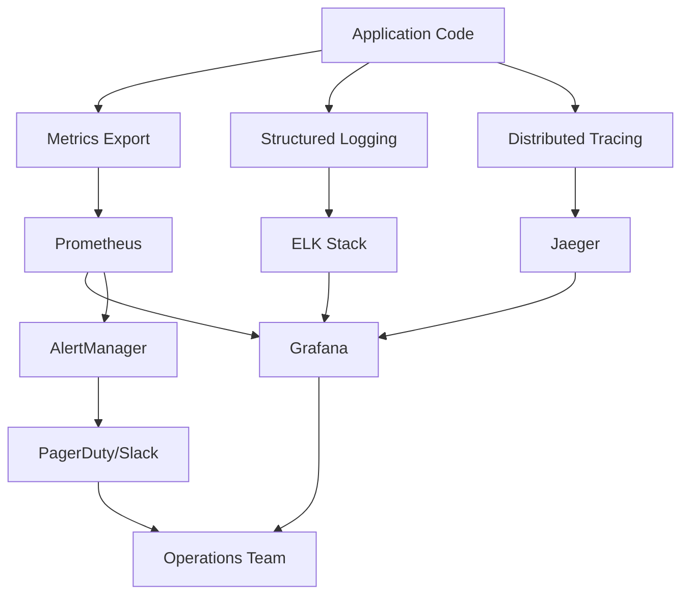

# Day 83: Monitoring & Observability - Prometheus, Grafana, ELK

## Learning Objectives
- Master Prometheus monitoring and alerting systems
- Implement comprehensive logging with ELK Stack
- Create operational dashboards with Grafana
- Learn distributed tracing and APM integration
- Configure alerting and incident response workflows

## Introduction to Observability

### The Three Pillars of Observability

```yaml
# Observability Foundation
observability_pillars:
  metrics:
    purpose: "Quantitative measurements over time"
    tools: ["Prometheus", "InfluxDB", "CloudWatch"]
    types:
      - counter: "Monotonically increasing values"
      - gauge: "Current value that can go up or down"
      - histogram: "Distribution of values"
      - summary: "Quantiles and totals"
    
  logs:
    purpose: "Discrete events with context"
    tools: ["ELK Stack", "Fluentd", "Loki"]
    levels: ["TRACE", "DEBUG", "INFO", "WARN", "ERROR", "FATAL"]
    
  traces:
    purpose: "Request flow across distributed systems"
    tools: ["Jaeger", "Zipkin", "AWS X-Ray"]
    components:
      - span: "Single unit of work"
      - trace: "Collection of spans"
      - baggage: "Cross-cutting concerns"
```

### Observability Strategy



## Prometheus Monitoring Setup

### Prometheus Configuration

```yaml
# day83-examples/prometheus/prometheus.yml
global:
  scrape_interval: 15s
  evaluation_interval: 15s
  external_labels:
    cluster: 'production'
    region: 'us-west-2'

rule_files:
  - "alerts/*.yml"
  - "recording_rules/*.yml"

alerting:
  alertmanagers:
    - static_configs:
        - targets:
          - alertmanager:9093

scrape_configs:
  # Prometheus itself
  - job_name: 'prometheus'
    static_configs:
      - targets: ['localhost:9090']
    scrape_interval: 5s

  # Spring Boot applications
  - job_name: 'spring-boot-apps'
    kubernetes_sd_configs:
      - role: pod
        namespaces:
          names:
            - production
            - staging
    relabel_configs:
      - source_labels: [__meta_kubernetes_pod_annotation_prometheus_io_scrape]
        action: keep
        regex: true
      - source_labels: [__meta_kubernetes_pod_annotation_prometheus_io_path]
        action: replace
        target_label: __metrics_path__
        regex: (.+)
      - source_labels: [__address__, __meta_kubernetes_pod_annotation_prometheus_io_port]
        action: replace
        regex: ([^:]+)(?::\d+)?;(\d+)
        replacement: $1:$2
        target_label: __address__
      - action: labelmap
        regex: __meta_kubernetes_pod_label_(.+)
      - source_labels: [__meta_kubernetes_namespace]
        action: replace
        target_label: kubernetes_namespace
      - source_labels: [__meta_kubernetes_pod_name]
        action: replace
        target_label: kubernetes_pod_name

  # Node Exporter
  - job_name: 'node-exporter'
    kubernetes_sd_configs:
      - role: node
    relabel_configs:
      - action: labelmap
        regex: __meta_kubernetes_node_label_(.+)
      - target_label: __address__
        replacement: kubernetes.default.svc:443
      - source_labels: [__meta_kubernetes_node_name]
        regex: (.+)
        target_label: __metrics_path__
        replacement: /api/v1/nodes/${1}/proxy/metrics

  # Kubernetes API Server
  - job_name: 'kubernetes-apiservers'
    kubernetes_sd_configs:
      - role: endpoints
        namespaces:
          names:
            - default
    scheme: https
    tls_config:
      ca_file: /var/run/secrets/kubernetes.io/serviceaccount/ca.crt
    bearer_token_file: /var/run/secrets/kubernetes.io/serviceaccount/token
    relabel_configs:
      - source_labels: [__meta_kubernetes_namespace, __meta_kubernetes_service_name, __meta_kubernetes_endpoint_port_name]
        action: keep
        regex: default;kubernetes;https

  # PostgreSQL
  - job_name: 'postgres-exporter'
    static_configs:
      - targets: ['postgres-exporter:9187']
    scrape_interval: 30s

  # Redis
  - job_name: 'redis-exporter'
    static_configs:
      - targets: ['redis-exporter:9121']
    scrape_interval: 30s

  # Kafka
  - job_name: 'kafka-exporter'
    static_configs:
      - targets: ['kafka-exporter:9308']
    scrape_interval: 30s

  # NGINX Ingress
  - job_name: 'nginx-ingress'
    kubernetes_sd_configs:
      - role: pod
        namespaces:
          names:
            - ingress-nginx
    relabel_configs:
      - source_labels: [__meta_kubernetes_pod_label_app_kubernetes_io_name]
        action: keep
        regex: ingress-nginx
      - source_labels: [__meta_kubernetes_pod_container_port_number]
        action: keep
        regex: "10254"
```

### Spring Boot Metrics Integration

```java
// day83-examples/monitoring/MetricsConfiguration.java
@Configuration
@EnablePrometheusEndpoint
@EnableMetrics
public class MetricsConfiguration {
    
    @Bean
    public MeterRegistryCustomizer<MeterRegistry> meterRegistryCustomizer(
            @Value("${spring.application.name}") String applicationName,
            @Value("${app.version:unknown}") String version,
            Environment environment) {
        
        return registry -> registry.config()
            .commonTags(
                "application", applicationName,
                "version", version,
                "environment", environment.getActiveProfiles().length > 0 
                    ? environment.getActiveProfiles()[0] : "default",
                "instance", getHostname()
            )
            .meterFilter(MeterFilter.deny(id -> {
                String name = id.getName();
                // Filter out noisy metrics
                return name.startsWith("jvm.gc.pause") && 
                       id.getTag("cause") != null && 
                       id.getTag("cause").equals("No GC");
            }));
    }
    
    @Bean
    public TimedAspect timedAspect(MeterRegistry registry) {
        return new TimedAspect(registry);
    }
    
    @Bean
    public CountedAspect countedAspect(MeterRegistry registry) {
        return new CountedAspect(registry);
    }
    
    @Bean
    public MeterBinder customMetrics() {
        return new CustomApplicationMetrics();
    }
    
    private String getHostname() {
        try {
            return InetAddress.getLocalHost().getHostName();
        } catch (UnknownHostException e) {
            return "unknown";
        }
    }
}

@Component
public class CustomApplicationMetrics implements MeterBinder {
    
    private final AtomicInteger activeUsers = new AtomicInteger(0);
    private final Counter orderProcessedCounter;
    private final Timer orderProcessingTime;
    private final Gauge connectionPoolGauge;
    
    private final DataSource dataSource;
    
    public CustomApplicationMetrics(DataSource dataSource) {
        this.dataSource = dataSource;
        this.orderProcessedCounter = Counter.builder("orders.processed.total")
            .description("Total number of processed orders")
            .register(Metrics.globalRegistry);
        
        this.orderProcessingTime = Timer.builder("orders.processing.duration")
            .description("Order processing duration")
            .register(Metrics.globalRegistry);
        
        this.connectionPoolGauge = Gauge.builder("database.connections.active")
            .description("Active database connections")
            .register(Metrics.globalRegistry, this, CustomApplicationMetrics::getActiveConnections);
    }
    
    @Override
    public void bindTo(MeterRegistry registry) {
        // Business metrics
        Gauge.builder("application.users.active")
            .description("Number of active users")
            .register(registry, activeUsers, AtomicInteger::get);
        
        // JVM metrics customization
        new JvmMemoryMetrics().bindTo(registry);
        new JvmGcMetrics().bindTo(registry);
        new JvmThreadMetrics().bindTo(registry);
        new ProcessorMetrics().bindTo(registry);
        new UptimeMetrics().bindTo(registry);
        
        // Custom health metrics
        Gauge.builder("application.health.status")
            .description("Application health status (1=UP, 0=DOWN)")
            .register(registry, this, metrics -> getHealthStatus() ? 1 : 0);
    }
    
    public void incrementOrderProcessed(String orderType) {
        orderProcessedCounter.increment(
            Tags.of("type", orderType, "status", "completed")
        );
    }
    
    public Timer.Sample startOrderProcessing() {
        return Timer.start(Metrics.globalRegistry);
    }
    
    public void recordOrderProcessingTime(Timer.Sample sample, String orderType, String status) {
        sample.stop(Timer.builder("orders.processing.duration")
            .tags("type", orderType, "status", status)
            .register(Metrics.globalRegistry));
    }
    
    private double getActiveConnections() {
        if (dataSource instanceof HikariDataSource) {
            HikariDataSource hikariDataSource = (HikariDataSource) dataSource;
            return hikariDataSource.getHikariPoolMXBean().getActiveConnections();
        }
        return 0;
    }
    
    private boolean getHealthStatus() {
        // Implement health check logic
        return true;
    }
}

@RestController
@RequestMapping("/api/orders")
@Timed(name = "orders.api.requests", description = "Order API requests")
public class OrderController {
    
    private final OrderService orderService;
    private final CustomApplicationMetrics metrics;
    private final MeterRegistry meterRegistry;
    
    public OrderController(OrderService orderService, 
                          CustomApplicationMetrics metrics,
                          MeterRegistry meterRegistry) {
        this.orderService = orderService;
        this.metrics = metrics;
        this.meterRegistry = meterRegistry;
    }
    
    @PostMapping
    @Timed(name = "orders.create", description = "Order creation time")
    @Counted(name = "orders.create.attempts", description = "Order creation attempts")
    public ResponseEntity<Order> createOrder(@RequestBody CreateOrderRequest request) {
        Timer.Sample sample = metrics.startOrderProcessing();
        
        try {
            Order order = orderService.createOrder(request);
            
            // Record success metrics
            metrics.incrementOrderProcessed(order.getType());
            metrics.recordOrderProcessingTime(sample, order.getType(), "success");
            
            // Custom counter with tags
            Counter.builder("orders.created")
                .tags("type", order.getType(), "customer_tier", order.getCustomerTier())
                .register(meterRegistry)
                .increment();
            
            return ResponseEntity.ok(order);
            
        } catch (Exception e) {
            // Record failure metrics
            metrics.recordOrderProcessingTime(sample, request.getType(), "failure");
            
            Counter.builder("orders.create.errors")
                .tags("error_type", e.getClass().getSimpleName())
                .register(meterRegistry)
                .increment();
            
            throw e;
        }
    }
    
    @GetMapping("/{id}")
    public ResponseEntity<Order> getOrder(@PathVariable String id) {
        return Timer.Sample.start(meterRegistry)
            .stop(Timer.builder("orders.retrieve.duration")
                .register(meterRegistry))
            .recordCallable(() -> {
                Order order = orderService.getOrder(id);
                return ResponseEntity.ok(order);
            });
    }
}
```

### Prometheus Alerting Rules

```yaml
# day83-examples/prometheus/alerts/application.yml
groups:
- name: application.alerts
  rules:
  # High error rate
  - alert: HighErrorRate
    expr: |
      (
        sum(rate(http_server_requests_seconds_count{status=~"5.."}[5m])) by (application, instance)
        /
        sum(rate(http_server_requests_seconds_count[5m])) by (application, instance)
      ) > 0.05
    for: 2m
    labels:
      severity: warning
      service: "{{ $labels.application }}"
    annotations:
      summary: "High error rate detected"
      description: "Application {{ $labels.application }} on {{ $labels.instance }} has error rate of {{ $value | humanizePercentage }}"
      runbook_url: "https://runbooks.company.com/high-error-rate"

  # High response time
  - alert: HighResponseTime
    expr: |
      histogram_quantile(0.95, 
        sum(rate(http_server_requests_seconds_bucket[5m])) by (application, instance, le)
      ) > 1.0
    for: 5m
    labels:
      severity: warning
      service: "{{ $labels.application }}"
    annotations:
      summary: "High response time detected"
      description: "95th percentile response time for {{ $labels.application }} is {{ $value }}s"
      runbook_url: "https://runbooks.company.com/high-response-time"

  # Database connection pool exhaustion
  - alert: DatabaseConnectionPoolHigh
    expr: |
      (
        database_connections_active
        /
        database_connections_max
      ) > 0.8
    for: 2m
    labels:
      severity: critical
      service: database
    annotations:
      summary: "Database connection pool usage high"
      description: "Database connection pool usage is at {{ $value | humanizePercentage }}"

  # Memory usage high
  - alert: HighMemoryUsage
    expr: |
      (
        jvm_memory_used_bytes{area="heap"}
        /
        jvm_memory_max_bytes{area="heap"}
      ) > 0.8
    for: 5m
    labels:
      severity: warning
      service: "{{ $labels.application }}"
    annotations:
      summary: "High JVM heap memory usage"
      description: "JVM heap memory usage is {{ $value | humanizePercentage }} on {{ $labels.instance }}"

  # Low disk space
  - alert: LowDiskSpace
    expr: |
      (
        node_filesystem_avail_bytes{mountpoint="/"}
        /
        node_filesystem_size_bytes{mountpoint="/"}
      ) < 0.1
    for: 1m
    labels:
      severity: critical
      service: infrastructure
    annotations:
      summary: "Low disk space"
      description: "Disk space is {{ $value | humanizePercentage }} full on {{ $labels.instance }}"

  # Application down
  - alert: ApplicationDown
    expr: up{job="spring-boot-apps"} == 0
    for: 1m
    labels:
      severity: critical
      service: "{{ $labels.application }}"
    annotations:
      summary: "Application is down"
      description: "Application {{ $labels.application }} on {{ $labels.instance }} is down"
      runbook_url: "https://runbooks.company.com/application-down"

  # Custom business metrics
  - alert: OrderProcessingBacklog
    expr: orders_queue_size > 100
    for: 5m
    labels:
      severity: warning
      service: order-processing
    annotations:
      summary: "Order processing backlog"
      description: "Order queue has {{ $value }} pending orders"

  - alert: HighOrderFailureRate
    expr: |
      (
        sum(rate(orders_create_errors_total[5m]))
        /
        sum(rate(orders_create_attempts_total[5m]))
      ) > 0.1
    for: 3m
    labels:
      severity: critical
      service: order-processing
    annotations:
      summary: "High order failure rate"
      description: "Order failure rate is {{ $value | humanizePercentage }}"
```

### AlertManager Configuration

```yaml
# day83-examples/alertmanager/alertmanager.yml
global:
  smtp_smarthost: 'localhost:587'
  smtp_from: 'alerts@company.com'
  slack_api_url: 'https://hooks.slack.com/services/YOUR/SLACK/WEBHOOK'

route:
  group_by: ['alertname', 'cluster', 'service']
  group_wait: 10s
  group_interval: 5m
  repeat_interval: 12h
  receiver: 'default'
  routes:
  - match:
      severity: critical
    receiver: 'critical-alerts'
    group_wait: 10s
    repeat_interval: 5m
  - match:
      service: database
    receiver: 'database-team'
  - match:
      service: order-processing
    receiver: 'business-team'

receivers:
- name: 'default'
  slack_configs:
  - channel: '#alerts'
    color: 'warning'
    title: 'Alert: {{ .GroupLabels.alertname }}'
    text: '{{ range .Alerts }}{{ .Annotations.description }}{{ end }}'

- name: 'critical-alerts'
  slack_configs:
  - channel: '#critical-alerts'
    color: 'danger'
    title: 'CRITICAL: {{ .GroupLabels.alertname }}'
    text: '{{ range .Alerts }}{{ .Annotations.description }}{{ end }}'
  pagerduty_configs:
  - routing_key: 'YOUR_PAGERDUTY_INTEGRATION_KEY'
    description: '{{ .GroupLabels.alertname }}: {{ .GroupLabels.instance }}'

- name: 'database-team'
  email_configs:
  - to: 'database-team@company.com'
    subject: 'Database Alert: {{ .GroupLabels.alertname }}'
    body: |
      {{ range .Alerts }}
      Alert: {{ .Annotations.summary }}
      Description: {{ .Annotations.description }}
      Instance: {{ .Labels.instance }}
      {{ end }}

- name: 'business-team'
  slack_configs:
  - channel: '#business-alerts'
    color: 'warning'
    title: 'Business Impact: {{ .GroupLabels.alertname }}'
    text: '{{ range .Alerts }}{{ .Annotations.description }}{{ end }}'

inhibit_rules:
- source_match:
    severity: 'critical'
  target_match:
    severity: 'warning'
  equal: ['alertname', 'cluster', 'service']
```

## ELK Stack Implementation

### Elasticsearch Configuration

```yaml
# day83-examples/elk/elasticsearch.yml
cluster.name: "production-logs"
node.name: "es-node-1"
node.roles: ["master", "data", "ingest"]

network.host: 0.0.0.0
http.port: 9200
transport.port: 9300

discovery.seed_hosts: ["es-node-1", "es-node-2", "es-node-3"]
cluster.initial_master_nodes: ["es-node-1", "es-node-2", "es-node-3"]

# Memory settings
bootstrap.memory_lock: true
indices.memory.index_buffer_size: 30%

# Index settings
action.auto_create_index: "+*"
indices.lifecycle.poll_interval: "10m"

# Security
xpack.security.enabled: true
xpack.security.transport.ssl.enabled: true
xpack.security.http.ssl.enabled: true

# Monitoring
xpack.monitoring.collection.enabled: true
```

### Logstash Pipeline Configuration

```ruby
# day83-examples/elk/logstash/pipeline/spring-boot.conf
input {
  beats {
    port => 5044
  }
  
  # For direct log shipping
  tcp {
    port => 5000
    codec => json_lines
  }
}

filter {
  # Parse Spring Boot logs
  if [fields][application] == "spring-boot" {
    grok {
      match => { 
        "message" => "%{TIMESTAMP_ISO8601:timestamp} \[%{DATA:thread}\] %{LOGLEVEL:level}\s+(?:\[%{DATA:trace_id},%{DATA:span_id}\])?\s+%{DATA:logger} - %{GREEDYDATA:log_message}"
      }
    }
    
    date {
      match => [ "timestamp", "yyyy-MM-dd HH:mm:ss.SSS" ]
    }
    
    # Extract structured data
    if [log_message] =~ /^\{.*\}$/ {
      json {
        source => "log_message"
        target => "json_data"
      }
    }
    
    # Enrich with metadata
    mutate {
      add_field => { 
        "[@metadata][index]" => "spring-boot-logs-%{+YYYY.MM.dd}"
        "environment" => "%{[fields][environment]}"
        "service" => "%{[fields][service]}"
      }
    }
    
    # Parse HTTP access logs
    if [logger] == "org.springframework.web.servlet.DispatcherServlet" {
      grok {
        match => {
          "log_message" => "(?<http_method>\w+) (?<http_path>\S+) (?<http_status>\d+) (?<response_time>\d+)ms"
        }
      }
      
      mutate {
        convert => { 
          "http_status" => "integer"
          "response_time" => "integer"
        }
      }
    }
    
    # Error detection
    if [level] in ["ERROR", "FATAL"] {
      mutate {
        add_tag => ["error"]
        add_field => { "alert_level" => "high" }
      }
    }
    
    # Performance monitoring
    if [response_time] and [response_time] > 1000 {
      mutate {
        add_tag => ["slow_request"]
        add_field => { "alert_level" => "medium" }
      }
    }
  }
  
  # Parse Nginx access logs
  if [fields][application] == "nginx" {
    grok {
      match => {
        "message" => '%{IPORHOST:remote_addr} - %{DATA:remote_user} \[%{HTTPDATE:timestamp}\] "%{WORD:http_method} %{DATA:http_path} HTTP/%{NUMBER:http_version}" %{INT:http_status} %{INT:bytes_sent} "%{DATA:http_referer}" "%{DATA:http_user_agent}" %{NUMBER:response_time}'
      }
    }
    
    date {
      match => [ "timestamp", "dd/MMM/yyyy:HH:mm:ss Z" ]
    }
    
    mutate {
      convert => {
        "http_status" => "integer"
        "bytes_sent" => "integer"
        "response_time" => "float"
      }
      add_field => { "[@metadata][index]" => "nginx-logs-%{+YYYY.MM.dd}" }
    }
  }
  
  # Common enrichments
  if [remote_addr] {
    # GeoIP enrichment
    geoip {
      source => "remote_addr"
      target => "geoip"
    }
  }
  
  # Remove unnecessary fields
  mutate {
    remove_field => ["agent", "ecs", "input", "log"]
  }
}

output {
  elasticsearch {
    hosts => ["elasticsearch:9200"]
    index => "%{[@metadata][index]}"
    template => "/usr/share/logstash/templates/spring-boot-template.json"
    template_name => "spring-boot"
    template_overwrite => true
    
    # Authentication
    user => "logstash_writer"
    password => "${ELASTICSEARCH_PASSWORD}"
  }
  
  # Debug output
  if [level] == "DEBUG" {
    stdout {
      codec => rubydebug
    }
  }
}
```

### Spring Boot Logging Configuration

```xml
<!-- day83-examples/spring-logging/logback-spring.xml -->
<?xml version="1.0" encoding="UTF-8"?>
<configuration>
    <springProfile name="production,staging">
        <!-- JSON logging for production -->
        <appender name="STDOUT" class="ch.qos.logback.core.ConsoleAppender">
            <encoder class="net.logstash.logback.encoder.LoggingEventCompositeJsonEncoder">
                <providers>
                    <timestamp>
                        <timeZone>UTC</timeZone>
                    </timestamp>
                    <version/>
                    <logLevel/>
                    <message/>
                    <mdc/>
                    <arguments/>
                    <loggerName/>
                    <stackTrace/>
                    <pattern>
                        <pattern>
                            {
                                "traceId": "%X{traceId:-}",
                                "spanId": "%X{spanId:-}",
                                "service": "${spring.application.name:-unknown}",
                                "environment": "${spring.profiles.active:-unknown}",
                                "host": "${HOSTNAME:-unknown}",
                                "pid": "${PID:-unknown}"
                            }
                        </pattern>
                    </pattern>
                </providers>
            </encoder>
        </appender>
        
        <!-- File appender for critical logs -->
        <appender name="FILE" class="ch.qos.logback.core.rolling.RollingFileAppender">
            <file>/app/logs/application.log</file>
            <rollingPolicy class="ch.qos.logback.core.rolling.SizeAndTimeBasedRollingPolicy">
                <fileNamePattern>/app/logs/application.%d{yyyy-MM-dd}.%i.log.gz</fileNamePattern>
                <maxFileSize>100MB</maxFileSize>
                <maxHistory>30</maxHistory>
                <totalSizeCap>3GB</totalSizeCap>
            </rollingPolicy>
            <encoder>
                <pattern>%d{ISO8601} [%thread] %-5level [%X{traceId:-},%X{spanId:-}] %logger{36} - %msg%n</pattern>
            </encoder>
            <filter class="ch.qos.logback.classic.filter.ThresholdFilter">
                <level>WARN</level>
            </filter>
        </appender>
        
        <!-- Separate appender for audit logs -->
        <appender name="AUDIT" class="ch.qos.logback.core.rolling.RollingFileAppender">
            <file>/app/logs/audit.log</file>
            <rollingPolicy class="ch.qos.logback.core.rolling.TimeBasedRollingPolicy">
                <fileNamePattern>/app/logs/audit.%d{yyyy-MM-dd}.log.gz</fileNamePattern>
                <maxHistory>90</maxHistory>
            </rollingPolicy>
            <encoder class="net.logstash.logback.encoder.LoggingEventCompositeJsonEncoder">
                <providers>
                    <timestamp/>
                    <logLevel/>
                    <message/>
                    <mdc/>
                    <pattern>
                        <pattern>
                            {
                                "audit": true,
                                "service": "${spring.application.name:-unknown}",
                                "environment": "${spring.profiles.active:-unknown}"
                            }
                        </pattern>
                    </pattern>
                </providers>
            </encoder>
        </appender>
    </springProfile>
    
    <springProfile name="development">
        <!-- Human-readable logging for development -->
        <appender name="STDOUT" class="ch.qos.logback.core.ConsoleAppender">
            <encoder>
                <pattern>%d{HH:mm:ss.SSS} [%thread] %-5level [%X{traceId:-},%X{spanId:-}] %logger{36} - %msg%n</pattern>
            </encoder>
        </appender>
    </springProfile>
    
    <!-- Logger configurations -->
    <logger name="com.company.application" level="INFO"/>
    <logger name="org.springframework.web" level="DEBUG"/>
    <logger name="org.hibernate.SQL" level="DEBUG"/>
    <logger name="audit" level="INFO" additivity="false">
        <appender-ref ref="AUDIT"/>
    </logger>
    
    <root level="INFO">
        <appender-ref ref="STDOUT"/>
        <springProfile name="production,staging">
            <appender-ref ref="FILE"/>
        </springProfile>
    </root>
</configuration>
```

```java
// day83-examples/spring-logging/LoggingService.java
@Service
@Slf4j
public class LoggingService {
    
    private static final Logger auditLogger = LoggerFactory.getLogger("audit");
    private final MeterRegistry meterRegistry;
    
    public LoggingService(MeterRegistry meterRegistry) {
        this.meterRegistry = meterRegistry;
    }
    
    public void logBusinessEvent(String event, Map<String, Object> details) {
        // Structure business events for easy querying
        Map<String, Object> logData = new HashMap<>();
        logData.put("eventType", event);
        logData.put("timestamp", Instant.now());
        logData.put("details", details);
        
        // Add trace context
        logData.put("traceId", MDC.get("traceId"));
        logData.put("spanId", MDC.get("spanId"));
        
        log.info("Business event: {}", objectMapper.writeValueAsString(logData));
        
        // Also send as metric
        meterRegistry.counter("business.events", "type", event).increment();
    }
    
    public void logAuditEvent(String action, String resource, String userId, Map<String, Object> metadata) {
        Map<String, Object> auditData = new HashMap<>();
        auditData.put("action", action);
        auditData.put("resource", resource);
        auditData.put("userId", userId);
        auditData.put("timestamp", Instant.now());
        auditData.put("metadata", metadata);
        auditData.put("sourceIp", getClientIpAddress());
        auditData.put("userAgent", getUserAgent());
        
        auditLogger.info(objectMapper.writeValueAsString(auditData));
    }
    
    public void logPerformanceMetric(String operation, long duration, Map<String, String> tags) {
        log.info("Performance metric - operation: {}, duration: {}ms, tags: {}", 
                operation, duration, tags);
        
        Timer.builder("operation.duration")
            .tags(tags)
            .register(meterRegistry)
            .record(duration, TimeUnit.MILLISECONDS);
    }
    
    public void logError(String operation, Throwable error, Map<String, Object> context) {
        Map<String, Object> errorData = new HashMap<>();
        errorData.put("operation", operation);
        errorData.put("errorType", error.getClass().getSimpleName());
        errorData.put("errorMessage", error.getMessage());
        errorData.put("stackTrace", ExceptionUtils.getStackTrace(error));
        errorData.put("context", context);
        
        log.error("Operation failed: {}", objectMapper.writeValueAsString(errorData), error);
        
        meterRegistry.counter("errors", 
            "operation", operation,
            "error_type", error.getClass().getSimpleName()
        ).increment();
    }
    
    private String getClientIpAddress() {
        // Implementation to get client IP from request
        return "127.0.0.1";
    }
    
    private String getUserAgent() {
        // Implementation to get user agent from request
        return "unknown";
    }
}

@Component
@Slf4j
public class LoggingAspect {
    
    private final LoggingService loggingService;
    
    public LoggingAspect(LoggingService loggingService) {
        this.loggingService = loggingService;
    }
    
    @Around("@annotation(Monitored)")
    public Object logExecutionTime(ProceedingJoinPoint joinPoint) throws Throwable {
        String methodName = joinPoint.getSignature().getName();
        String className = joinPoint.getTarget().getClass().getSimpleName();
        
        long startTime = System.currentTimeMillis();
        try {
            Object result = joinPoint.proceed();
            long duration = System.currentTimeMillis() - startTime;
            
            loggingService.logPerformanceMetric(
                className + "." + methodName,
                duration,
                Map.of("class", className, "method", methodName, "status", "success")
            );
            
            return result;
        } catch (Exception e) {
            long duration = System.currentTimeMillis() - startTime;
            
            loggingService.logError(
                className + "." + methodName, 
                e, 
                Map.of("duration", duration, "args", joinPoint.getArgs())
            );
            
            throw e;
        }
    }
}

@Target(ElementType.METHOD)
@Retention(RetentionPolicy.RUNTIME)
public @interface Monitored {
}
```

### Kibana Dashboard Configuration

```json
// day83-examples/elk/kibana/dashboard-export.json
{
  "objects": [
    {
      "id": "spring-boot-overview",
      "type": "dashboard",
      "attributes": {
        "title": "Spring Boot Application Overview",
        "description": "Overview of Spring Boot application metrics and logs",
        "panelsJSON": "[{\"version\":\"8.8.0\",\"gridData\":{\"x\":0,\"y\":0,\"w\":24,\"h\":15},\"panelIndex\":\"1\",\"embeddableConfig\":{},\"panelRefName\":\"panel_1\"}]",
        "timeRestore": true,
        "timeTo": "now",
        "timeFrom": "now-15m",
        "refreshInterval": {
          "pause": false,
          "value": 30000
        }
      }
    },
    {
      "id": "error-logs-visualization",
      "type": "visualization",
      "attributes": {
        "title": "Error Logs Over Time",
        "visState": "{\"title\":\"Error Logs Over Time\",\"type\":\"histogram\",\"params\":{\"grid\":{\"categoryLines\":false,\"style\":{\"color\":\"#eee\"}},\"categoryAxes\":[{\"id\":\"CategoryAxis-1\",\"type\":\"category\",\"position\":\"bottom\",\"show\":true,\"style\":{},\"scale\":{\"type\":\"linear\"},\"labels\":{\"show\":true,\"truncate\":100},\"title\":{}}],\"valueAxes\":[{\"id\":\"ValueAxis-1\",\"name\":\"LeftAxis-1\",\"type\":\"value\",\"position\":\"left\",\"show\":true,\"style\":{},\"scale\":{\"type\":\"linear\",\"mode\":\"normal\"},\"labels\":{\"show\":true,\"rotate\":0,\"filter\":false,\"truncate\":100},\"title\":{\"text\":\"Count\"}}],\"seriesParams\":[{\"show\":\"true\",\"type\":\"histogram\",\"mode\":\"stacked\",\"data\":{\"label\":\"Count\",\"id\":\"1\"},\"valueAxis\":\"ValueAxis-1\",\"drawLinesBetweenPoints\":true,\"showCircles\":true}],\"addTooltip\":true,\"addLegend\":true,\"legendPosition\":\"right\",\"times\":[],\"addTimeMarker\":false},\"aggs\":[{\"id\":\"1\",\"enabled\":true,\"type\":\"count\",\"schema\":\"metric\",\"params\":{}},{\"id\":\"2\",\"enabled\":true,\"type\":\"date_histogram\",\"schema\":\"segment\",\"params\":{\"field\":\"@timestamp\",\"interval\":\"auto\",\"customInterval\":\"2h\",\"min_doc_count\":1,\"extended_bounds\":{}}}]}",
        "uiStateJSON": "{}",
        "kibanaSavedObjectMeta": {
          "searchSourceJSON": "{\"index\":\"spring-boot-logs-*\",\"query\":{\"match\":{\"level\":\"ERROR\"}},\"filter\":[]}"
        }
      }
    }
  ]
}
```

## Grafana Dashboard Setup

### Grafana Configuration

```yaml
# day83-examples/grafana/grafana.ini
[server]
protocol = http
http_port = 3000
domain = grafana.company.com
root_url = https://grafana.company.com/

[database]
type = postgres
host = postgres:5432
name = grafana
user = grafana
password = ${GF_DATABASE_PASSWORD}

[auth]
disable_login_form = false

[auth.ldap]
enabled = true
config_file = /etc/grafana/ldap.toml

[security]
admin_user = admin
admin_password = ${GF_SECURITY_ADMIN_PASSWORD}
secret_key = ${GF_SECURITY_SECRET_KEY}

[smtp]
enabled = true
host = smtp.company.com:587
user = grafana@company.com
password = ${GF_SMTP_PASSWORD}
from_address = grafana@company.com

[alerting]
enabled = true
execute_alerts = true

[metrics]
enabled = true
interval_seconds = 10

[feature_toggles]
enable = publicDashboards
```

### Comprehensive Application Dashboard

```json
// day83-examples/grafana/dashboards/spring-boot-dashboard.json
{
  "dashboard": {
    "id": null,
    "title": "Spring Boot Application Monitoring",
    "tags": ["spring-boot", "application", "monitoring"],
    "timezone": "browser",
    "refresh": "30s",
    "time": {
      "from": "now-1h",
      "to": "now"
    },
    "panels": [
      {
        "id": 1,
        "title": "Request Rate",
        "type": "stat",
        "targets": [
          {
            "expr": "sum(rate(http_server_requests_seconds_count{application=\"$application\"}[5m]))",
            "legendFormat": "Requests/sec"
          }
        ],
        "fieldConfig": {
          "defaults": {
            "unit": "reqps",
            "thresholds": {
              "steps": [
                {"color": "green", "value": null},
                {"color": "yellow", "value": 100},
                {"color": "red", "value": 500}
              ]
            }
          }
        },
        "gridPos": {"h": 8, "w": 6, "x": 0, "y": 0}
      },
      {
        "id": 2,
        "title": "Error Rate",
        "type": "stat",
        "targets": [
          {
            "expr": "sum(rate(http_server_requests_seconds_count{application=\"$application\",status=~\"5..\"}[5m])) / sum(rate(http_server_requests_seconds_count{application=\"$application\"}[5m])) * 100",
            "legendFormat": "Error %"
          }
        ],
        "fieldConfig": {
          "defaults": {
            "unit": "percent",
            "thresholds": {
              "steps": [
                {"color": "green", "value": null},
                {"color": "yellow", "value": 1},
                {"color": "red", "value": 5}
              ]
            }
          }
        },
        "gridPos": {"h": 8, "w": 6, "x": 6, "y": 0}
      },
      {
        "id": 3,
        "title": "Response Time (95th percentile)",
        "type": "stat",
        "targets": [
          {
            "expr": "histogram_quantile(0.95, sum(rate(http_server_requests_seconds_bucket{application=\"$application\"}[5m])) by (le))",
            "legendFormat": "95th percentile"
          }
        ],
        "fieldConfig": {
          "defaults": {
            "unit": "s",
            "thresholds": {
              "steps": [
                {"color": "green", "value": null},
                {"color": "yellow", "value": 0.5},
                {"color": "red", "value": 1.0}
              ]
            }
          }
        },
        "gridPos": {"h": 8, "w": 6, "x": 12, "y": 0}
      },
      {
        "id": 4,
        "title": "Active Instances",
        "type": "stat",
        "targets": [
          {
            "expr": "count(up{job=\"spring-boot-apps\",application=\"$application\"} == 1)",
            "legendFormat": "Active"
          }
        ],
        "gridPos": {"h": 8, "w": 6, "x": 18, "y": 0}
      },
      {
        "id": 5,
        "title": "Request Rate by Endpoint",
        "type": "graph",
        "targets": [
          {
            "expr": "sum(rate(http_server_requests_seconds_count{application=\"$application\"}[5m])) by (uri)",
            "legendFormat": "{{uri}}"
          }
        ],
        "yAxes": [
          {
            "label": "Requests/sec",
            "min": 0
          }
        ],
        "gridPos": {"h": 9, "w": 12, "x": 0, "y": 8}
      },
      {
        "id": 6,
        "title": "Response Time Distribution",
        "type": "heatmap",
        "targets": [
          {
            "expr": "sum(rate(http_server_requests_seconds_bucket{application=\"$application\"}[5m])) by (le)",
            "format": "heatmap",
            "legendFormat": "{{le}}"
          }
        ],
        "heatmap": {
          "xBucketSize": null,
          "yBucketSize": null,
          "yBucketNumber": null
        },
        "gridPos": {"h": 9, "w": 12, "x": 12, "y": 8}
      },
      {
        "id": 7,
        "title": "JVM Memory Usage",
        "type": "graph",
        "targets": [
          {
            "expr": "jvm_memory_used_bytes{application=\"$application\",area=\"heap\"} / jvm_memory_max_bytes{application=\"$application\",area=\"heap\"} * 100",
            "legendFormat": "Heap Usage %"
          },
          {
            "expr": "jvm_memory_used_bytes{application=\"$application\",area=\"nonheap\"} / jvm_memory_max_bytes{application=\"$application\",area=\"nonheap\"} * 100",
            "legendFormat": "Non-Heap Usage %"
          }
        ],
        "yAxes": [
          {
            "label": "Percentage",
            "min": 0,
            "max": 100
          }
        ],
        "gridPos": {"h": 9, "w": 12, "x": 0, "y": 17}
      },
      {
        "id": 8,
        "title": "Database Connections",
        "type": "graph",
        "targets": [
          {
            "expr": "database_connections_active{application=\"$application\"}",
            "legendFormat": "Active Connections"
          },
          {
            "expr": "database_connections_max{application=\"$application\"}",
            "legendFormat": "Max Connections"
          }
        ],
        "gridPos": {"h": 9, "w": 12, "x": 12, "y": 17}
      }
    ],
    "templating": {
      "list": [
        {
          "name": "application",
          "type": "query",
          "query": "label_values(up{job=\"spring-boot-apps\"}, application)",
          "refresh": 1,
          "includeAll": false,
          "multi": false
        },
        {
          "name": "instance",
          "type": "query",
          "query": "label_values(up{job=\"spring-boot-apps\",application=\"$application\"}, instance)",
          "refresh": 1,
          "includeAll": true,
          "multi": true
        }
      ]
    },
    "annotations": {
      "list": [
        {
          "name": "Deployments",
          "datasource": "Prometheus",
          "expr": "changes(up{job=\"spring-boot-apps\",application=\"$application\"}[1m]) > 0",
          "iconColor": "blue",
          "textFormat": "Deployment detected"
        }
      ]
    }
  }
}
```

### Infrastructure Dashboard

```json
// day83-examples/grafana/dashboards/infrastructure-dashboard.json
{
  "dashboard": {
    "title": "Infrastructure Monitoring",
    "panels": [
      {
        "id": 1,
        "title": "CPU Usage by Node",
        "type": "graph",
        "targets": [
          {
            "expr": "100 - (avg by (instance) (rate(node_cpu_seconds_total{mode=\"idle\"}[5m])) * 100)",
            "legendFormat": "{{instance}}"
          }
        ],
        "yAxes": [{"label": "CPU %", "min": 0, "max": 100}]
      },
      {
        "id": 2,
        "title": "Memory Usage by Node",
        "type": "graph",
        "targets": [
          {
            "expr": "(1 - (node_memory_MemAvailable_bytes / node_memory_MemTotal_bytes)) * 100",
            "legendFormat": "{{instance}}"
          }
        ],
        "yAxes": [{"label": "Memory %", "min": 0, "max": 100}]
      },
      {
        "id": 3,
        "title": "Disk Usage by Node",
        "type": "graph",
        "targets": [
          {
            "expr": "100 - ((node_filesystem_avail_bytes{mountpoint=\"/\"} / node_filesystem_size_bytes{mountpoint=\"/\"}) * 100)",
            "legendFormat": "{{instance}}"
          }
        ],
        "yAxes": [{"label": "Disk %", "min": 0, "max": 100}]
      },
      {
        "id": 4,
        "title": "Network I/O",
        "type": "graph",
        "targets": [
          {
            "expr": "rate(node_network_receive_bytes_total[5m])",
            "legendFormat": "{{instance}} - Receive"
          },
          {
            "expr": "rate(node_network_transmit_bytes_total[5m])",
            "legendFormat": "{{instance}} - Transmit"
          }
        ],
        "yAxes": [{"label": "Bytes/sec", "min": 0}]
      }
    ]
  }
}
```

## Distributed Tracing

### OpenTelemetry Integration

```java
// day83-examples/tracing/TracingConfiguration.java
@Configuration
public class TracingConfiguration {
    
    @Bean
    public OpenTelemetry openTelemetry() {
        return OpenTelemetrySdk.builder()
            .setTracerProvider(
                SdkTracerProvider.builder()
                    .addSpanProcessor(BatchSpanProcessor.builder(
                        OtlpGrpcSpanExporter.builder()
                            .setEndpoint("http://jaeger:14250")
                            .build())
                        .build())
                    .setResource(Resource.getDefault()
                        .merge(Resource.builder()
                            .put(ResourceAttributes.SERVICE_NAME, "spring-boot-app")
                            .put(ResourceAttributes.SERVICE_VERSION, "1.0.0")
                            .put(ResourceAttributes.DEPLOYMENT_ENVIRONMENT, "production")
                            .build()))
                    .build())
            .buildAndRegisterGlobal();
    }
    
    @Bean
    public Tracer tracer(OpenTelemetry openTelemetry) {
        return openTelemetry.getTracer("spring-boot-app");
    }
}

@Component
@Slf4j
public class TracingService {
    
    private final Tracer tracer;
    
    public TracingService(Tracer tracer) {
        this.tracer = tracer;
    }
    
    public <T> T trace(String operationName, Supplier<T> operation) {
        Span span = tracer.spanBuilder(operationName)
            .setSpanKind(SpanKind.INTERNAL)
            .startSpan();
        
        try (Scope scope = span.makeCurrent()) {
            // Add standard attributes
            span.setAllAttributes(Attributes.builder()
                .put("service.name", "spring-boot-app")
                .put("operation.name", operationName)
                .build());
            
            T result = operation.get();
            
            span.setStatus(StatusCode.OK);
            return result;
            
        } catch (Exception e) {
            span.recordException(e);
            span.setStatus(StatusCode.ERROR, e.getMessage());
            throw e;
        } finally {
            span.end();
        }
    }
    
    public void traceAsync(String operationName, Runnable operation) {
        Span span = tracer.spanBuilder(operationName)
            .setSpanKind(SpanKind.INTERNAL)
            .startSpan();
        
        CompletableFuture.runAsync(() -> {
            try (Scope scope = span.makeCurrent()) {
                operation.run();
                span.setStatus(StatusCode.OK);
            } catch (Exception e) {
                span.recordException(e);
                span.setStatus(StatusCode.ERROR, e.getMessage());
                throw e;
            } finally {
                span.end();
            }
        });
    }
    
    public void addSpanAttributes(Map<String, String> attributes) {
        Span currentSpan = Span.current();
        attributes.forEach((key, value) -> 
            currentSpan.setAttribute(key, value));
    }
    
    public void addSpanEvent(String eventName, Map<String, String> attributes) {
        Span currentSpan = Span.current();
        AttributesBuilder builder = Attributes.builder();
        attributes.forEach(builder::put);
        currentSpan.addEvent(eventName, builder.build());
    }
}

@RestController
@RequestMapping("/api/orders")
public class TracedOrderController {
    
    private final OrderService orderService;
    private final TracingService tracingService;
    
    @PostMapping
    public ResponseEntity<Order> createOrder(@RequestBody CreateOrderRequest request) {
        return tracingService.trace("order.create", () -> {
            // Add custom attributes to span
            tracingService.addSpanAttributes(Map.of(
                "order.type", request.getType(),
                "customer.id", request.getCustomerId(),
                "order.amount", String.valueOf(request.getAmount())
            ));
            
            // Add business event
            tracingService.addSpanEvent("order.validation.started", Map.of(
                "validation.type", "business_rules"
            ));
            
            Order order = orderService.createOrder(request);
            
            tracingService.addSpanEvent("order.created", Map.of(
                "order.id", order.getId(),
                "order.status", order.getStatus()
            ));
            
            return ResponseEntity.ok(order);
        });
    }
}
```

### Jaeger Configuration

```yaml
# day83-examples/tracing/jaeger-deployment.yaml
apiVersion: apps/v1
kind: Deployment
metadata:
  name: jaeger
  namespace: monitoring
spec:
  replicas: 1
  selector:
    matchLabels:
      app: jaeger
  template:
    metadata:
      labels:
        app: jaeger
    spec:
      containers:
      - name: jaeger
        image: jaegertracing/all-in-one:latest
        ports:
        - containerPort: 16686
          name: ui
        - containerPort: 14250
          name: grpc
        - containerPort: 14268
          name: http
        env:
        - name: COLLECTOR_OTLP_ENABLED
          value: "true"
        - name: SPAN_STORAGE_TYPE
          value: "elasticsearch"
        - name: ES_SERVER_URLS
          value: "http://elasticsearch:9200"
        - name: ES_USERNAME
          valueFrom:
            secretKeyRef:
              name: elasticsearch-credentials
              key: username
        - name: ES_PASSWORD
          valueFrom:
            secretKeyRef:
              name: elasticsearch-credentials
              key: password
        resources:
          requests:
            memory: "512Mi"
            cpu: "500m"
          limits:
            memory: "1Gi"
            cpu: "1000m"

---
apiVersion: v1
kind: Service
metadata:
  name: jaeger
  namespace: monitoring
spec:
  selector:
    app: jaeger
  ports:
  - name: ui
    port: 16686
    targetPort: ui
  - name: grpc
    port: 14250
    targetPort: grpc
  - name: http
    port: 14268
    targetPort: http
```

## Complete Monitoring Stack Deployment

### Docker Compose Monitoring Stack

```yaml
# day83-examples/complete-stack/docker-compose.monitoring.yml
version: '3.8'

services:
  # Prometheus
  prometheus:
    image: prom/prometheus:latest
    container_name: prometheus
    ports:
      - "9090:9090"
    volumes:
      - ./prometheus:/etc/prometheus
      - prometheus_data:/prometheus
    command:
      - '--config.file=/etc/prometheus/prometheus.yml'
      - '--storage.tsdb.path=/prometheus'
      - '--storage.tsdb.retention.time=30d'
      - '--web.console.libraries=/etc/prometheus/console_libraries'
      - '--web.console.templates=/etc/prometheus/consoles'
      - '--web.enable-lifecycle'
      - '--web.enable-admin-api'
    networks:
      - monitoring

  # AlertManager
  alertmanager:
    image: prom/alertmanager:latest
    container_name: alertmanager
    ports:
      - "9093:9093"
    volumes:
      - ./alertmanager:/etc/alertmanager
      - alertmanager_data:/alertmanager
    command:
      - '--config.file=/etc/alertmanager/alertmanager.yml'
      - '--storage.path=/alertmanager'
      - '--web.external-url=http://localhost:9093'
    networks:
      - monitoring

  # Grafana
  grafana:
    image: grafana/grafana:latest
    container_name: grafana
    ports:
      - "3000:3000"
    environment:
      - GF_SECURITY_ADMIN_PASSWORD=admin
      - GF_USERS_ALLOW_SIGN_UP=false
      - GF_INSTALL_PLUGINS=grafana-piechart-panel,grafana-worldmap-panel
    volumes:
      - grafana_data:/var/lib/grafana
      - ./grafana/provisioning:/etc/grafana/provisioning
      - ./grafana/dashboards:/var/lib/grafana/dashboards
    networks:
      - monitoring

  # Elasticsearch
  elasticsearch:
    image: docker.elastic.co/elasticsearch/elasticsearch:8.8.0
    container_name: elasticsearch
    environment:
      - node.name=elasticsearch
      - cluster.name=docker-cluster
      - discovery.type=single-node
      - bootstrap.memory_lock=true
      - "ES_JAVA_OPTS=-Xms1g -Xmx1g"
      - xpack.security.enabled=false
    ulimits:
      memlock:
        soft: -1
        hard: -1
    volumes:
      - elasticsearch_data:/usr/share/elasticsearch/data
    ports:
      - "9200:9200"
    networks:
      - monitoring

  # Logstash
  logstash:
    image: docker.elastic.co/logstash/logstash:8.8.0
    container_name: logstash
    volumes:
      - ./logstash/pipeline:/usr/share/logstash/pipeline
      - ./logstash/config:/usr/share/logstash/config
    ports:
      - "5044:5044"
      - "5000:5000/tcp"
      - "5000:5000/udp"
    environment:
      LS_JAVA_OPTS: "-Xmx1g -Xms1g"
    depends_on:
      - elasticsearch
    networks:
      - monitoring

  # Kibana
  kibana:
    image: docker.elastic.co/kibana/kibana:8.8.0
    container_name: kibana
    ports:
      - "5601:5601"
    environment:
      ELASTICSEARCH_URL: http://elasticsearch:9200
      ELASTICSEARCH_HOSTS: '["http://elasticsearch:9200"]'
    depends_on:
      - elasticsearch
    networks:
      - monitoring

  # Jaeger
  jaeger:
    image: jaegertracing/all-in-one:latest
    container_name: jaeger
    ports:
      - "16686:16686"
      - "14250:14250"
      - "14268:14268"
    environment:
      - COLLECTOR_OTLP_ENABLED=true
      - SPAN_STORAGE_TYPE=elasticsearch
      - ES_SERVER_URLS=http://elasticsearch:9200
    depends_on:
      - elasticsearch
    networks:
      - monitoring

  # Node Exporter
  node-exporter:
    image: prom/node-exporter:latest
    container_name: node-exporter
    ports:
      - "9100:9100"
    volumes:
      - /proc:/host/proc:ro
      - /sys:/host/sys:ro
      - /:/rootfs:ro
    command:
      - '--path.procfs=/host/proc'
      - '--path.sysfs=/host/sys'
      - '--collector.filesystem.ignored-mount-points=^/(sys|proc|dev|host|etc)($$|/)'
    networks:
      - monitoring

  # cAdvisor
  cadvisor:
    image: gcr.io/cadvisor/cadvisor:latest
    container_name: cadvisor
    ports:
      - "8080:8080"
    volumes:
      - /:/rootfs:ro
      - /var/run:/var/run:ro
      - /sys:/sys:ro
      - /var/lib/docker/:/var/lib/docker:ro
      - /dev/disk/:/dev/disk:ro
    privileged: true
    devices:
      - /dev/kmsg
    networks:
      - monitoring

volumes:
  prometheus_data:
  grafana_data:
  elasticsearch_data:
  alertmanager_data:

networks:
  monitoring:
    driver: bridge
```

### Kubernetes Monitoring Stack

```yaml
# day83-examples/k8s-monitoring/monitoring-namespace.yaml
apiVersion: v1
kind: Namespace
metadata:
  name: monitoring
  labels:
    name: monitoring

---
# day83-examples/k8s-monitoring/prometheus-deployment.yaml
apiVersion: apps/v1
kind: Deployment
metadata:
  name: prometheus
  namespace: monitoring
spec:
  replicas: 1
  selector:
    matchLabels:
      app: prometheus
  template:
    metadata:
      labels:
        app: prometheus
    spec:
      serviceAccountName: prometheus
      containers:
      - name: prometheus
        image: prom/prometheus:latest
        ports:
        - containerPort: 9090
        volumeMounts:
        - name: config
          mountPath: /etc/prometheus
        - name: storage
          mountPath: /prometheus
        command:
        - /bin/prometheus
        - --config.file=/etc/prometheus/prometheus.yml
        - --storage.tsdb.path=/prometheus
        - --storage.tsdb.retention.time=30d
        - --web.console.libraries=/etc/prometheus/console_libraries
        - --web.console.templates=/etc/prometheus/consoles
        - --web.enable-lifecycle
        - --web.route-prefix=/
        resources:
          requests:
            memory: "1Gi"
            cpu: "500m"
          limits:
            memory: "2Gi"
            cpu: "1000m"
      volumes:
      - name: config
        configMap:
          name: prometheus-config
      - name: storage
        persistentVolumeClaim:
          claimName: prometheus-storage

---
apiVersion: v1
kind: ServiceAccount
metadata:
  name: prometheus
  namespace: monitoring

---
apiVersion: rbac.authorization.k8s.io/v1
kind: ClusterRole
metadata:
  name: prometheus
rules:
- apiGroups: [""]
  resources: ["nodes", "nodes/proxy", "services", "endpoints", "pods"]
  verbs: ["get", "list", "watch"]
- apiGroups: ["extensions"]
  resources: ["ingresses"]
  verbs: ["get", "list", "watch"]
- nonResourceURLs: ["/metrics"]
  verbs: ["get"]

---
apiVersion: rbac.authorization.k8s.io/v1
kind: ClusterRoleBinding
metadata:
  name: prometheus
roleRef:
  apiGroup: rbac.authorization.k8s.io
  kind: ClusterRole
  name: prometheus
subjects:
- kind: ServiceAccount
  name: prometheus
  namespace: monitoring

---
apiVersion: v1
kind: PersistentVolumeClaim
metadata:
  name: prometheus-storage
  namespace: monitoring
spec:
  accessModes:
    - ReadWriteOnce
  resources:
    requests:
      storage: 50Gi
  storageClassName: fast-ssd

---
apiVersion: v1
kind: Service
metadata:
  name: prometheus
  namespace: monitoring
spec:
  selector:
    app: prometheus
  ports:
  - name: web
    port: 9090
    targetPort: 9090
  type: ClusterIP
```

## Summary

### Key Concepts Covered
- **Prometheus Monitoring**: Metrics collection, alerting rules, and AlertManager configuration
- **ELK Stack Implementation**: Elasticsearch, Logstash, and Kibana for centralized logging
- **Grafana Dashboards**: Comprehensive visualization and operational dashboards
- **Distributed Tracing**: OpenTelemetry and Jaeger integration for request flow tracking
- **Complete Monitoring Stack**: Docker Compose and Kubernetes deployment strategies

### Observability Best Practices Implemented
- **Structured Logging**: JSON format with trace correlation and business context
- **Custom Metrics**: Business KPIs and technical performance indicators
- **Proactive Alerting**: Threshold-based and anomaly detection alerts
- **Dashboard Design**: Role-based dashboards for different stakeholders
- **Trace Correlation**: End-to-end request tracking across services

### Monitoring Strategy Matrix

| Component | Metrics | Logs | Traces | Alerts |
|-----------|---------|------|--------|--------|
| **Application** | Business KPIs, Performance | Structured JSON logs | Request flows | Error rates, SLA breaches |
| **Infrastructure** | CPU, Memory, Disk, Network | System logs | N/A | Resource exhaustion |
| **Database** | Connections, Query time | Slow queries | Connection spans | Connection pool issues |
| **Cache** | Hit/miss ratio, Latency | Access patterns | Cache operations | Cache evictions |
| **Message Queue** | Queue depth, Processing time | Message logs | Message flows | Queue backlog |

### Next Steps
- Day 84: Week 12 Capstone - Complete DevOps Pipeline
- Integrate all Week 12 concepts into comprehensive project
- Implement production-ready deployment pipeline
- Master end-to-end DevOps workflows

---

## Exercises

### Exercise 1: Prometheus Setup
Configure Prometheus with custom metrics and alerting rules for a Spring Boot application.

### Exercise 2: ELK Stack Configuration
Set up centralized logging with structured JSON logs and business event tracking.

### Exercise 3: Grafana Dashboards
Create comprehensive dashboards for application, infrastructure, and business metrics.

### Exercise 4: Distributed Tracing
Implement OpenTelemetry tracing with custom spans and business context.

### Exercise 5: Complete Monitoring Stack
Deploy the full monitoring stack with Prometheus, ELK, Grafana, and Jaeger integration.