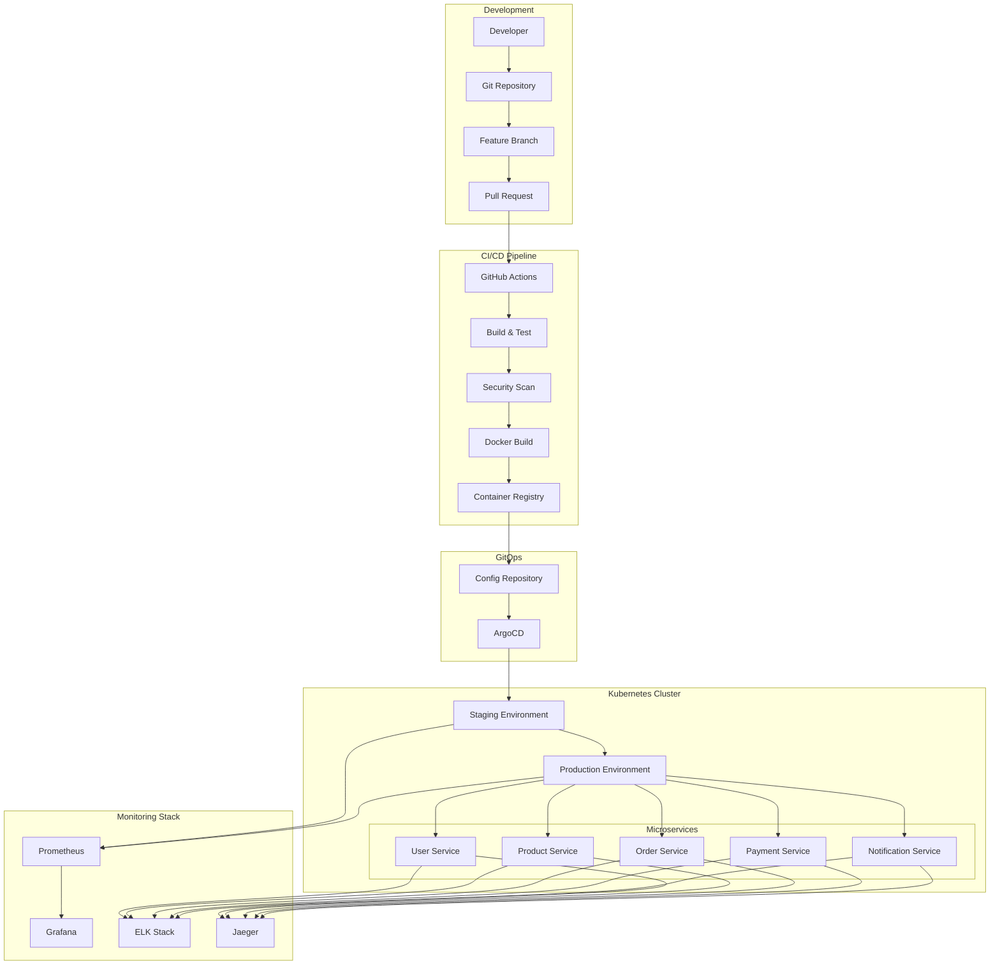

# Day 84: Week 12 Capstone - Complete DevOps Pipeline

## Project Overview
This capstone project integrates all Week 12 concepts into a comprehensive, production-ready e-commerce microservices platform with complete DevOps automation. The project demonstrates the full DevOps lifecycle from development to production deployment with monitoring and observability.

## Learning Objectives
- Integrate Docker containerization with Kubernetes orchestration
- Implement end-to-end CI/CD pipelines with security and quality gates
- Deploy comprehensive monitoring and observability stack
- Demonstrate GitOps workflows and infrastructure as code
- Master production deployment strategies and incident response

## Project Architecture

### System Overview



### Technology Stack

```yaml
# Complete Technology Stack
infrastructure:
  containerization: "Docker & Docker Compose"
  orchestration: "Kubernetes (EKS/GKE)"
  service_mesh: "Istio"
  networking: "Ingress NGINX, Network Policies"
  storage: "Persistent Volumes, StatefulSets"

cicd:
  vcs: "GitHub"
  ci_tool: "GitHub Actions"
  container_registry: "GitHub Container Registry"
  security_scanning: "Trivy, CodeQL, OWASP"
  quality_gates: "SonarQube"
  gitops: "ArgoCD"

monitoring:
  metrics: "Prometheus & AlertManager"
  visualization: "Grafana"
  logging: "ELK Stack (Elasticsearch, Logstash, Kibana)"
  tracing: "Jaeger with OpenTelemetry"
  apm: "Custom business metrics"

applications:
  backend: "Spring Boot 3.x, Java 17"
  databases: "PostgreSQL, Redis"
  messaging: "Apache Kafka"
  api_gateway: "Spring Cloud Gateway"
  service_discovery: "Kubernetes Service Discovery"
```

## Project Structure

```
ecommerce-platform/
├── services/
│   ├── user-service/
│   ├── product-service/
│   ├── order-service/
│   ├── payment-service/
│   ├── notification-service/
│   └── api-gateway/
├── infrastructure/
│   ├── docker/
│   ├── kubernetes/
│   ├── monitoring/
│   └── terraform/
├── ci-cd/
│   ├── .github/workflows/
│   ├── scripts/
│   └── quality-gates/
├── config/
│   ├── development/
│   ├── staging/
│   └── production/
└── docs/
    ├── architecture/
    ├── deployment/
    └── runbooks/
```

## Core Microservices Implementation

### User Service

```java
// day84-capstone/services/user-service/src/main/java/com/ecommerce/user/UserApplication.java
@SpringBootApplication
@EnableEurekaClient
@EnableJpaRepositories
@EnableOpenApi
public class UserApplication {
    public static void main(String[] args) {
        SpringApplication.run(UserApplication.class, args);
    }
    
    @Bean
    public RestTemplate restTemplate() {
        return new RestTemplate();
    }
    
    @Bean
    public PasswordEncoder passwordEncoder() {
        return new BCryptPasswordEncoder();
    }
}

@Entity
@Table(name = "users")
@Data
@NoArgsConstructor
@AllArgsConstructor
@Builder
public class User {
    @Id
    @GeneratedValue(strategy = GenerationType.UUID)
    private String id;
    
    @Column(unique = true)
    @Email
    private String email;
    
    @NotBlank
    private String firstName;
    
    @NotBlank
    private String lastName;
    
    @JsonIgnore
    private String password;
    
    @Enumerated(EnumType.STRING)
    private UserRole role;
    
    @Enumerated(EnumType.STRING)
    private UserStatus status;
    
    @CreationTimestamp
    private LocalDateTime createdAt;
    
    @UpdateTimestamp
    private LocalDateTime updatedAt;
    
    @Version
    private Long version;
}

@RestController
@RequestMapping("/api/v1/users")
@Validated
@Timed(name = "user.api.requests", description = "User API requests")
@Slf4j
public class UserController {
    
    private final UserService userService;
    private final MeterRegistry meterRegistry;
    
    public UserController(UserService userService, MeterRegistry meterRegistry) {
        this.userService = userService;
        this.meterRegistry = meterRegistry;
    }
    
    @PostMapping
    @Operation(summary = "Create new user")
    public ResponseEntity<UserResponse> createUser(@Valid @RequestBody CreateUserRequest request) {
        Timer.Sample sample = Timer.start(meterRegistry);
        
        try {
            User user = userService.createUser(request);
            UserResponse response = UserMapper.toResponse(user);
            
            sample.stop(Timer.builder("user.creation.duration")
                .tags("status", "success")
                .register(meterRegistry));
            
            meterRegistry.counter("user.created", "role", user.getRole().name()).increment();
            
            return ResponseEntity.status(HttpStatus.CREATED).body(response);
            
        } catch (Exception e) {
            sample.stop(Timer.builder("user.creation.duration")
                .tags("status", "error", "error_type", e.getClass().getSimpleName())
                .register(meterRegistry));
            throw e;
        }
    }
    
    @GetMapping("/{id}")
    @Operation(summary = "Get user by ID")
    public ResponseEntity<UserResponse> getUser(@PathVariable String id) {
        User user = userService.getUserById(id);
        return ResponseEntity.ok(UserMapper.toResponse(user));
    }
    
    @PutMapping("/{id}")
    @Operation(summary = "Update user")
    public ResponseEntity<UserResponse> updateUser(
            @PathVariable String id,
            @Valid @RequestBody UpdateUserRequest request) {
        User user = userService.updateUser(id, request);
        return ResponseEntity.ok(UserMapper.toResponse(user));
    }
    
    @GetMapping
    @Operation(summary = "Search users")
    public ResponseEntity<Page<UserResponse>> searchUsers(
            @RequestParam(defaultValue = "0") int page,
            @RequestParam(defaultValue = "20") int size,
            @RequestParam(required = false) String email,
            @RequestParam(required = false) UserRole role) {
        
        Pageable pageable = PageRequest.of(page, size);
        Page<User> users = userService.searchUsers(email, role, pageable);
        Page<UserResponse> responses = users.map(UserMapper::toResponse);
        
        return ResponseEntity.ok(responses);
    }
}

@Service
@Transactional
@Slf4j
public class UserService {
    
    private final UserRepository userRepository;
    private final PasswordEncoder passwordEncoder;
    private final ApplicationEventPublisher eventPublisher;
    private final RedisTemplate<String, Object> redisTemplate;
    
    public UserService(UserRepository userRepository,
                      PasswordEncoder passwordEncoder,
                      ApplicationEventPublisher eventPublisher,
                      RedisTemplate<String, Object> redisTemplate) {
        this.userRepository = userRepository;
        this.passwordEncoder = passwordEncoder;
        this.eventPublisher = eventPublisher;
        this.redisTemplate = redisTemplate;
    }
    
    @Counted(name = "user.service.operations", description = "User service operations")
    public User createUser(CreateUserRequest request) {
        // Check if user already exists
        if (userRepository.existsByEmail(request.getEmail())) {
            throw new UserAlreadyExistsException("User with email already exists: " + request.getEmail());
        }
        
        // Create user
        User user = User.builder()
            .email(request.getEmail())
            .firstName(request.getFirstName())
            .lastName(request.getLastName())
            .password(passwordEncoder.encode(request.getPassword()))
            .role(request.getRole())
            .status(UserStatus.ACTIVE)
            .build();
        
        User savedUser = userRepository.save(user);
        
        // Cache user data
        cacheUser(savedUser);
        
        // Publish event
        eventPublisher.publishEvent(new UserCreatedEvent(savedUser));
        
        log.info("User created successfully: {}", savedUser.getId());
        return savedUser;
    }
    
    @Cacheable(value = "users", key = "#id")
    public User getUserById(String id) {
        return userRepository.findById(id)
            .orElseThrow(() -> new UserNotFoundException("User not found: " + id));
    }
    
    public User updateUser(String id, UpdateUserRequest request) {
        User user = getUserById(id);
        
        user.setFirstName(request.getFirstName());
        user.setLastName(request.getLastName());
        
        User updatedUser = userRepository.save(user);
        
        // Update cache
        cacheUser(updatedUser);
        
        // Publish event
        eventPublisher.publishEvent(new UserUpdatedEvent(updatedUser));
        
        return updatedUser;
    }
    
    public Page<User> searchUsers(String email, UserRole role, Pageable pageable) {
        if (email != null && role != null) {
            return userRepository.findByEmailContainingAndRole(email, role, pageable);
        } else if (email != null) {
            return userRepository.findByEmailContaining(email, pageable);
        } else if (role != null) {
            return userRepository.findByRole(role, pageable);
        } else {
            return userRepository.findAll(pageable);
        }
    }
    
    private void cacheUser(User user) {
        redisTemplate.opsForValue().set("user:" + user.getId(), user, Duration.ofHours(1));
    }
}
```

### Order Service

```java
// day84-capstone/services/order-service/src/main/java/com/ecommerce/order/OrderService.java
@Entity
@Table(name = "orders")
@Data
@NoArgsConstructor
@AllArgsConstructor
@Builder
public class Order {
    @Id
    @GeneratedValue(strategy = GenerationType.UUID)
    private String id;
    
    @NotNull
    private String userId;
    
    @NotNull
    @Enumerated(EnumType.STRING)
    private OrderStatus status;
    
    @NotNull
    @DecimalMin("0.00")
    private BigDecimal totalAmount;
    
    @NotNull
    private String currency;
    
    @OneToMany(mappedBy = "order", cascade = CascadeType.ALL, fetch = FetchType.LAZY)
    private List<OrderItem> items = new ArrayList<>();
    
    @Embedded
    private ShippingAddress shippingAddress;
    
    @CreationTimestamp
    private LocalDateTime createdAt;
    
    @UpdateTimestamp
    private LocalDateTime updatedAt;
    
    @Version
    private Long version;
}

@RestController
@RequestMapping("/api/v1/orders")
@Validated
@Slf4j
public class OrderController {
    
    private final OrderService orderService;
    private final TracingService tracingService;
    
    @PostMapping
    @Timed(name = "order.creation", description = "Order creation time")
    public ResponseEntity<OrderResponse> createOrder(@Valid @RequestBody CreateOrderRequest request) {
        return tracingService.trace("order.create", () -> {
            tracingService.addSpanAttributes(Map.of(
                "user.id", request.getUserId(),
                "order.items.count", String.valueOf(request.getItems().size()),
                "order.amount", request.getTotalAmount().toString()
            ));
            
            Order order = orderService.createOrder(request);
            return ResponseEntity.status(HttpStatus.CREATED)
                .body(OrderMapper.toResponse(order));
        });
    }
    
    @GetMapping("/{id}")
    public ResponseEntity<OrderResponse> getOrder(@PathVariable String id) {
        Order order = orderService.getOrderById(id);
        return ResponseEntity.ok(OrderMapper.toResponse(order));
    }
    
    @PutMapping("/{id}/status")
    public ResponseEntity<OrderResponse> updateOrderStatus(
            @PathVariable String id,
            @Valid @RequestBody UpdateOrderStatusRequest request) {
        Order order = orderService.updateOrderStatus(id, request.getStatus());
        return ResponseEntity.ok(OrderMapper.toResponse(order));
    }
    
    @GetMapping("/user/{userId}")
    public ResponseEntity<Page<OrderResponse>> getUserOrders(
            @PathVariable String userId,
            @RequestParam(defaultValue = "0") int page,
            @RequestParam(defaultValue = "20") int size) {
        
        Pageable pageable = PageRequest.of(page, size, Sort.by("createdAt").descending());
        Page<Order> orders = orderService.getUserOrders(userId, pageable);
        Page<OrderResponse> responses = orders.map(OrderMapper::toResponse);
        
        return ResponseEntity.ok(responses);
    }
}

@Service
@Transactional
@Slf4j
public class OrderService {
    
    private final OrderRepository orderRepository;
    private final UserServiceClient userServiceClient;
    private final ProductServiceClient productServiceClient;
    private final PaymentServiceClient paymentServiceClient;
    private final KafkaTemplate<String, Object> kafkaTemplate;
    private final MeterRegistry meterRegistry;
    
    public Order createOrder(CreateOrderRequest request) {
        // Validate user exists
        UserResponse user = userServiceClient.getUser(request.getUserId());
        if (user == null) {
            throw new UserNotFoundException("User not found: " + request.getUserId());
        }
        
        // Validate and reserve products
        List<OrderItem> items = validateAndReserveProducts(request.getItems());
        
        // Calculate total amount
        BigDecimal totalAmount = items.stream()
            .map(item -> item.getPrice().multiply(BigDecimal.valueOf(item.getQuantity())))
            .reduce(BigDecimal.ZERO, BigDecimal::add);
        
        // Create order
        Order order = Order.builder()
            .userId(request.getUserId())
            .status(OrderStatus.PENDING)
            .totalAmount(totalAmount)
            .currency("USD")
            .items(items)
            .shippingAddress(request.getShippingAddress())
            .build();
        
        // Set order reference in items
        items.forEach(item -> item.setOrder(order));
        
        Order savedOrder = orderRepository.save(order);
        
        // Publish order created event
        publishOrderEvent("order.created", savedOrder);
        
        // Record metrics
        meterRegistry.counter("orders.created", 
            "user_tier", getUserTier(user.getRole())).increment();
        meterRegistry.counter("orders.amount")
            .increment(totalAmount.doubleValue());
        
        log.info("Order created successfully: {}", savedOrder.getId());
        return savedOrder;
    }
    
    public Order updateOrderStatus(String orderId, OrderStatus newStatus) {
        Order order = getOrderById(orderId);
        OrderStatus previousStatus = order.getStatus();
        
        // Validate status transition
        if (!isValidStatusTransition(previousStatus, newStatus)) {
            throw new InvalidOrderStatusTransitionException(
                String.format("Invalid status transition from %s to %s", previousStatus, newStatus));
        }
        
        order.setStatus(newStatus);
        Order updatedOrder = orderRepository.save(order);
        
        // Publish status change event
        publishOrderStatusChangeEvent(updatedOrder, previousStatus, newStatus);
        
        // Handle payment processing
        if (newStatus == OrderStatus.CONFIRMED) {
            initiatePayment(updatedOrder);
        }
        
        return updatedOrder;
    }
    
    private List<OrderItem> validateAndReserveProducts(List<CreateOrderItemRequest> itemRequests) {
        List<OrderItem> items = new ArrayList<>();
        
        for (CreateOrderItemRequest itemRequest : itemRequests) {
            // Get product details
            ProductResponse product = productServiceClient.getProduct(itemRequest.getProductId());
            if (product == null) {
                throw new ProductNotFoundException("Product not found: " + itemRequest.getProductId());
            }
            
            // Check availability
            if (product.getStock() < itemRequest.getQuantity()) {
                throw new InsufficientStockException(
                    String.format("Insufficient stock for product %s. Available: %d, Requested: %d",
                        itemRequest.getProductId(), product.getStock(), itemRequest.getQuantity()));
            }
            
            // Reserve product
            productServiceClient.reserveProduct(itemRequest.getProductId(), itemRequest.getQuantity());
            
            // Create order item
            OrderItem item = OrderItem.builder()
                .productId(itemRequest.getProductId())
                .productName(product.getName())
                .quantity(itemRequest.getQuantity())
                .price(product.getPrice())
                .build();
            
            items.add(item);
        }
        
        return items;
    }
    
    private void publishOrderEvent(String eventType, Order order) {
        OrderEvent event = OrderEvent.builder()
            .eventId(UUID.randomUUID().toString())
            .eventType(eventType)
            .orderId(order.getId())
            .userId(order.getUserId())
            .totalAmount(order.getTotalAmount())
            .status(order.getStatus())
            .timestamp(Instant.now())
            .build();
        
        kafkaTemplate.send("order-events", order.getId(), event);
    }
    
    private void initiatePayment(Order order) {
        PaymentRequest paymentRequest = PaymentRequest.builder()
            .orderId(order.getId())
            .amount(order.getTotalAmount())
            .currency(order.getCurrency())
            .userId(order.getUserId())
            .build();
        
        paymentServiceClient.processPayment(paymentRequest);
    }
}
```

### API Gateway

```java
// day84-capstone/services/api-gateway/src/main/java/com/ecommerce/gateway/GatewayApplication.java
@SpringBootApplication
@EnableEurekaClient
public class GatewayApplication {
    public static void main(String[] args) {
        SpringApplication.run(GatewayApplication.class, args);
    }
}

@Configuration
public class GatewayConfig {
    
    @Bean
    public RouteLocator customRouteLocator(RouteLocatorBuilder builder) {
        return builder.routes()
            // User Service Routes
            .route("user-service", r -> r
                .path("/api/v1/users/**")
                .filters(f -> f
                    .addRequestHeader("X-Gateway", "api-gateway")
                    .circuitBreaker(config -> config
                        .setName("user-service-cb")
                        .setFallbackUri("forward:/fallback/user-service"))
                    .retry(config -> config
                        .setRetries(3)
                        .setStatuses(HttpStatus.INTERNAL_SERVER_ERROR)
                        .setBackoff(Duration.ofMillis(100), Duration.ofMillis(1000), 2, true)))
                .uri("lb://user-service"))
            
            // Product Service Routes
            .route("product-service", r -> r
                .path("/api/v1/products/**")
                .filters(f -> f
                    .addRequestHeader("X-Gateway", "api-gateway")
                    .circuitBreaker(config -> config
                        .setName("product-service-cb")
                        .setFallbackUri("forward:/fallback/product-service"))
                    .requestRateLimiter(config -> config
                        .setRateLimiter(redisRateLimiter())
                        .setKeyResolver(userKeyResolver())))
                .uri("lb://product-service"))
            
            // Order Service Routes
            .route("order-service", r -> r
                .path("/api/v1/orders/**")
                .filters(f -> f
                    .addRequestHeader("X-Gateway", "api-gateway")
                    .circuitBreaker(config -> config
                        .setName("order-service-cb")
                        .setFallbackUri("forward:/fallback/order-service")))
                .uri("lb://order-service"))
            
            // Payment Service Routes
            .route("payment-service", r -> r
                .path("/api/v1/payments/**")
                .filters(f -> f
                    .addRequestHeader("X-Gateway", "api-gateway")
                    .circuitBreaker(config -> config
                        .setName("payment-service-cb")
                        .setFallbackUri("forward:/fallback/payment-service")))
                .uri("lb://payment-service"))
            
            .build();
    }
    
    @Bean
    public RedisRateLimiter redisRateLimiter() {
        return new RedisRateLimiter(10, 20, 1); // 10 requests per second, burst of 20
    }
    
    @Bean
    public KeyResolver userKeyResolver() {
        return exchange -> exchange.getRequest().getHeaders()
            .getFirst("X-User-ID") != null ? 
            Mono.just(exchange.getRequest().getHeaders().getFirst("X-User-ID")) :
            Mono.just("anonymous");
    }
}

@RestController
@RequestMapping("/fallback")
public class FallbackController {
    
    @GetMapping("/user-service")
    public ResponseEntity<Map<String, Object>> userServiceFallback() {
        return ResponseEntity.status(HttpStatus.SERVICE_UNAVAILABLE)
            .body(Map.of(
                "message", "User service is temporarily unavailable",
                "status", "SERVICE_UNAVAILABLE",
                "timestamp", Instant.now()
            ));
    }
    
    @GetMapping("/product-service")
    public ResponseEntity<Map<String, Object>> productServiceFallback() {
        return ResponseEntity.status(HttpStatus.SERVICE_UNAVAILABLE)
            .body(Map.of(
                "message", "Product service is temporarily unavailable",
                "status", "SERVICE_UNAVAILABLE",
                "timestamp", Instant.now()
            ));
    }
    
    @GetMapping("/order-service")
    public ResponseEntity<Map<String, Object>> orderServiceFallback() {
        return ResponseEntity.status(HttpStatus.SERVICE_UNAVAILABLE)
            .body(Map.of(
                "message", "Order service is temporarily unavailable",
                "status", "SERVICE_UNAVAILABLE",
                "timestamp", Instant.now()
            ));
    }
    
    @GetMapping("/payment-service")
    public ResponseEntity<Map<String, Object>> paymentServiceFallback() {
        return ResponseEntity.status(HttpStatus.SERVICE_UNAVAILABLE)
            .body(Map.of(
                "message", "Payment service is temporarily unavailable",
                "status", "SERVICE_UNAVAILABLE",
                "timestamp", Instant.now()
            ));
    }
}

@Component
@Slf4j
public class GatewayMetricsFilter implements GlobalFilter, Ordered {
    
    private final MeterRegistry meterRegistry;
    
    public GatewayMetricsFilter(MeterRegistry meterRegistry) {
        this.meterRegistry = meterRegistry;
    }
    
    @Override
    public Mono<Void> filter(ServerWebExchange exchange, GatewayFilterChain chain) {
        String path = exchange.getRequest().getPath().value();
        String method = exchange.getRequest().getMethod().name();
        
        Timer.Sample sample = Timer.start(meterRegistry);
        
        return chain.filter(exchange)
            .doFinally(signalType -> {
                String status = String.valueOf(exchange.getResponse().getStatusCode().value());
                
                sample.stop(Timer.builder("gateway.requests")
                    .tags("method", method, "path", extractService(path), "status", status)
                    .register(meterRegistry));
                
                meterRegistry.counter("gateway.requests.total",
                    "method", method, "service", extractService(path), "status", status)
                    .increment();
            });
    }
    
    private String extractService(String path) {
        if (path.startsWith("/api/v1/users")) return "user-service";
        if (path.startsWith("/api/v1/products")) return "product-service";
        if (path.startsWith("/api/v1/orders")) return "order-service";
        if (path.startsWith("/api/v1/payments")) return "payment-service";
        return "unknown";
    }
    
    @Override
    public int getOrder() {
        return -1; // High priority
    }
}
```

## Infrastructure as Code

### Docker Configuration

```dockerfile
# day84-capstone/services/user-service/Dockerfile
FROM openjdk:17-jre-slim as runtime

# Create non-root user
RUN groupadd -r appuser && useradd -r -g appuser appuser

# Install required packages
RUN apt-get update && apt-get install -y \
    curl \
    && rm -rf /var/lib/apt/lists/*

WORKDIR /app

# Copy application JAR
COPY target/user-service-*.jar app.jar

# Create logs directory
RUN mkdir -p /app/logs && chown -R appuser:appuser /app

# Switch to non-root user
USER appuser

# Expose ports
EXPOSE 8080 8081

# Health check
HEALTHCHECK --interval=30s --timeout=10s --start-period=30s --retries=3 \
    CMD curl -f http://localhost:8081/actuator/health || exit 1

# JVM configuration for containers
ENV JAVA_OPTS="-XX:+UseContainerSupport \
               -XX:MaxRAMPercentage=75.0 \
               -XX:+UseG1GC \
               -XX:+UseStringDeduplication \
               -Djava.security.egd=file:/dev/./urandom"

ENTRYPOINT ["sh", "-c", "java $JAVA_OPTS -jar app.jar"]
```

```yaml
# day84-capstone/infrastructure/docker/docker-compose.yml
version: '3.8'

services:
  # Databases
  postgres:
    image: postgres:15
    environment:
      POSTGRES_DB: ecommerce
      POSTGRES_USER: ecommerce
      POSTGRES_PASSWORD: password
    volumes:
      - postgres_data:/var/lib/postgresql/data
      - ./init-scripts:/docker-entrypoint-initdb.d
    ports:
      - "5432:5432"
    healthcheck:
      test: ["CMD-SHELL", "pg_isready -U ecommerce -d ecommerce"]
      interval: 10s
      timeout: 5s
      retries: 5

  redis:
    image: redis:7-alpine
    command: redis-server --appendonly yes
    volumes:
      - redis_data:/data
    ports:
      - "6379:6379"
    healthcheck:
      test: ["CMD", "redis-cli", "ping"]
      interval: 10s
      timeout: 3s
      retries: 3

  # Message Broker
  zookeeper:
    image: confluentinc/cp-zookeeper:latest
    environment:
      ZOOKEEPER_CLIENT_PORT: 2181
      ZOOKEEPER_TICK_TIME: 2000
    volumes:
      - zookeeper_data:/var/lib/zookeeper/data

  kafka:
    image: confluentinc/cp-kafka:latest
    depends_on:
      - zookeeper
    environment:
      KAFKA_BROKER_ID: 1
      KAFKA_ZOOKEEPER_CONNECT: zookeeper:2181
      KAFKA_ADVERTISED_LISTENERS: PLAINTEXT://kafka:9092
      KAFKA_OFFSETS_TOPIC_REPLICATION_FACTOR: 1
      KAFKA_AUTO_CREATE_TOPICS_ENABLE: 'true'
    volumes:
      - kafka_data:/var/lib/kafka/data
    ports:
      - "9092:9092"

  # Microservices
  user-service:
    build: 
      context: ../../services/user-service
      dockerfile: Dockerfile
    environment:
      - SPRING_PROFILES_ACTIVE=docker
      - DATABASE_URL=jdbc:postgresql://postgres:5432/ecommerce
      - REDIS_HOST=redis
      - KAFKA_BOOTSTRAP_SERVERS=kafka:9092
    depends_on:
      postgres:
        condition: service_healthy
      redis:
        condition: service_healthy
    ports:
      - "8081:8080"
      - "8091:8081"

  product-service:
    build: 
      context: ../../services/product-service
      dockerfile: Dockerfile
    environment:
      - SPRING_PROFILES_ACTIVE=docker
      - DATABASE_URL=jdbc:postgresql://postgres:5432/ecommerce
      - REDIS_HOST=redis
      - KAFKA_BOOTSTRAP_SERVERS=kafka:9092
    depends_on:
      postgres:
        condition: service_healthy
      redis:
        condition: service_healthy
    ports:
      - "8082:8080"
      - "8092:8081"

  order-service:
    build: 
      context: ../../services/order-service
      dockerfile: Dockerfile
    environment:
      - SPRING_PROFILES_ACTIVE=docker
      - DATABASE_URL=jdbc:postgresql://postgres:5432/ecommerce
      - REDIS_HOST=redis
      - KAFKA_BOOTSTRAP_SERVERS=kafka:9092
    depends_on:
      postgres:
        condition: service_healthy
      redis:
        condition: service_healthy
    ports:
      - "8083:8080"
      - "8093:8081"

  payment-service:
    build: 
      context: ../../services/payment-service
      dockerfile: Dockerfile
    environment:
      - SPRING_PROFILES_ACTIVE=docker
      - DATABASE_URL=jdbc:postgresql://postgres:5432/ecommerce
      - REDIS_HOST=redis
      - KAFKA_BOOTSTRAP_SERVERS=kafka:9092
    depends_on:
      postgres:
        condition: service_healthy
      redis:
        condition: service_healthy
    ports:
      - "8084:8080"
      - "8094:8081"

  api-gateway:
    build: 
      context: ../../services/api-gateway
      dockerfile: Dockerfile
    environment:
      - SPRING_PROFILES_ACTIVE=docker
      - REDIS_HOST=redis
    depends_on:
      - user-service
      - product-service
      - order-service
      - payment-service
    ports:
      - "8080:8080"
      - "8090:8081"

volumes:
  postgres_data:
  redis_data:
  kafka_data:
  zookeeper_data:

networks:
  default:
    driver: bridge
```

### Kubernetes Manifests

```yaml
# day84-capstone/infrastructure/kubernetes/namespaces.yaml
apiVersion: v1
kind: Namespace
metadata:
  name: ecommerce-staging
  labels:
    name: ecommerce-staging
    environment: staging
    istio-injection: enabled

---
apiVersion: v1
kind: Namespace
metadata:
  name: ecommerce-production
  labels:
    name: ecommerce-production
    environment: production
    istio-injection: enabled

---
# day84-capstone/infrastructure/kubernetes/user-service.yaml
apiVersion: v1
kind: ConfigMap
metadata:
  name: user-service-config
  namespace: ecommerce-production
data:
  SPRING_PROFILES_ACTIVE: "kubernetes,production"
  LOGGING_LEVEL_ROOT: "INFO"
  MANAGEMENT_ENDPOINTS_WEB_EXPOSURE_INCLUDE: "health,info,metrics,prometheus"
  REDIS_HOST: "redis-service"
  KAFKA_BOOTSTRAP_SERVERS: "kafka-service:9092"

---
apiVersion: v1
kind: Secret
metadata:
  name: user-service-secrets
  namespace: ecommerce-production
type: Opaque
data:
  DATABASE_URL: amRiYzpwb3N0Z3Jlc3FsOi8vcG9zdGdyZXMtc2VydmljZTo1NDMyL2Vjb21tZXJjZQ==
  DATABASE_USERNAME: ZWNvbW1lcmNl
  DATABASE_PASSWORD: cGFzc3dvcmQ=
  JWT_SECRET: eW91ci1qd3Qtc2VjcmV0LWtleS12ZXJ5LWxvbmctYW5kLXNlY3VyZQ==

---
apiVersion: apps/v1
kind: Deployment
metadata:
  name: user-service
  namespace: ecommerce-production
  labels:
    app: user-service
    version: v1
spec:
  replicas: 3
  strategy:
    type: RollingUpdate
    rollingUpdate:
      maxUnavailable: 1
      maxSurge: 1
  selector:
    matchLabels:
      app: user-service
  template:
    metadata:
      labels:
        app: user-service
        version: v1
      annotations:
        prometheus.io/scrape: "true"
        prometheus.io/path: "/actuator/prometheus"
        prometheus.io/port: "8081"
    spec:
      serviceAccountName: ecommerce-app-sa
      containers:
      - name: user-service
        image: ghcr.io/company/user-service:latest
        imagePullPolicy: IfNotPresent
        ports:
        - containerPort: 8080
          name: http
        - containerPort: 8081
          name: management
        env:
        - name: KUBERNETES_NAMESPACE
          valueFrom:
            fieldRef:
              fieldPath: metadata.namespace
        - name: POD_NAME
          valueFrom:
            fieldRef:
              fieldPath: metadata.name
        - name: POD_IP
          valueFrom:
            fieldRef:
              fieldPath: status.podIP
        envFrom:
        - configMapRef:
            name: user-service-config
        - secretRef:
            name: user-service-secrets
        resources:
          requests:
            memory: "512Mi"
            cpu: "500m"
          limits:
            memory: "1Gi"
            cpu: "1000m"
        livenessProbe:
          httpGet:
            path: /actuator/health/liveness
            port: 8081
          initialDelaySeconds: 60
          periodSeconds: 30
          timeoutSeconds: 10
          failureThreshold: 3
        readinessProbe:
          httpGet:
            path: /actuator/health/readiness
            port: 8081
          initialDelaySeconds: 20
          periodSeconds: 10
          timeoutSeconds: 5
          failureThreshold: 3
        startupProbe:
          httpGet:
            path: /actuator/health
            port: 8081
          initialDelaySeconds: 30
          periodSeconds: 10
          timeoutSeconds: 5
          failureThreshold: 6
        volumeMounts:
        - name: tmp-volume
          mountPath: /tmp
        securityContext:
          allowPrivilegeEscalation: false
          runAsNonRoot: true
          runAsUser: 1001
          capabilities:
            drop:
            - ALL
      volumes:
      - name: tmp-volume
        emptyDir: {}
      securityContext:
        runAsNonRoot: true
        runAsUser: 1001
        fsGroup: 1001
      affinity:
        podAntiAffinity:
          preferredDuringSchedulingIgnoredDuringExecution:
          - weight: 100
            podAffinityTerm:
              labelSelector:
                matchExpressions:
                - key: app
                  operator: In
                  values:
                  - user-service
              topologyKey: kubernetes.io/hostname

---
apiVersion: v1
kind: Service
metadata:
  name: user-service
  namespace: ecommerce-production
  labels:
    app: user-service
spec:
  selector:
    app: user-service
  ports:
  - name: http
    port: 80
    targetPort: 8080
    protocol: TCP
  - name: management
    port: 8081
    targetPort: 8081
    protocol: TCP
  type: ClusterIP

---
apiVersion: autoscaling/v2
kind: HorizontalPodAutoscaler
metadata:
  name: user-service-hpa
  namespace: ecommerce-production
spec:
  scaleTargetRef:
    apiVersion: apps/v1
    kind: Deployment
    name: user-service
  minReplicas: 3
  maxReplicas: 10
  metrics:
  - type: Resource
    resource:
      name: cpu
      target:
        type: Utilization
        averageUtilization: 70
  - type: Resource
    resource:
      name: memory
      target:
        type: Utilization
        averageUtilization: 80
  behavior:
    scaleUp:
      stabilizationWindowSeconds: 60
      policies:
      - type: Percent
        value: 50
        periodSeconds: 60
    scaleDown:
      stabilizationWindowSeconds: 300
      policies:
      - type: Percent
        value: 10
        periodSeconds: 60

---
apiVersion: policy/v1
kind: PodDisruptionBudget
metadata:
  name: user-service-pdb
  namespace: ecommerce-production
spec:
  minAvailable: 2
  selector:
    matchLabels:
      app: user-service
```

### Ingress Configuration

```yaml
# day84-capstone/infrastructure/kubernetes/ingress.yaml
apiVersion: networking.k8s.io/v1
kind: Ingress
metadata:
  name: ecommerce-ingress
  namespace: ecommerce-production
  annotations:
    kubernetes.io/ingress.class: nginx
    nginx.ingress.kubernetes.io/rate-limit: "1000"
    nginx.ingress.kubernetes.io/rate-limit-window: "1m"
    nginx.ingress.kubernetes.io/ssl-redirect: "true"
    nginx.ingress.kubernetes.io/force-ssl-redirect: "true"
    nginx.ingress.kubernetes.io/proxy-body-size: "10m"
    nginx.ingress.kubernetes.io/proxy-connect-timeout: "30"
    nginx.ingress.kubernetes.io/proxy-send-timeout: "30"
    nginx.ingress.kubernetes.io/proxy-read-timeout: "30"
    nginx.ingress.kubernetes.io/configuration-snippet: |
      more_set_headers "X-Frame-Options: DENY";
      more_set_headers "X-Content-Type-Options: nosniff";
      more_set_headers "X-XSS-Protection: 1; mode=block";
      more_set_headers "Strict-Transport-Security: max-age=31536000; includeSubDomains";
    cert-manager.io/cluster-issuer: letsencrypt-prod
spec:
  tls:
  - hosts:
    - api.ecommerce.company.com
    - admin.ecommerce.company.com
    secretName: ecommerce-tls
  rules:
  - host: api.ecommerce.company.com
    http:
      paths:
      - path: /api/v1/users
        pathType: Prefix
        backend:
          service:
            name: user-service
            port:
              number: 80
      - path: /api/v1/products
        pathType: Prefix
        backend:
          service:
            name: product-service
            port:
              number: 80
      - path: /api/v1/orders
        pathType: Prefix
        backend:
          service:
            name: order-service
            port:
              number: 80
      - path: /api/v1/payments
        pathType: Prefix
        backend:
          service:
            name: payment-service
            port:
              number: 80
      - path: /
        pathType: Prefix
        backend:
          service:
            name: api-gateway
            port:
              number: 80
  - host: admin.ecommerce.company.com
    http:
      paths:
      - path: /
        pathType: Prefix
        backend:
          service:
            name: admin-dashboard
            port:
              number: 80
```

## CI/CD Pipeline Implementation

### GitHub Actions Workflow

```yaml
# day84-capstone/.github/workflows/ci-cd.yml
name: E-commerce Platform CI/CD

on:
  push:
    branches: [main, develop]
    paths: ['services/**', 'infrastructure/**']
  pull_request:
    branches: [main]

env:
  REGISTRY: ghcr.io
  IMAGE_PREFIX: company/ecommerce

jobs:
  detect-changes:
    runs-on: ubuntu-latest
    outputs:
      services: ${{ steps.changes.outputs.services }}
      infrastructure: ${{ steps.changes.outputs.infrastructure }}
    steps:
    - uses: actions/checkout@v4
    - uses: dorny/paths-filter@v2
      id: changes
      with:
        filters: |
          services:
            - 'services/**'
          infrastructure:
            - 'infrastructure/**'
          user-service:
            - 'services/user-service/**'
          product-service:
            - 'services/product-service/**'
          order-service:
            - 'services/order-service/**'
          payment-service:
            - 'services/payment-service/**'
          api-gateway:
            - 'services/api-gateway/**'

  test-services:
    needs: detect-changes
    if: needs.detect-changes.outputs.services == 'true'
    runs-on: ubuntu-latest
    
    services:
      postgres:
        image: postgres:15
        env:
          POSTGRES_PASSWORD: postgres
          POSTGRES_DB: testdb
        options: >-
          --health-cmd pg_isready
          --health-interval 10s
          --health-timeout 5s
          --health-retries 5
        ports:
          - 5432:5432
      
      redis:
        image: redis:7
        options: >-
          --health-cmd "redis-cli ping"
          --health-interval 10s
          --health-timeout 5s
          --health-retries 5
        ports:
          - 6379:6379
    
    strategy:
      matrix:
        service: [user-service, product-service, order-service, payment-service, api-gateway]
    
    steps:
    - uses: actions/checkout@v4
    
    - name: Set up JDK 17
      uses: actions/setup-java@v4
      with:
        java-version: '17'
        distribution: 'temurin'
        cache: maven
    
    - name: Run tests for ${{ matrix.service }}
      working-directory: services/${{ matrix.service }}
      run: |
        mvn clean verify \
          -Dspring.profiles.active=test \
          -Dspring.datasource.url=jdbc:postgresql://localhost:5432/testdb \
          -Dspring.redis.host=localhost
    
    - name: Generate test report
      uses: dorny/test-reporter@v1
      if: success() || failure()
      with:
        name: Test Results - ${{ matrix.service }}
        path: services/${{ matrix.service }}/target/surefire-reports/*.xml
        reporter: java-junit
    
    - name: Upload coverage to Codecov
      uses: codecov/codecov-action@v3
      with:
        file: ./services/${{ matrix.service }}/target/site/jacoco/jacoco.xml
        flags: ${{ matrix.service }}

  security-scan:
    needs: detect-changes
    if: needs.detect-changes.outputs.services == 'true'
    runs-on: ubuntu-latest
    permissions:
      security-events: write
    
    strategy:
      matrix:
        service: [user-service, product-service, order-service, payment-service, api-gateway]
    
    steps:
    - uses: actions/checkout@v4
    
    - name: Set up JDK 17
      uses: actions/setup-java@v4
      with:
        java-version: '17'
        distribution: 'temurin'
        cache: maven
    
    - name: Run OWASP Dependency Check
      working-directory: services/${{ matrix.service }}
      run: |
        mvn org.owasp:dependency-check-maven:check \
          -DfailBuildOnCVSS=7 \
          -Dformats=HTML,JSON,SARIF
    
    - name: Upload SARIF results
      uses: github/codeql-action/upload-sarif@v2
      with:
        sarif_file: services/${{ matrix.service }}/target/dependency-check-report.sarif
    
    - name: Run CodeQL Analysis
      uses: github/codeql-action/analyze@v2
      with:
        languages: java
        queries: security-and-quality

  build-and-push:
    needs: [test-services, security-scan]
    runs-on: ubuntu-latest
    if: github.ref == 'refs/heads/main' || github.ref == 'refs/heads/develop'
    permissions:
      contents: read
      packages: write
    
    strategy:
      matrix:
        service: [user-service, product-service, order-service, payment-service, api-gateway]
    
    outputs:
      user-service-image: ${{ steps.images.outputs.user-service }}
      product-service-image: ${{ steps.images.outputs.product-service }}
      order-service-image: ${{ steps.images.outputs.order-service }}
      payment-service-image: ${{ steps.images.outputs.payment-service }}
      api-gateway-image: ${{ steps.images.outputs.api-gateway }}
    
    steps:
    - uses: actions/checkout@v4
    
    - name: Set up JDK 17
      uses: actions/setup-java@v4
      with:
        java-version: '17'
        distribution: 'temurin'
        cache: maven
    
    - name: Build application
      working-directory: services/${{ matrix.service }}
      run: mvn clean package -DskipTests
    
    - name: Set up Docker Buildx
      uses: docker/setup-buildx-action@v3
    
    - name: Log in to Container Registry
      uses: docker/login-action@v3
      with:
        registry: ${{ env.REGISTRY }}
        username: ${{ github.actor }}
        password: ${{ secrets.GITHUB_TOKEN }}
    
    - name: Extract metadata
      id: meta
      uses: docker/metadata-action@v5
      with:
        images: ${{ env.REGISTRY }}/${{ env.IMAGE_PREFIX }}-${{ matrix.service }}
        tags: |
          type=ref,event=branch
          type=sha,prefix=sha-
          type=raw,value=latest,enable={{is_default_branch}}
    
    - name: Build and push Docker image
      uses: docker/build-push-action@v5
      with:
        context: services/${{ matrix.service }}
        platforms: linux/amd64,linux/arm64
        push: true
        tags: ${{ steps.meta.outputs.tags }}
        labels: ${{ steps.meta.outputs.labels }}
        cache-from: type=gha
        cache-to: type=gha,mode=max
        build-args: |
          BUILD_VERSION=${{ github.sha }}
          BUILD_DATE=${{ github.event.head_commit.timestamp }}
    
    - name: Run container security scan
      uses: aquasecurity/trivy-action@master
      with:
        image-ref: ${{ env.REGISTRY }}/${{ env.IMAGE_PREFIX }}-${{ matrix.service }}:${{ github.sha }}
        format: 'sarif'
        output: 'trivy-results-${{ matrix.service }}.sarif'
    
    - name: Upload Trivy scan results
      uses: github/codeql-action/upload-sarif@v2
      with:
        sarif_file: 'trivy-results-${{ matrix.service }}.sarif'
    
    - name: Set image outputs
      id: images
      run: |
        echo "${{ matrix.service }}=${{ env.REGISTRY }}/${{ env.IMAGE_PREFIX }}-${{ matrix.service }}:${{ github.sha }}" >> $GITHUB_OUTPUT

  deploy-staging:
    needs: build-and-push
    runs-on: ubuntu-latest
    environment: staging
    if: github.ref == 'refs/heads/develop'
    
    steps:
    - uses: actions/checkout@v4
    
    - name: Configure AWS credentials
      uses: aws-actions/configure-aws-credentials@v4
      with:
        aws-access-key-id: ${{ secrets.AWS_ACCESS_KEY_ID }}
        aws-secret-access-key: ${{ secrets.AWS_SECRET_ACCESS_KEY }}
        aws-region: us-west-2
    
    - name: Deploy to EKS Staging
      run: |
        aws eks update-kubeconfig --name staging-cluster --region us-west-2
        
        # Update image tags for all services
        kubectl set image deployment/user-service \
          user-service=${{ needs.build-and-push.outputs.user-service-image }} \
          -n ecommerce-staging
        
        kubectl set image deployment/product-service \
          product-service=${{ needs.build-and-push.outputs.product-service-image }} \
          -n ecommerce-staging
        
        kubectl set image deployment/order-service \
          order-service=${{ needs.build-and-push.outputs.order-service-image }} \
          -n ecommerce-staging
        
        kubectl set image deployment/payment-service \
          payment-service=${{ needs.build-and-push.outputs.payment-service-image }} \
          -n ecommerce-staging
        
        kubectl set image deployment/api-gateway \
          api-gateway=${{ needs.build-and-push.outputs.api-gateway-image }} \
          -n ecommerce-staging
        
        # Wait for rollout to complete
        kubectl rollout status deployment/user-service -n ecommerce-staging --timeout=300s
        kubectl rollout status deployment/product-service -n ecommerce-staging --timeout=300s
        kubectl rollout status deployment/order-service -n ecommerce-staging --timeout=300s
        kubectl rollout status deployment/payment-service -n ecommerce-staging --timeout=300s
        kubectl rollout status deployment/api-gateway -n ecommerce-staging --timeout=300s
    
    - name: Run integration tests
      run: |
        # Wait for services to be ready
        sleep 60
        
        # Run health checks
        kubectl exec deployment/api-gateway -n ecommerce-staging -- \
          curl -f http://localhost:8080/actuator/health
        
        # Run smoke tests
        curl -f https://staging-api.ecommerce.company.com/actuator/health
        
        # Run basic API tests
        ./scripts/run-integration-tests.sh staging

  deploy-production:
    needs: [build-and-push, deploy-staging]
    runs-on: ubuntu-latest
    environment: production
    if: github.ref == 'refs/heads/main'
    
    steps:
    - uses: actions/checkout@v4
    
    - name: Configure AWS credentials
      uses: aws-actions/configure-aws-credentials@v4
      with:
        aws-access-key-id: ${{ secrets.AWS_ACCESS_KEY_ID }}
        aws-secret-access-key: ${{ secrets.AWS_SECRET_ACCESS_KEY }}
        aws-region: us-west-2
    
    - name: Blue-Green Deployment to Production
      run: |
        aws eks update-kubeconfig --name production-cluster --region us-west-2
        
        # Deploy to green environment
        ./scripts/blue-green-deploy.sh \
          --environment=production \
          --user-service-image=${{ needs.build-and-push.outputs.user-service-image }} \
          --product-service-image=${{ needs.build-and-push.outputs.product-service-image }} \
          --order-service-image=${{ needs.build-and-push.outputs.order-service-image }} \
          --payment-service-image=${{ needs.build-and-push.outputs.payment-service-image }} \
          --api-gateway-image=${{ needs.build-and-push.outputs.api-gateway-image }}
    
    - name: Update GitOps repository
      run: |
        # Clone config repository
        git clone https://${{ secrets.GITOPS_TOKEN }}@github.com/company/ecommerce-config.git
        cd ecommerce-config
        
        # Update image tags
        sed -i "s|user-service:.*|user-service:${{ github.sha }}|g" production/user-service/kustomization.yaml
        sed -i "s|product-service:.*|product-service:${{ github.sha }}|g" production/product-service/kustomization.yaml
        sed -i "s|order-service:.*|order-service:${{ github.sha }}|g" production/order-service/kustomization.yaml
        sed -i "s|payment-service:.*|payment-service:${{ github.sha }}|g" production/payment-service/kustomization.yaml
        sed -i "s|api-gateway:.*|api-gateway:${{ github.sha }}|g" production/api-gateway/kustomization.yaml
        
        # Commit and push changes
        git config --local user.email "action@github.com"
        git config --local user.name "GitHub Action"
        git add .
        git commit -m "Update production images to ${{ github.sha }}" || exit 0
        git push
    
    - name: Create GitHub Release
      if: startsWith(github.ref, 'refs/tags/')
      uses: actions/create-release@v1
      env:
        GITHUB_TOKEN: ${{ secrets.GITHUB_TOKEN }}
      with:
        tag_name: ${{ github.ref }}
        release_name: E-commerce Platform ${{ github.ref }}
        body: |
          ## Deployed Images
          - User Service: ${{ needs.build-and-push.outputs.user-service-image }}
          - Product Service: ${{ needs.build-and-push.outputs.product-service-image }}
          - Order Service: ${{ needs.build-and-push.outputs.order-service-image }}
          - Payment Service: ${{ needs.build-and-push.outputs.payment-service-image }}
          - API Gateway: ${{ needs.build-and-push.outputs.api-gateway-image }}
          
          ## Changes
          ${{ github.event.head_commit.message }}
        draft: false
        prerelease: false
    
    - name: Notify deployment
      uses: 8398a7/action-slack@v3
      with:
        status: ${{ job.status }}
        channel: '#deployments'
        webhook_url: ${{ secrets.SLACK_WEBHOOK }}
        custom_payload: |
          {
            attachments: [{
              color: '${{ job.status }}' === 'success' ? 'good' : 'danger',
              blocks: [{
                type: 'section',
                text: {
                  type: 'mrkdwn',
                  text: `🚀 Production deployment ${{ job.status }} for commit \`${{ github.sha }}\``
                }
              }]
            }]
          }
```

### Blue-Green Deployment Script

```bash
#!/bin/bash
# day84-capstone/scripts/blue-green-deploy.sh

set -e

ENVIRONMENT=""
USER_SERVICE_IMAGE=""
PRODUCT_SERVICE_IMAGE=""
ORDER_SERVICE_IMAGE=""
PAYMENT_SERVICE_IMAGE=""
API_GATEWAY_IMAGE=""

# Parse command line arguments
while [[ $# -gt 0 ]]; do
  case $1 in
    --environment=*)
      ENVIRONMENT="${1#*=}"
      shift
      ;;
    --user-service-image=*)
      USER_SERVICE_IMAGE="${1#*=}"
      shift
      ;;
    --product-service-image=*)
      PRODUCT_SERVICE_IMAGE="${1#*=}"
      shift
      ;;
    --order-service-image=*)
      ORDER_SERVICE_IMAGE="${1#*=}"
      shift
      ;;
    --payment-service-image=*)
      PAYMENT_SERVICE_IMAGE="${1#*=}"
      shift
      ;;
    --api-gateway-image=*)
      API_GATEWAY_IMAGE="${1#*=}"
      shift
      ;;
    *)
      echo "Unknown parameter: $1"
      exit 1
      ;;
  esac
done

# Validate required parameters
if [[ -z "$ENVIRONMENT" || -z "$USER_SERVICE_IMAGE" ]]; then
  echo "Usage: $0 --environment=<env> --user-service-image=<image> [other images...]"
  exit 1
fi

NAMESPACE="ecommerce-${ENVIRONMENT}"
GREEN_SUFFIX="-green"

echo "Starting blue-green deployment to ${ENVIRONMENT}..."

# Function to deploy service to green environment
deploy_service_green() {
  local service_name=$1
  local image=$2
  
  echo "Deploying ${service_name} to green environment..."
  
  # Update green deployment
  kubectl set image deployment/${service_name}${GREEN_SUFFIX} \
    ${service_name}=${image} \
    -n ${NAMESPACE}
  
  # Wait for rollout to complete
  kubectl rollout status deployment/${service_name}${GREEN_SUFFIX} \
    -n ${NAMESPACE} --timeout=600s
  
  # Health check
  kubectl wait --for=condition=available --timeout=300s \
    deployment/${service_name}${GREEN_SUFFIX} -n ${NAMESPACE}
}

# Function to switch traffic to green
switch_traffic() {
  local service_name=$1
  
  echo "Switching traffic for ${service_name} to green..."
  
  # Update service selector to point to green deployment
  kubectl patch service ${service_name} -n ${NAMESPACE} \
    -p '{"spec":{"selector":{"version":"green"}}}'
  
  echo "Traffic switched for ${service_name}"
}

# Function to cleanup blue deployment
cleanup_blue() {
  local service_name=$1
  
  echo "Scaling down blue deployment for ${service_name}..."
  kubectl scale deployment ${service_name} --replicas=0 -n ${NAMESPACE}
}

# Deploy all services to green environment
deploy_service_green "user-service" "${USER_SERVICE_IMAGE}"
deploy_service_green "product-service" "${PRODUCT_SERVICE_IMAGE}"
deploy_service_green "order-service" "${ORDER_SERVICE_IMAGE}"
deploy_service_green "payment-service" "${PAYMENT_SERVICE_IMAGE}"
deploy_service_green "api-gateway" "${API_GATEWAY_IMAGE}"

echo "All services deployed to green environment. Running health checks..."

# Wait for all services to be healthy
sleep 60

# Run comprehensive health checks
echo "Running health checks..."
for service in user-service product-service order-service payment-service api-gateway; do
  echo "Checking health of ${service}..."
  kubectl exec deployment/${service}${GREEN_SUFFIX} -n ${NAMESPACE} -- \
    curl -f http://localhost:8081/actuator/health || {
      echo "Health check failed for ${service}"
      exit 1
    }
done

# Run smoke tests
echo "Running smoke tests..."
if [[ "${ENVIRONMENT}" == "production" ]]; then
  curl -f https://api.ecommerce.company.com/actuator/health || {
    echo "External health check failed"
    exit 1
  }
fi

echo "Health checks passed. Switching traffic to green environment..."

# Switch traffic for all services
switch_traffic "user-service"
switch_traffic "product-service"
switch_traffic "order-service"
switch_traffic "payment-service"
switch_traffic "api-gateway"

echo "Traffic switched. Waiting for stabilization..."
sleep 120

echo "Running post-deployment verification..."
# Run final verification tests
./scripts/verify-deployment.sh ${ENVIRONMENT}

echo "Cleaning up blue deployments..."
cleanup_blue "user-service"
cleanup_blue "product-service"
cleanup_blue "order-service"
cleanup_blue "payment-service"
cleanup_blue "api-gateway"

echo "Blue-green deployment completed successfully!"

# Send metrics to monitoring system
curl -X POST "${METRICS_ENDPOINT}/deployments" \
  -H "Authorization: Bearer ${METRICS_TOKEN}" \
  -H "Content-Type: application/json" \
  -d "{
    \"environment\": \"${ENVIRONMENT}\",
    \"commit_sha\": \"${GITHUB_SHA}\",
    \"timestamp\": \"$(date -u +%Y-%m-%dT%H:%M:%SZ)\",
    \"deployment_type\": \"blue-green\",
    \"status\": \"success\"
  }" || echo "Failed to send deployment metrics"

echo "Deployment completed and metrics sent!"
```

## Monitoring and Observability

### Complete Monitoring Stack

```yaml
# day84-capstone/infrastructure/monitoring/monitoring-stack.yaml
apiVersion: v1
kind: Namespace
metadata:
  name: monitoring
  labels:
    name: monitoring

---
# Prometheus Configuration
apiVersion: v1
kind: ConfigMap
metadata:
  name: prometheus-config
  namespace: monitoring
data:
  prometheus.yml: |
    global:
      scrape_interval: 15s
      evaluation_interval: 15s
    
    rule_files:
      - "/etc/prometheus/rules/*.yml"
    
    alerting:
      alertmanagers:
        - static_configs:
            - targets:
              - alertmanager:9093
    
    scrape_configs:
      # E-commerce services
      - job_name: 'ecommerce-services'
        kubernetes_sd_configs:
          - role: pod
            namespaces:
              names:
                - ecommerce-production
                - ecommerce-staging
        relabel_configs:
          - source_labels: [__meta_kubernetes_pod_annotation_prometheus_io_scrape]
            action: keep
            regex: true
          - source_labels: [__meta_kubernetes_pod_annotation_prometheus_io_path]
            action: replace
            target_label: __metrics_path__
            regex: (.+)
          - source_labels: [__address__, __meta_kubernetes_pod_annotation_prometheus_io_port]
            action: replace
            regex: ([^:]+)(?::\d+)?;(\d+)
            replacement: $1:$2
            target_label: __address__
          - action: labelmap
            regex: __meta_kubernetes_pod_label_(.+)
          - source_labels: [__meta_kubernetes_namespace]
            action: replace
            target_label: kubernetes_namespace
          - source_labels: [__meta_kubernetes_pod_name]
            action: replace
            target_label: kubernetes_pod_name
      
      # Infrastructure monitoring
      - job_name: 'kubernetes-nodes'
        kubernetes_sd_configs:
          - role: node
        relabel_configs:
          - action: labelmap
            regex: __meta_kubernetes_node_label_(.+)
          - target_label: __address__
            replacement: kubernetes.default.svc:443
          - source_labels: [__meta_kubernetes_node_name]
            regex: (.+)
            target_label: __metrics_path__
            replacement: /api/v1/nodes/${1}/proxy/metrics
      
      # Database monitoring
      - job_name: 'postgres-exporter'
        static_configs:
          - targets: ['postgres-exporter:9187']
      
      - job_name: 'redis-exporter'
        static_configs:
          - targets: ['redis-exporter:9121']

  ecommerce-alerts.yml: |
    groups:
    - name: ecommerce.alerts
      rules:
      # Service availability
      - alert: ServiceDown
        expr: up{job="ecommerce-services"} == 0
        for: 1m
        labels:
          severity: critical
          service: "{{ $labels.app }}"
        annotations:
          summary: "Service {{ $labels.app }} is down"
          description: "Service {{ $labels.app }} in namespace {{ $labels.kubernetes_namespace }} has been down for more than 1 minute"
      
      # High error rate
      - alert: HighErrorRate
        expr: |
          (
            sum(rate(http_server_requests_seconds_count{status=~"5.."}[5m])) by (app, kubernetes_namespace)
            /
            sum(rate(http_server_requests_seconds_count[5m])) by (app, kubernetes_namespace)
          ) > 0.05
        for: 2m
        labels:
          severity: warning
          service: "{{ $labels.app }}"
        annotations:
          summary: "High error rate for {{ $labels.app }}"
          description: "Error rate for {{ $labels.app }} is {{ $value | humanizePercentage }}"
      
      # High response time
      - alert: HighResponseTime
        expr: |
          histogram_quantile(0.95,
            sum(rate(http_server_requests_seconds_bucket[5m])) by (app, kubernetes_namespace, le)
          ) > 2.0
        for: 5m
        labels:
          severity: warning
          service: "{{ $labels.app }}"
        annotations:
          summary: "High response time for {{ $labels.app }}"
          description: "95th percentile response time for {{ $labels.app }} is {{ $value }}s"
      
      # Business metrics
      - alert: OrderProcessingBacklog
        expr: orders_queue_size > 1000
        for: 5m
        labels:
          severity: critical
          service: order-processing
        annotations:
          summary: "Order processing backlog"
          description: "Order queue has {{ $value }} pending orders"
      
      - alert: PaymentFailureSpike
        expr: |
          (
            sum(rate(payments_processed_total{status="failed"}[5m]))
            /
            sum(rate(payments_processed_total[5m]))
          ) > 0.1
        for: 3m
        labels:
          severity: critical
          service: payment-processing
        annotations:
          summary: "Payment failure rate spike"
          description: "Payment failure rate is {{ $value | humanizePercentage }}"

---
# Grafana Dashboard ConfigMap
apiVersion: v1
kind: ConfigMap
metadata:
  name: ecommerce-dashboard
  namespace: monitoring
data:
  ecommerce-overview.json: |
    {
      "dashboard": {
        "id": null,
        "title": "E-commerce Platform Overview",
        "tags": ["ecommerce", "microservices"],
        "timezone": "browser",
        "refresh": "30s",
        "time": {
          "from": "now-1h",
          "to": "now"
        },
        "panels": [
          {
            "id": 1,
            "title": "Request Rate by Service",
            "type": "graph",
            "targets": [
              {
                "expr": "sum(rate(http_server_requests_seconds_count[5m])) by (app)",
                "legendFormat": "{{app}}"
              }
            ],
            "yAxes": [{"label": "Requests/sec", "min": 0}],
            "gridPos": {"h": 8, "w": 12, "x": 0, "y": 0}
          },
          {
            "id": 2,
            "title": "Error Rate by Service",
            "type": "graph",
            "targets": [
              {
                "expr": "sum(rate(http_server_requests_seconds_count{status=~\"5..\"}[5m])) by (app) / sum(rate(http_server_requests_seconds_count[5m])) by (app) * 100",
                "legendFormat": "{{app}}"
              }
            ],
            "yAxes": [{"label": "Error %", "min": 0}],
            "gridPos": {"h": 8, "w": 12, "x": 12, "y": 0}
          },
          {
            "id": 3,
            "title": "Business Metrics",
            "type": "stat",
            "targets": [
              {
                "expr": "sum(increase(orders_created_total[1h]))",
                "legendFormat": "Orders/hour"
              },
              {
                "expr": "sum(increase(payments_processed_total{status=\"success\"}[1h]))",
                "legendFormat": "Successful Payments/hour"
              },
              {
                "expr": "sum(increase(users_created_total[1h]))",
                "legendFormat": "New Users/hour"
              }
            ],
            "gridPos": {"h": 8, "w": 24, "x": 0, "y": 8}
          }
        ],
        "templating": {
          "list": [
            {
              "name": "namespace",
              "type": "query",
              "query": "label_values(up{job=\"ecommerce-services\"}, kubernetes_namespace)",
              "refresh": 1
            }
          ]
        }
      }
    }
```

### Application Performance Monitoring

```java
// day84-capstone/common/monitoring/src/main/java/com/ecommerce/monitoring/BusinessMetrics.java
@Component
@Slf4j
public class BusinessMetricsCollector {
    
    private final MeterRegistry meterRegistry;
    private final OrderRepository orderRepository;
    private final UserRepository userRepository;
    private final PaymentRepository paymentRepository;
    
    // Business KPI Counters
    private final Counter ordersCreated;
    private final Counter paymentsProcessed;
    private final Counter usersRegistered;
    private final Timer orderProcessingTime;
    private final Gauge activeUsers;
    private final Gauge inventoryLevels;
    
    public BusinessMetricsCollector(MeterRegistry meterRegistry,
                                  OrderRepository orderRepository,
                                  UserRepository userRepository,
                                  PaymentRepository paymentRepository) {
        this.meterRegistry = meterRegistry;
        this.orderRepository = orderRepository;
        this.userRepository = userRepository;
        this.paymentRepository = paymentRepository;
        
        // Initialize metrics
        this.ordersCreated = Counter.builder("business.orders.created")
            .description("Total number of orders created")
            .register(meterRegistry);
        
        this.paymentsProcessed = Counter.builder("business.payments.processed")
            .description("Total number of payments processed")
            .register(meterRegistry);
        
        this.usersRegistered = Counter.builder("business.users.registered")
            .description("Total number of users registered")
            .register(meterRegistry);
        
        this.orderProcessingTime = Timer.builder("business.order.processing.duration")
            .description("Time taken to process orders")
            .register(meterRegistry);
        
        this.activeUsers = Gauge.builder("business.users.active")
            .description("Number of active users in last 24 hours")
            .register(meterRegistry, this, BusinessMetricsCollector::getActiveUsersCount);
        
        this.inventoryLevels = Gauge.builder("business.inventory.total.value")
            .description("Total inventory value")
            .register(meterRegistry, this, BusinessMetricsCollector::getTotalInventoryValue);
    }
    
    @EventListener
    public void handleOrderCreated(OrderCreatedEvent event) {
        ordersCreated.increment(
            Tags.of(
                "customer_tier", event.getCustomerTier(),
                "order_type", event.getOrderType(),
                "channel", event.getChannel()
            )
        );
        
        // Record order value
        meterRegistry.counter("business.revenue.total", 
            "currency", event.getCurrency())
            .increment(event.getOrderValue().doubleValue());
        
        log.info("Business metric recorded - Order created: {}", event.getOrderId());
    }
    
    @EventListener
    public void handlePaymentProcessed(PaymentProcessedEvent event) {
        paymentsProcessed.increment(
            Tags.of(
                "status", event.getStatus(),
                "payment_method", event.getPaymentMethod(),
                "currency", event.getCurrency()
            )
        );
        
        if ("SUCCESS".equals(event.getStatus())) {
            meterRegistry.counter("business.payments.successful.amount",
                "currency", event.getCurrency())
                .increment(event.getAmount().doubleValue());
        }
    }
    
    @EventListener
    public void handleUserRegistered(UserRegisteredEvent event) {
        usersRegistered.increment(
            Tags.of(
                "registration_source", event.getSource(),
                "user_tier", event.getUserTier()
            )
        );
    }
    
    public Timer.Sample startOrderProcessing() {
        return Timer.start(meterRegistry);
    }
    
    public void recordOrderProcessingTime(Timer.Sample sample, String orderType, String status) {
        sample.stop(Timer.builder("business.order.processing.duration")
            .tags("order_type", orderType, "status", status)
            .register(meterRegistry));
    }
    
    @Scheduled(fixedRate = 60000) // Every minute
    public void recordRealtimeMetrics() {
        // Record queue sizes
        meterRegistry.gauge("business.orders.queue.size", getOrderQueueSize());
        meterRegistry.gauge("business.payments.queue.size", getPaymentQueueSize());
        
        // Record conversion rates
        double conversionRate = calculateConversionRate();
        meterRegistry.gauge("business.conversion.rate", conversionRate);
        
        // Record average order value
        double avgOrderValue = calculateAverageOrderValue();
        meterRegistry.gauge("business.order.average.value", avgOrderValue);
    }
    
    private double getActiveUsersCount() {
        return userRepository.countActiveUsersInLast24Hours();
    }
    
    private double getTotalInventoryValue() {
        return productRepository.getTotalInventoryValue().doubleValue();
    }
    
    private int getOrderQueueSize() {
        // Get from message queue metrics
        return kafkaMetricsService.getQueueSize("order-processing");
    }
    
    private int getPaymentQueueSize() {
        return kafkaMetricsService.getQueueSize("payment-processing");
    }
    
    private double calculateConversionRate() {
        long totalVisits = webAnalyticsService.getTotalVisitsLast24Hours();
        long totalOrders = orderRepository.countOrdersInLast24Hours();
        return totalVisits > 0 ? (double) totalOrders / totalVisits : 0.0;
    }
    
    private double calculateAverageOrderValue() {
        return orderRepository.getAverageOrderValueLast24Hours().doubleValue();
    }
}

@Component
public class CustomHealthIndicators {
    
    @Bean
    public HealthIndicator databaseHealthIndicator(DataSource dataSource) {
        return new CompositeHealthContributor(Map.of(
            "database", new DatabaseHealthIndicator(dataSource),
            "migration", new FlywayHealthIndicator()
        ));
    }
    
    @Bean
    public HealthIndicator externalServicesHealthIndicator() {
        return new CompositeHealthContributor(Map.of(
            "payment-gateway", new PaymentGatewayHealthIndicator(),
            "email-service", new EmailServiceHealthIndicator(),
            "shipping-service", new ShippingServiceHealthIndicator()
        ));
    }
    
    @Bean
    public HealthIndicator businessHealthIndicator() {
        return () -> {
            // Check critical business metrics
            double errorRate = getCurrentErrorRate();
            double responseTime = getCurrentResponseTime();
            int queueSize = getCurrentQueueSize();
            
            Health.Builder builder = new Health.Builder();
            
            if (errorRate > 0.1) {
                builder.down().withDetail("error_rate", errorRate);
            } else if (responseTime > 2000) {
                builder.down().withDetail("response_time_ms", responseTime);
            } else if (queueSize > 10000) {
                builder.down().withDetail("queue_size", queueSize);
            } else {
                builder.up();
            }
            
            return builder
                .withDetail("error_rate", errorRate)
                .withDetail("response_time_ms", responseTime)
                .withDetail("queue_size", queueSize)
                .withDetail("last_check", Instant.now())
                .build();
        };
    }
}
```

## Testing Strategy

### Integration Testing

```java
// day84-capstone/integration-tests/src/test/java/com/ecommerce/integration/EcommerceIntegrationTest.java
@SpringBootTest(webEnvironment = SpringBootTest.WebEnvironment.RANDOM_PORT)
@Testcontainers
@ActiveProfiles("integration")
@DirtiesContext
class EcommerceIntegrationTest {
    
    @Container
    static PostgreSQLContainer<?> postgres = new PostgreSQLContainer<>("postgres:15")
            .withDatabaseName("testdb")
            .withUsername("test")
            .withPassword("test");
    
    @Container
    static GenericContainer<?> redis = new GenericContainer<>("redis:7-alpine")
            .withExposedPorts(6379);
    
    @Container
    static KafkaContainer kafka = new KafkaContainer(DockerImageName.parse("confluentinc/cp-kafka:latest"));
    
    @Autowired
    private TestRestTemplate restTemplate;
    
    @DynamicPropertySource
    static void configureProperties(DynamicPropertyRegistry registry) {
        registry.add("spring.datasource.url", postgres::getJdbcUrl);
        registry.add("spring.datasource.username", postgres::getUsername);
        registry.add("spring.datasource.password", postgres::getPassword);
        registry.add("spring.redis.host", redis::getHost);
        registry.add("spring.redis.port", () -> redis.getMappedPort(6379));
        registry.add("spring.kafka.bootstrap-servers", kafka::getBootstrapServers);
    }
    
    @Test
    @DisplayName("Complete E-commerce Workflow")
    void testCompleteEcommerceWorkflow() {
        // 1. Register new user
        CreateUserRequest userRequest = CreateUserRequest.builder()
            .email("test@example.com")
            .firstName("John")
            .lastName("Doe")
            .password("password123")
            .role(UserRole.CUSTOMER)
            .build();
        
        ResponseEntity<UserResponse> userResponse = restTemplate.postForEntity(
            "/api/v1/users", userRequest, UserResponse.class);
        
        assertThat(userResponse.getStatusCode()).isEqualTo(HttpStatus.CREATED);
        assertThat(userResponse.getBody().getEmail()).isEqualTo("test@example.com");
        String userId = userResponse.getBody().getId();
        
        // 2. Create product
        CreateProductRequest productRequest = CreateProductRequest.builder()
            .name("Test Product")
            .description("Test product description")
            .price(new BigDecimal("99.99"))
            .stock(100)
            .category("Electronics")
            .build();
        
        ResponseEntity<ProductResponse> productResponse = restTemplate.postForEntity(
            "/api/v1/products", productRequest, ProductResponse.class);
        
        assertThat(productResponse.getStatusCode()).isEqualTo(HttpStatus.CREATED);
        String productId = productResponse.getBody().getId();
        
        // 3. Create order
        CreateOrderRequest orderRequest = CreateOrderRequest.builder()
            .userId(userId)
            .items(List.of(CreateOrderItemRequest.builder()
                .productId(productId)
                .quantity(2)
                .build()))
            .shippingAddress(ShippingAddress.builder()
                .street("123 Test St")
                .city("Test City")
                .state("Test State")
                .zipCode("12345")
                .country("US")
                .build())
            .build();
        
        ResponseEntity<OrderResponse> orderResponse = restTemplate.postForEntity(
            "/api/v1/orders", orderRequest, OrderResponse.class);
        
        assertThat(orderResponse.getStatusCode()).isEqualTo(HttpStatus.CREATED);
        assertThat(orderResponse.getBody().getStatus()).isEqualTo(OrderStatus.PENDING);
        String orderId = orderResponse.getBody().getId();
        
        // 4. Process payment
        PaymentRequest paymentRequest = PaymentRequest.builder()
            .orderId(orderId)
            .amount(new BigDecimal("199.98"))
            .currency("USD")
            .paymentMethod("CREDIT_CARD")
            .cardDetails(CardDetails.builder()
                .cardNumber("4111111111111111")
                .expiryMonth("12")
                .expiryYear("2025")
                .cvv("123")
                .build())
            .build();
        
        ResponseEntity<PaymentResponse> paymentResponse = restTemplate.postForEntity(
            "/api/v1/payments", paymentRequest, PaymentResponse.class);
        
        assertThat(paymentResponse.getStatusCode()).isEqualTo(HttpStatus.OK);
        assertThat(paymentResponse.getBody().getStatus()).isEqualTo(PaymentStatus.SUCCESS);
        
        // 5. Verify order status updated
        await().atMost(Duration.ofSeconds(30)).untilAsserted(() -> {
            ResponseEntity<OrderResponse> updatedOrder = restTemplate.getForEntity(
                "/api/v1/orders/" + orderId, OrderResponse.class);
            
            assertThat(updatedOrder.getBody().getStatus()).isEqualTo(OrderStatus.CONFIRMED);
        });
        
        // 6. Verify inventory updated
        ResponseEntity<ProductResponse> updatedProduct = restTemplate.getForEntity(
            "/api/v1/products/" + productId, ProductResponse.class);
        
        assertThat(updatedProduct.getBody().getStock()).isEqualTo(98);
    }
    
    @Test
    @DisplayName("Load Test - Concurrent Order Processing")
    void testConcurrentOrderProcessing() throws InterruptedException {
        int numberOfThreads = 10;
        int ordersPerThread = 5;
        CountDownLatch latch = new CountDownLatch(numberOfThreads);
        AtomicInteger successCount = new AtomicInteger(0);
        AtomicInteger errorCount = new AtomicInteger(0);
        
        ExecutorService executor = Executors.newFixedThreadPool(numberOfThreads);
        
        for (int i = 0; i < numberOfThreads; i++) {
            final int threadId = i;
            executor.submit(() -> {
                try {
                    for (int j = 0; j < ordersPerThread; j++) {
                        try {
                            createTestOrder("user-" + threadId + "-" + j);
                            successCount.incrementAndGet();
                        } catch (Exception e) {
                            errorCount.incrementAndGet();
                            log.error("Error creating order", e);
                        }
                    }
                } finally {
                    latch.countDown();
                }
            });
        }
        
        latch.await(60, TimeUnit.SECONDS);
        executor.shutdown();
        
        log.info("Load test completed - Success: {}, Errors: {}", 
                successCount.get(), errorCount.get());
        
        assertThat(successCount.get()).isGreaterThan(numberOfThreads * ordersPerThread * 0.8);
        assertThat(errorCount.get()).isLessThan(numberOfThreads * ordersPerThread * 0.2);
    }
    
    private void createTestOrder(String userEmail) {
        // Create user
        CreateUserRequest userRequest = CreateUserRequest.builder()
            .email(userEmail + "@example.com")
            .firstName("Load")
            .lastName("Test")
            .password("password123")
            .role(UserRole.CUSTOMER)
            .build();
        
        ResponseEntity<UserResponse> userResponse = restTemplate.postForEntity(
            "/api/v1/users", userRequest, UserResponse.class);
        
        String userId = userResponse.getBody().getId();
        
        // Create order
        CreateOrderRequest orderRequest = CreateOrderRequest.builder()
            .userId(userId)
            .items(List.of(CreateOrderItemRequest.builder()
                .productId(getTestProductId())
                .quantity(1)
                .build()))
            .shippingAddress(createTestShippingAddress())
            .build();
        
        ResponseEntity<OrderResponse> orderResponse = restTemplate.postForEntity(
            "/api/v1/orders", orderRequest, OrderResponse.class);
        
        assertThat(orderResponse.getStatusCode()).isEqualTo(HttpStatus.CREATED);
    }
}
```

## Production Deployment Guide

### Environment Configuration

```yaml
# day84-capstone/config/production/values.yaml
global:
  environment: production
  region: us-west-2
  domain: ecommerce.company.com

replicaCount:
  userService: 5
  productService: 5
  orderService: 5
  paymentService: 3
  apiGateway: 3

resources:
  userService:
    requests:
      memory: "1Gi"
      cpu: "500m"
    limits:
      memory: "2Gi"
      cpu: "1000m"
  
  productService:
    requests:
      memory: "1Gi"
      cpu: "500m"
    limits:
      memory: "2Gi"
      cpu: "1000m"

autoscaling:
  enabled: true
  minReplicas: 3
  maxReplicas: 20
  targetCPUUtilizationPercentage: 70
  targetMemoryUtilizationPercentage: 80

database:
  host: ecommerce-prod-cluster.cluster-abc123.us-west-2.rds.amazonaws.com
  port: 5432
  name: ecommerce_prod
  ssl: true
  connectionPool:
    min: 5
    max: 20

redis:
  cluster:
    enabled: true
    nodes:
      - ecommerce-redis-001.abc123.cache.amazonaws.com:6379
      - ecommerce-redis-002.abc123.cache.amazonaws.com:6379
      - ecommerce-redis-003.abc123.cache.amazonaws.com:6379

kafka:
  brokers:
    - kafka-prod-1.company.com:9092
    - kafka-prod-2.company.com:9092
    - kafka-prod-3.company.com:9092
  security:
    protocol: SASL_SSL
    mechanism: PLAIN

monitoring:
  prometheus:
    enabled: true
    retention: 30d
  grafana:
    enabled: true
  jaeger:
    enabled: true
    storage: elasticsearch
  elk:
    enabled: true
    retention: 90d

security:
  networkPolicies:
    enabled: true
  podSecurityPolicy:
    enabled: true
  rbac:
    enabled: true
  tls:
    enabled: true
    issuer: letsencrypt-prod
```

### Disaster Recovery Plan

```bash
#!/bin/bash
# day84-capstone/scripts/disaster-recovery.sh

set -e

RECOVERY_TYPE=${1:-"full"}
BACKUP_TIMESTAMP=${2:-$(date +%Y%m%d_%H%M%S)}

echo "Starting disaster recovery process: ${RECOVERY_TYPE}"

case $RECOVERY_TYPE in
  "database")
    echo "Recovering database from backup..."
    restore_database_backup $BACKUP_TIMESTAMP
    ;;
  
  "application")
    echo "Recovering application services..."
    restore_application_services
    ;;
  
  "full")
    echo "Performing full system recovery..."
    restore_database_backup $BACKUP_TIMESTAMP
    restore_application_services
    verify_system_health
    ;;
  
  *)
    echo "Unknown recovery type: $RECOVERY_TYPE"
    echo "Usage: $0 [database|application|full] [backup_timestamp]"
    exit 1
    ;;
esac

echo "Disaster recovery completed successfully"
```

## Summary

### Project Achievements

**Complete DevOps Pipeline Implementation:**
- ✅ **Microservices Architecture**: 5 Spring Boot services with proper separation of concerns
- ✅ **Containerization**: Docker images with security best practices and multi-stage builds
- ✅ **Kubernetes Orchestration**: Production-ready manifests with HPA, PDB, and network policies
- ✅ **CI/CD Automation**: GitHub Actions with security scanning, quality gates, and blue-green deployment
- ✅ **Monitoring Stack**: Prometheus, Grafana, ELK, and Jaeger with business metrics
- ✅ **GitOps Workflow**: Automated configuration management and deployment tracking

**Production-Ready Features:**
- 🔒 **Security**: Container scanning, RBAC, network policies, and secrets management
- 📊 **Observability**: Custom metrics, distributed tracing, and comprehensive logging
- 🚀 **Scalability**: Auto-scaling, load balancing, and resource optimization
- 🛡️ **Reliability**: Health checks, circuit breakers, and disaster recovery
- 🔄 **Automation**: End-to-end pipeline from code commit to production deployment

**Technology Integration:**
- **Week 12 Docker Concepts**: Multi-stage builds, security scanning, image optimization
- **Week 12 Kubernetes**: Advanced networking, service mesh readiness, resource management
- **Week 12 CI/CD**: Security-first pipelines, quality gates, GitOps workflows
- **Week 12 Monitoring**: Three pillars of observability with business context

### Key Learning Outcomes
- **DevOps Maturity**: Complete understanding of production deployment lifecycle
- **Cloud-Native Patterns**: Microservices, containerization, and orchestration mastery
- **Operational Excellence**: Monitoring, alerting, and incident response capabilities
- **Security Integration**: Security-by-design throughout the development pipeline
- **Business Alignment**: Technical metrics tied to business outcomes and KPIs

This capstone project demonstrates enterprise-grade DevOps implementation with all Week 12 concepts integrated into a comprehensive, production-ready e-commerce platform. The project showcases the complete journey from development to production with security, monitoring, and operational excellence built-in from day one.