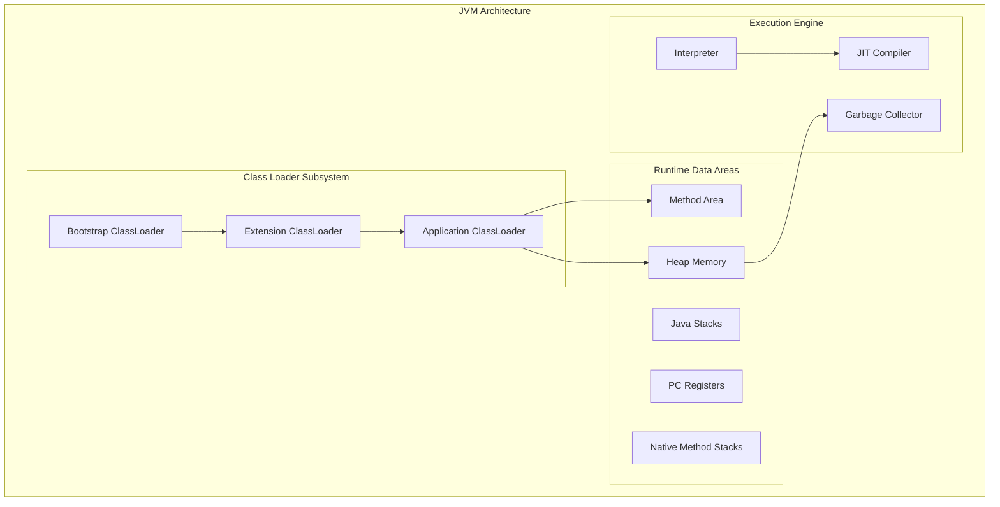

# Day 85: Java Virtual Machine (JVM) Deep Dive - Memory Management & Garbage Collection

## Learning Objectives

- Master JVM architecture and memory model
- Understand garbage collection algorithms and tuning
- Learn memory leak detection and resolution techniques
- Implement performance monitoring and profiling strategies
- Optimize applications for different JVM implementations

## JVM Architecture Overview

### JVM Components



### JVM Memory Structure

```java
// day85-examples/memory/JVMMemoryExample.java
public class JVMMemoryDemo {
    
    // Method Area (Metaspace in Java 8+)
    // - Class metadata
    // - Static variables
    // - Constant pool
    private static final String CONSTANT = "Method Area Storage";
    private static int staticCounter = 0;
    
    public static void demonstrateMemoryAreas() {
        // Stack Memory - Local variables and method calls
        int localVariable = 42;
        String localString = "Stack Memory";
        
        // Heap Memory - Object instances
        JVMMemoryDemo instance = new JVMMemoryDemo();
        List<String> heapList = new ArrayList<>();
        
        // Direct Memory (Off-heap)
        ByteBuffer directBuffer = ByteBuffer.allocateDirect(1024);
        
        // Method call - creates new stack frame
        analyzeMemoryUsage(localVariable, heapList);
    }
    
    private static void analyzeMemoryUsage(int value, List<String> list) {
        // Get memory information
        MemoryMXBean memoryBean = ManagementFactory.getMemoryMXBean();
        
        // Heap memory usage
        MemoryUsage heapUsage = memoryBean.getHeapMemoryUsage();
        System.out.println("Heap Memory Usage:");
        System.out.println("  Used: " + formatBytes(heapUsage.getUsed()));
        System.out.println("  Committed: " + formatBytes(heapUsage.getCommitted()));
        System.out.println("  Max: " + formatBytes(heapUsage.getMax()));
        
        // Non-heap memory usage (Method Area)
        MemoryUsage nonHeapUsage = memoryBean.getNonHeapMemoryUsage();
        System.out.println("\nNon-Heap Memory Usage:");
        System.out.println("  Used: " + formatBytes(nonHeapUsage.getUsed()));
        System.out.println("  Committed: " + formatBytes(nonHeapUsage.getCommitted()));
        System.out.println("  Max: " + formatBytes(nonHeapUsage.getMax()));
        
        // Memory pool details
        List<MemoryPoolMXBean> memoryPools = ManagementFactory.getMemoryPoolMXBeans();
        System.out.println("\nMemory Pools:");
        for (MemoryPoolMXBean pool : memoryPools) {
            MemoryUsage usage = pool.getUsage();
            System.out.printf("  %s: %s / %s%n", 
                pool.getName(),
                formatBytes(usage.getUsed()),
                formatBytes(usage.getMax())
            );
        }
    }
    
    private static String formatBytes(long bytes) {
        if (bytes < 0) return "N/A";
        
        String[] units = {"B", "KB", "MB", "GB", "TB"};
        int unit = 0;
        double size = bytes;
        
        while (size >= 1024 && unit < units.length - 1) {
            size /= 1024;
            unit++;
        }
        
        return String.format("%.2f %s", size, units[unit]);
    }
}
```

## Heap Memory Management

### Heap Structure

```java
// day85-examples/heap/HeapStructureDemo.java
public class HeapStructureDemo {
    
    public static void demonstrateHeapGeneration() {
        // Young Generation objects
        for (int i = 0; i < 1000; i++) {
            String youngObject = "Young Generation Object " + i;
            // Most of these will be garbage collected quickly
        }
        
        // Objects that survive and move to Old Generation
        List<String> survivingObjects = new ArrayList<>();
        for (int i = 0; i < 100; i++) {
            survivingObjects.add("Survivor Object " + i);
        }
        
        // Force minor GC to see generation movement
        System.gc();
        
        // Analyze heap after GC
        analyzeHeapRegions();
    }
    
    private static void analyzeHeapRegions() {
        List<MemoryPoolMXBean> memoryPools = ManagementFactory.getMemoryPoolMXBeans();
        
        System.out.println("Heap Regions Analysis:");
        for (MemoryPoolMXBean pool : memoryPools) {
            MemoryUsage usage = pool.getUsage();
            
            if (pool.getType() == MemoryType.HEAP) {
                System.out.printf("Region: %s%n", pool.getName());
                System.out.printf("  Type: %s%n", pool.getType());
                System.out.printf("  Used: %s%n", formatBytes(usage.getUsed()));
                System.out.printf("  Committed: %s%n", formatBytes(usage.getCommitted()));
                System.out.printf("  Max: %s%n", formatBytes(usage.getMax()));
                System.out.printf("  Usage: %.2f%%%n", 
                    (double) usage.getUsed() / usage.getMax() * 100);
                System.out.println();
            }
        }
    }
    
    // Demonstrate object lifecycle and generation movement
    public static class ObjectLifecycleDemo {
        private static List<Object> longLivedObjects = new ArrayList<>();
        
        public static void simulateObjectLifecycle() {
            System.out.println("Simulating object lifecycle...");
            
            // Create short-lived objects (Young Generation)
            for (int cycle = 0; cycle < 10; cycle++) {
                List<String> shortLived = new ArrayList<>();
                
                for (int i = 0; i < 10000; i++) {
                    shortLived.add("Short-lived object " + i);
                }
                
                // Some objects survive to Old Generation
                if (cycle % 3 == 0) {
                    longLivedObjects.addAll(shortLived.subList(0, 100));
                }
                
                // Clear short-lived objects
                shortLived.clear();
                
                // Monitor memory after each cycle
                if (cycle % 2 == 0) {
                    printMemoryStats("Cycle " + cycle);
                }
            }
        }
        
        private static void printMemoryStats(String phase) {
            MemoryMXBean memoryBean = ManagementFactory.getMemoryMXBean();
            MemoryUsage heapUsage = memoryBean.getHeapMemoryUsage();
            
            System.out.printf("%s - Heap: %s used, %s max%n",
                phase,
                formatBytes(heapUsage.getUsed()),
                formatBytes(heapUsage.getMax())
            );
        }
    }
    
    private static String formatBytes(long bytes) {
        if (bytes == -1) return "undefined";
        return String.format("%.2f MB", bytes / (1024.0 * 1024.0));
    }
}
```

### Memory Allocation Patterns

```java
// day85-examples/heap/MemoryAllocationPatterns.java
public class MemoryAllocationPatterns {
    
    // Thread Local Allocation Buffers (TLAB) demonstration
    public static void demonstrateTLAB() {
        System.out.println("Demonstrating TLAB allocation...");
        
        // Rapid object allocation in single thread - uses TLAB
        Thread thread1 = new Thread(() -> allocateObjects("Thread-1", 100000));
        Thread thread2 = new Thread(() -> allocateObjects("Thread-2", 100000));
        
        long startTime = System.nanoTime();
        
        thread1.start();
        thread2.start();
        
        try {
            thread1.join();
            thread2.join();
        } catch (InterruptedException e) {
            Thread.currentThread().interrupt();
        }
        
        long endTime = System.nanoTime();
        System.out.printf("Total allocation time: %.2f ms%n", 
            (endTime - startTime) / 1_000_000.0);
    }
    
    private static void allocateObjects(String threadName, int count) {
        List<Object> objects = new ArrayList<>();
        
        for (int i = 0; i < count; i++) {
            // Small object allocation - typically uses TLAB
            objects.add(new SmallObject(i));
            
            // Large object allocation - may bypass TLAB
            if (i % 1000 == 0) {
                objects.add(new LargeObject(new byte[100 * 1024])); // 100KB
            }
        }
        
        System.out.printf("%s allocated %d objects%n", threadName, count);
    }
    
    // Demonstrate escape analysis impact
    public static class EscapeAnalysisDemo {
        
        // Object doesn't escape - may be stack allocated
        public static int noEscape() {
            Point p = new Point(10, 20);
            return p.x + p.y;
        }
        
        // Object escapes to heap
        public static Point escapeToHeap() {
            return new Point(10, 20);
        }
        
        // Object escapes through method parameter
        public static void escapeAsParameter(List<Point> points) {
            Point p = new Point(30, 40);
            points.add(p); // Escapes to heap
        }
        
        // Benchmark escape analysis impact
        public static void benchmarkEscapeAnalysis() {
            int iterations = 10_000_000;
            
            // No escape - potential stack allocation
            long start = System.nanoTime();
            for (int i = 0; i < iterations; i++) {
                noEscape();
            }
            long noEscapeTime = System.nanoTime() - start;
            
            // Escape to heap
            start = System.nanoTime();
            List<Point> points = new ArrayList<>();
            for (int i = 0; i < iterations; i++) {
                points.add(escapeToHeap());
            }
            long escapeTime = System.nanoTime() - start;
            
            System.out.printf("No escape time: %.2f ms%n", noEscapeTime / 1_000_000.0);
            System.out.printf("Escape time: %.2f ms%n", escapeTime / 1_000_000.0);
            System.out.printf("Performance difference: %.2fx%n", 
                (double) escapeTime / noEscapeTime);
        }
    }
    
    static class SmallObject {
        private final int value;
        
        SmallObject(int value) {
            this.value = value;
        }
    }
    
    static class LargeObject {
        private final byte[] data;
        
        LargeObject(byte[] data) {
            this.data = data;
        }
    }
    
    static class Point {
        final int x, y;
        
        Point(int x, int y) {
            this.x = x;
            this.y = y;
        }
    }
}
```

## Garbage Collection Deep Dive

### GC Algorithms Comparison

```java
// day85-examples/gc/GarbageCollectionDemo.java
public class GarbageCollectionDemo {
    
    private static final List<GarbageCollectorMXBean> gcBeans = 
        ManagementFactory.getGarbageCollectorMXBeans();
    
    public static void analyzeGarbageCollectors() {
        System.out.println("Available Garbage Collectors:");
        
        for (GarbageCollectorMXBean gcBean : gcBeans) {
            System.out.printf("Name: %s%n", gcBean.getName());
            System.out.printf("Collection Count: %d%n", gcBean.getCollectionCount());
            System.out.printf("Collection Time: %d ms%n", gcBean.getCollectionTime());
            System.out.printf("Memory Pools: %s%n", 
                Arrays.toString(gcBean.getMemoryPoolNames()));
            System.out.println();
        }
    }
    
    // Demonstrate different GC pressure scenarios
    public static class GCPressureDemo {
        
        // High allocation rate - triggers frequent minor GC
        public static void highAllocationRate() {
            System.out.println("Testing high allocation rate...");
            
            long startTime = System.currentTimeMillis();
            List<Object> references = new ArrayList<>();
            
            for (int i = 0; i < 1_000_000; i++) {
                // Create objects that quickly become garbage
                String temp = "Temporary object " + i;
                
                // Keep some references to create survivors
                if (i % 1000 == 0) {
                    references.add(temp);
                }
            }
            
            long endTime = System.currentTimeMillis();
            printGCStats("High Allocation Rate", startTime, endTime);
        }
        
        // Large object allocation - may trigger major GC
        public static void largeObjectAllocation() {
            System.out.println("Testing large object allocation...");
            
            long startTime = System.currentTimeMillis();
            List<byte[]> largeObjects = new ArrayList<>();
            
            for (int i = 0; i < 100; i++) {
                // Allocate 10MB objects
                largeObjects.add(new byte[10 * 1024 * 1024]);
            }
            
            long endTime = System.currentTimeMillis();
            printGCStats("Large Object Allocation", startTime, endTime);
        }
        
        // Memory leak simulation
        public static void memoryLeakSimulation() {
            System.out.println("Simulating memory leak...");
            
            List<Object> leakyList = new ArrayList<>();
            long startTime = System.currentTimeMillis();
            
            try {
                while (true) {
                    // Continuously add objects without removal
                    for (int i = 0; i < 10000; i++) {
                        leakyList.add(new byte[1024]); // 1KB each
                    }
                    
                    // Print memory usage periodically
                    if (leakyList.size() % 100000 == 0) {
                        MemoryMXBean memoryBean = ManagementFactory.getMemoryMXBean();
                        MemoryUsage heapUsage = memoryBean.getHeapMemoryUsage();
                        
                        System.out.printf("Objects: %d, Heap used: %.2f MB%n",
                            leakyList.size(),
                            heapUsage.getUsed() / (1024.0 * 1024.0));
                    }
                }
            } catch (OutOfMemoryError e) {
                long endTime = System.currentTimeMillis();
                System.out.printf("OutOfMemoryError after %d ms%n", 
                    endTime - startTime);
                printGCStats("Memory Leak Simulation", startTime, endTime);
            }
        }
        
        private static void printGCStats(String testName, long startTime, long endTime) {
            System.out.printf("\n%s Results:%n", testName);
            System.out.printf("Duration: %d ms%n", endTime - startTime);
            
            for (GarbageCollectorMXBean gcBean : gcBeans) {
                System.out.printf("%s: %d collections, %d ms%n",
                    gcBean.getName(),
                    gcBean.getCollectionCount(),
                    gcBean.getCollectionTime());
            }
            System.out.println();
        }
    }
    
    // GC notification and monitoring
    public static class GCNotificationDemo {
        
        public static void setupGCNotifications() {
            // Register for GC notifications
            for (GarbageCollectorMXBean gcBean : gcBeans) {
                if (gcBean instanceof NotificationEmitter) {
                    NotificationEmitter emitter = (NotificationEmitter) gcBean;
                    
                    emitter.addNotificationListener(new NotificationListener() {
                        @Override
                        public void handleNotification(Notification notification, 
                                                     Object handback) {
                            if (notification.getType().equals(
                                    GarbageCollectionNotificationInfo.GARBAGE_COLLECTION_NOTIFICATION)) {
                                
                                GarbageCollectionNotificationInfo info = 
                                    GarbageCollectionNotificationInfo.from(
                                        (CompositeData) notification.getUserData());
                                
                                System.out.printf("GC Event: %s%n", info.getGcName());
                                System.out.printf("  Action: %s%n", info.getGcAction());
                                System.out.printf("  Duration: %d ms%n", info.getGcInfo().getDuration());
                                System.out.printf("  Before GC: %s%n", 
                                    formatMemoryUsage(info.getGcInfo().getMemoryUsageBeforeGc()));
                                System.out.printf("  After GC: %s%n", 
                                    formatMemoryUsage(info.getGcInfo().getMemoryUsageAfterGc()));
                                System.out.println();
                            }
                        }
                    }, null, null);
                }
            }
        }
        
        private static String formatMemoryUsage(Map<String, MemoryUsage> memoryUsage) {
            StringBuilder sb = new StringBuilder();
            for (Map.Entry<String, MemoryUsage> entry : memoryUsage.entrySet()) {
                if (sb.length() > 0) sb.append(", ");
                sb.append(entry.getKey()).append(": ")
                  .append(formatBytes(entry.getValue().getUsed()));
            }
            return sb.toString();
        }
        
        private static String formatBytes(long bytes) {
            return String.format("%.2f MB", bytes / (1024.0 * 1024.0));
        }
    }
}
```

### G1 Garbage Collector Tuning

```java
// day85-examples/gc/G1GCTuningDemo.java
public class G1GCTuningDemo {
    
    public static void demonstrateG1Features() {
        // G1 is designed for:
        // - Large heaps (>4GB)
        // - Low latency requirements
        // - Predictable pause times
        
        System.out.println("G1GC Configuration Analysis:");
        analyzeG1Configuration();
        
        // Simulate workload that benefits from G1
        simulateLowLatencyWorkload();
    }
    
    private static void analyzeG1Configuration() {
        // Check if G1 is being used
        List<GarbageCollectorMXBean> gcBeans = ManagementFactory.getGarbageCollectorMXBeans();
        boolean usingG1 = gcBeans.stream()
            .anyMatch(gc -> gc.getName().contains("G1"));
        
        System.out.println("Using G1GC: " + usingG1);
        
        // G1 specific JVM parameters to monitor:
        RuntimeMXBean runtimeBean = ManagementFactory.getRuntimeMXBean();
        List<String> jvmArgs = runtimeBean.getInputArguments();
        
        System.out.println("Relevant JVM Arguments:");
        for (String arg : jvmArgs) {
            if (arg.contains("G1") || arg.contains("MaxGCPause") || 
                arg.contains("GCTimeRatio") || arg.contains("heap")) {
                System.out.println("  " + arg);
            }
        }
        
        // Recommended G1 settings for different scenarios
        printG1Recommendations();
    }
    
    private static void printG1Recommendations() {
        System.out.println("\nG1GC Tuning Recommendations:");
        
        System.out.println("\nLow Latency Web Applications:");
        System.out.println("  -XX:+UseG1GC");
        System.out.println("  -XX:MaxGCPauseMillis=100");
        System.out.println("  -XX:G1HeapRegionSize=16m");
        System.out.println("  -XX:+G1UseAdaptiveIHOP");
        
        System.out.println("\nHigh Throughput Batch Processing:");
        System.out.println("  -XX:+UseG1GC");
        System.out.println("  -XX:MaxGCPauseMillis=200");
        System.out.println("  -XX:G1MixedGCCountTarget=8");
        System.out.println("  -XX:G1MixedGCLiveThresholdPercent=85");
        
        System.out.println("\nLarge Heap Applications (>32GB):");
        System.out.println("  -XX:+UseG1GC");
        System.out.println("  -XX:G1HeapRegionSize=32m");
        System.out.println("  -XX:MaxGCPauseMillis=50");
        System.out.println("  -XX:+UnlockExperimentalVMOptions");
        System.out.println("  -XX:+UseTransparentHugePages");
    }
    
    private static void simulateLowLatencyWorkload() {
        System.out.println("\nSimulating low-latency workload...");
        
        // Create a workload that benefits from G1's region-based collection
        List<Object> activeObjects = new ArrayList<>();
        Random random = new Random();
        
        long startTime = System.currentTimeMillis();
        
        for (int iteration = 0; iteration < 1000; iteration++) {
            // Simulate request processing
            List<Object> requestObjects = new ArrayList<>();
            
            // Allocate objects for request
            for (int i = 0; i < 1000; i++) {
                requestObjects.add(new RequestData(random.nextInt(10000)));
            }
            
            // Some objects survive the request (cached data)
            if (iteration % 10 == 0) {
                activeObjects.addAll(requestObjects.subList(0, 100));
            }
            
            // Periodic cleanup of old cached data
            if (iteration % 100 == 0 && activeObjects.size() > 10000) {
                activeObjects.subList(0, 5000).clear();
            }
            
            // Monitor GC impact on latency
            if (iteration % 100 == 0) {
                measureLatencyImpact(iteration);
            }
        }
        
        long endTime = System.currentTimeMillis();
        System.out.printf("Workload completed in %d ms%n", endTime - startTime);
    }
    
    private static void measureLatencyImpact(int iteration) {
        // Simulate latency-sensitive operation
        long operationStart = System.nanoTime();
        
        // Do some work
        for (int i = 0; i < 10000; i++) {
            Math.sqrt(i);
        }
        
        long operationEnd = System.nanoTime();
        double latency = (operationEnd - operationStart) / 1_000_000.0; // ms
        
        System.out.printf("Iteration %d - Operation latency: %.2f ms%n", 
            iteration, latency);
    }
    
    static class RequestData {
        private final int id;
        private final byte[] data;
        
        RequestData(int id) {
            this.id = id;
            this.data = new byte[1024]; // 1KB per request object
        }
    }
}
```

## Memory Leak Detection and Analysis

### Common Memory Leak Patterns

```java
// day85-examples/leaks/MemoryLeakPatterns.java
public class MemoryLeakPatterns {
    
    // 1. Static collection that grows indefinitely
    private static final List<Object> STATIC_LEAK = new ArrayList<>();
    
    // 2. Listener/Observer not unregistered
    private static final List<EventListener> LISTENERS = new ArrayList<>();
    
    // 3. ThreadLocal not cleaned up
    private static final ThreadLocal<LargeObject> THREAD_LOCAL_LEAK = new ThreadLocal<>();
    
    public static void demonstrateCommonLeaks() {
        System.out.println("Demonstrating common memory leak patterns...");
        
        // Static collection leak
        demonstrateStaticCollectionLeak();
        
        // Listener leak
        demonstrateListenerLeak();
        
        // ThreadLocal leak
        demonstrateThreadLocalLeak();
        
        // Inner class reference leak
        demonstrateInnerClassLeak();
    }
    
    // Pattern 1: Static Collection Leak
    public static void demonstrateStaticCollectionLeak() {
        System.out.println("Static Collection Leak Pattern:");
        
        for (int i = 0; i < 10000; i++) {
            // Objects added to static collection never get removed
            STATIC_LEAK.add(new LeakyObject("Static-" + i));
        }
        
        System.out.printf("Static collection size: %d%n", STATIC_LEAK.size());
        
        // Proper cleanup would be:
        // STATIC_LEAK.clear();
    }
    
    // Pattern 2: Listener/Observer Leak
    public static void demonstrateListenerLeak() {
        System.out.println("Listener Leak Pattern:");
        
        EventSource eventSource = new EventSource();
        
        for (int i = 0; i < 1000; i++) {
            EventListener listener = new EventListener() {
                @Override
                public void onEvent(String event) {
                    // Handle event
                }
            };
            
            // Listener registered but never unregistered
            eventSource.addListener(listener);
            LISTENERS.add(listener);
        }
        
        System.out.printf("Registered listeners: %d%n", LISTENERS.size());
        
        // Proper cleanup would be:
        // for (EventListener listener : LISTENERS) {
        //     eventSource.removeListener(listener);
        // }
        // LISTENERS.clear();
    }
    
    // Pattern 3: ThreadLocal Leak
    public static void demonstrateThreadLocalLeak() {
        System.out.println("ThreadLocal Leak Pattern:");
        
        ExecutorService executor = Executors.newFixedThreadPool(10);
        
        for (int i = 0; i < 100; i++) {
            final int taskId = i;
            executor.submit(() -> {
                // ThreadLocal value set but never cleaned up
                THREAD_LOCAL_LEAK.set(new LargeObject("ThreadLocal-" + taskId));
                
                // Do some work
                try {
                    Thread.sleep(100);
                } catch (InterruptedException e) {
                    Thread.currentThread().interrupt();
                }
                
                // Proper cleanup would be:
                // THREAD_LOCAL_LEAK.remove();
            });
        }
        
        executor.shutdown();
        try {
            executor.awaitTermination(10, TimeUnit.SECONDS);
        } catch (InterruptedException e) {
            Thread.currentThread().interrupt();
        }
    }
    
    // Pattern 4: Inner Class Reference Leak
    public static void demonstrateInnerClassLeak() {
        System.out.println("Inner Class Reference Leak Pattern:");
        
        OuterClass outer = new OuterClass();
        List<Object> innerInstances = outer.createLeakyInnerInstances(1000);
        
        // Even if we nullify the outer reference,
        // inner class instances hold reference to outer
        outer = null;
        
        // Force GC attempt
        System.gc();
        
        System.out.printf("Created %d inner instances%n", innerInstances.size());
        // The outer instance cannot be collected due to inner class references
    }
    
    static class LeakyObject {
        private final String name;
        private final byte[] data = new byte[1024]; // 1KB each
        
        LeakyObject(String name) {
            this.name = name;
        }
    }
    
    static class LargeObject {
        private final String name;
        private final byte[] data = new byte[100 * 1024]; // 100KB each
        
        LargeObject(String name) {
            this.name = name;
        }
    }
    
    interface EventListener {
        void onEvent(String event);
    }
    
    static class EventSource {
        private final List<EventListener> listeners = new ArrayList<>();
        
        public void addListener(EventListener listener) {
            listeners.add(listener);
        }
        
        public void removeListener(EventListener listener) {
            listeners.remove(listener);
        }
        
        public void fireEvent(String event) {
            for (EventListener listener : listeners) {
                listener.onEvent(event);
            }
        }
    }
    
    static class OuterClass {
        private final byte[] outerData = new byte[10 * 1024]; // 10KB
        
        public List<Object> createLeakyInnerInstances(int count) {
            List<Object> instances = new ArrayList<>();
            
            for (int i = 0; i < count; i++) {
                // Non-static inner class holds reference to outer instance
                instances.add(new LeakyInnerClass(i));
            }
            
            return instances;
        }
        
        // Non-static inner class - holds implicit reference to outer
        class LeakyInnerClass {
            private final int id;
            private final byte[] innerData = new byte[1024]; // 1KB each
            
            LeakyInnerClass(int id) {
                this.id = id;
            }
            
            // Can access outer class members - creates reference
            public void accessOuter() {
                System.out.println("Outer data length: " + outerData.length);
            }
        }
    }
}
```

### Memory Leak Detection Tools

```java
// day85-examples/leaks/MemoryLeakDetector.java
public class MemoryLeakDetector {
    
    private static final long MEMORY_THRESHOLD = 100 * 1024 * 1024; // 100MB
    private static final long CHECK_INTERVAL = 5000; // 5 seconds
    
    private final MemoryMXBean memoryBean;
    private final List<MemoryPoolMXBean> memoryPools;
    private final Map<String, Long> previousUsage = new HashMap<>();
    
    public MemoryLeakDetector() {
        this.memoryBean = ManagementFactory.getMemoryMXBean();
        this.memoryPools = ManagementFactory.getMemoryPoolMXBeans();
    }
    
    public void startMonitoring() {
        System.out.println("Starting memory leak detection...");
        
        ScheduledExecutorService scheduler = Executors.newScheduledThreadPool(1);
        
        scheduler.scheduleAtFixedRate(this::checkForLeaks, 
            0, CHECK_INTERVAL, TimeUnit.MILLISECONDS);
    }
    
    private void checkForLeaks() {
        MemoryUsage heapUsage = memoryBean.getHeapMemoryUsage();
        long currentUsed = heapUsage.getUsed();
        
        System.out.printf("Heap Usage: %s / %s (%.2f%%)%n",
            formatBytes(currentUsed),
            formatBytes(heapUsage.getMax()),
            (double) currentUsed / heapUsage.getMax() * 100);
        
        // Check each memory pool
        for (MemoryPoolMXBean pool : memoryPools) {
            if (pool.getType() == MemoryType.HEAP) {
                checkMemoryPool(pool);
            }
        }
        
        // Check for rapid growth
        String heapKey = "heap";
        Long previousHeapUsage = previousUsage.get(heapKey);
        if (previousHeapUsage != null) {
            long growth = currentUsed - previousHeapUsage;
            if (growth > MEMORY_THRESHOLD) {
                System.out.printf("WARNING: Rapid heap growth detected: %s in %d seconds%n",
                    formatBytes(growth), CHECK_INTERVAL / 1000);
            }
        }
        previousUsage.put(heapKey, currentUsed);
        
        // Check for approaching OOM
        if (currentUsed > heapUsage.getMax() * 0.9) {
            System.out.println("CRITICAL: Memory usage above 90% - potential OOM!");
            triggerMemoryDump();
        }
    }
    
    private void checkMemoryPool(MemoryPoolMXBean pool) {
        MemoryUsage usage = pool.getUsage();
        String poolName = pool.getName();
        long currentUsed = usage.getUsed();
        
        Long previousUsed = previousUsage.get(poolName);
        if (previousUsed != null) {
            long growth = currentUsed - previousUsed;
            double growthRate = (double) growth / previousUsed;
            
            if (growthRate > 0.5) { // 50% growth
                System.out.printf("WARNING: High growth rate in %s: %.2f%% (%s)%n",
                    poolName, growthRate * 100, formatBytes(growth));
            }
        }
        
        previousUsage.put(poolName, currentUsed);
    }
    
    private void triggerMemoryDump() {
        try {
            MBeanServer server = ManagementFactory.getPlatformMBeanServer();
            HotSpotDiagnosticMXBean hotspotMBean = ManagementFactory.newPlatformMXBeanProxy(
                server, "com.sun.management:type=HotSpotDiagnostic", HotSpotDiagnosticMXBean.class);
            
            String dumpFile = "memory-leak-" + System.currentTimeMillis() + ".hprof";
            hotspotMBean.dumpHeap(dumpFile, true);
            
            System.out.println("Memory dump created: " + dumpFile);
        } catch (Exception e) {
            System.err.println("Failed to create memory dump: " + e.getMessage());
        }
    }
    
    // Advanced leak detection using weak references
    public static class WeakReferenceLeakDetector {
        
        private final Map<WeakReference<Object>, String> trackedObjects = new HashMap<>();
        private final ReferenceQueue<Object> referenceQueue = new ReferenceQueue<>();
        
        public void trackObject(Object obj, String description) {
            trackedObjects.put(new WeakReference<>(obj, referenceQueue), description);
        }
        
        public void checkForLeaks() {
            // Clean up collected references
            Reference<?> collected;
            while ((collected = referenceQueue.poll()) != null) {
                trackedObjects.remove(collected);
            }
            
            // Report objects that haven't been collected
            System.out.printf("Objects still in memory: %d%n", trackedObjects.size());
            
            for (Map.Entry<WeakReference<Object>, String> entry : trackedObjects.entrySet()) {
                Object obj = entry.getKey().get();
                if (obj != null) {
                    System.out.printf("  Potential leak: %s - %s%n", 
                        entry.getValue(), obj.getClass().getSimpleName());
                }
            }
        }
    }
    
    // Method to analyze object references
    public static void analyzeObjectReferences() {
        // Create objects with different reference types
        Object strongRef = new LargeObject("strong");
        WeakReference<Object> weakRef = new WeakReference<>(new LargeObject("weak"));
        SoftReference<Object> softRef = new SoftReference<>(new LargeObject("soft"));
        PhantomReference<Object> phantomRef = new PhantomReference<>(
            new LargeObject("phantom"), new ReferenceQueue<>());
        
        System.out.println("Before GC:");
        System.out.println("Strong ref: " + (strongRef != null));
        System.out.println("Weak ref: " + (weakRef.get() != null));
        System.out.println("Soft ref: " + (softRef.get() != null));
        System.out.println("Phantom ref: " + (phantomRef.get() != null));
        
        // Force GC
        strongRef = null; // Remove strong reference
        System.gc();
        
        try {
            Thread.sleep(1000); // Give GC time to run
        } catch (InterruptedException e) {
            Thread.currentThread().interrupt();
        }
        
        System.out.println("\nAfter GC:");
        System.out.println("Weak ref: " + (weakRef.get() != null));
        System.out.println("Soft ref: " + (softRef.get() != null));
        System.out.println("Phantom ref: " + (phantomRef.get() != null));
    }
    
    static class LargeObject {
        private final String name;
        private final byte[] data = new byte[1024 * 1024]; // 1MB
        
        LargeObject(String name) {
            this.name = name;
        }
        
        @Override
        public String toString() {
            return "LargeObject{" + name + "}";
        }
    }
    
    private static String formatBytes(long bytes) {
        if (bytes < 0) return "N/A";
        
        String[] units = {"B", "KB", "MB", "GB"};
        int unit = 0;
        double size = bytes;
        
        while (size >= 1024 && unit < units.length - 1) {
            size /= 1024;
            unit++;
        }
        
        return String.format("%.2f %s", size, units[unit]);
    }
}
```

## JVM Monitoring and Profiling

### Performance Monitoring

```java
// day85-examples/monitoring/JVMPerformanceMonitor.java
public class JVMPerformanceMonitor {
    
    private final MBeanServer mBeanServer;
    
    public JVMPerformanceMonitor() {
        this.mBeanServer = ManagementFactory.getPlatformMBeanServer();
    }
    
    public void generatePerformanceReport() {
        System.out.println("=== JVM Performance Report ===\n");
        
        reportRuntimeInfo();
        reportMemoryInfo();
        reportGarbageCollectionInfo();
        reportThreadInfo();
        reportClassLoadingInfo();
        reportCompilationInfo();
    }
    
    private void reportRuntimeInfo() {
        RuntimeMXBean runtimeBean = ManagementFactory.getRuntimeMXBean();
        
        System.out.println("Runtime Information:");
        System.out.printf("  JVM Name: %s%n", runtimeBean.getVmName());
        System.out.printf("  JVM Version: %s%n", runtimeBean.getVmVersion());
        System.out.printf("  JVM Vendor: %s%n", runtimeBean.getVmVendor());
        System.out.printf("  Uptime: %s%n", formatDuration(runtimeBean.getUptime()));
        System.out.printf("  Start Time: %s%n", 
            new Date(runtimeBean.getStartTime()));
        
        // JVM Arguments
        System.out.println("  JVM Arguments:");
        for (String arg : runtimeBean.getInputArguments()) {
            System.out.println("    " + arg);
        }
        System.out.println();
    }
    
    private void reportMemoryInfo() {
        MemoryMXBean memoryBean = ManagementFactory.getMemoryMXBean();
        
        System.out.println("Memory Information:");
        
        // Heap Memory
        MemoryUsage heapUsage = memoryBean.getHeapMemoryUsage();
        System.out.println("  Heap Memory:");
        System.out.printf("    Used: %s%n", formatBytes(heapUsage.getUsed()));
        System.out.printf("    Committed: %s%n", formatBytes(heapUsage.getCommitted()));
        System.out.printf("    Max: %s%n", formatBytes(heapUsage.getMax()));
        System.out.printf("    Usage: %.2f%%%n", 
            (double) heapUsage.getUsed() / heapUsage.getMax() * 100);
        
        // Non-Heap Memory
        MemoryUsage nonHeapUsage = memoryBean.getNonHeapMemoryUsage();
        System.out.println("  Non-Heap Memory:");
        System.out.printf("    Used: %s%n", formatBytes(nonHeapUsage.getUsed()));
        System.out.printf("    Committed: %s%n", formatBytes(nonHeapUsage.getCommitted()));
        System.out.printf("    Max: %s%n", formatBytes(nonHeapUsage.getMax()));
        
        // Memory Pools
        System.out.println("  Memory Pools:");
        List<MemoryPoolMXBean> memoryPools = ManagementFactory.getMemoryPoolMXBeans();
        for (MemoryPoolMXBean pool : memoryPools) {
            MemoryUsage usage = pool.getUsage();
            System.out.printf("    %s (%s):%n", pool.getName(), pool.getType());
            System.out.printf("      Used: %s%n", formatBytes(usage.getUsed()));
            System.out.printf("      Peak: %s%n", formatBytes(pool.getPeakUsage().getUsed()));
            System.out.printf("      Usage Threshold: %s%n", 
                pool.isUsageThresholdSupported() ? 
                formatBytes(pool.getUsageThreshold()) : "Not supported");
        }
        System.out.println();
    }
    
    private void reportGarbageCollectionInfo() {
        System.out.println("Garbage Collection Information:");
        
        List<GarbageCollectorMXBean> gcBeans = ManagementFactory.getGarbageCollectorMXBeans();
        
        for (GarbageCollectorMXBean gcBean : gcBeans) {
            System.out.printf("  %s:%n", gcBean.getName());
            System.out.printf("    Collection Count: %d%n", gcBean.getCollectionCount());
            System.out.printf("    Collection Time: %s%n", 
                formatDuration(gcBean.getCollectionTime()));
            System.out.printf("    Memory Pools: %s%n", 
                Arrays.toString(gcBean.getMemoryPoolNames()));
            
            // Calculate average collection time
            if (gcBean.getCollectionCount() > 0) {
                double avgTime = (double) gcBean.getCollectionTime() / gcBean.getCollectionCount();
                System.out.printf("    Average Collection Time: %.2f ms%n", avgTime);
            }
        }
        System.out.println();
    }
    
    private void reportThreadInfo() {
        ThreadMXBean threadBean = ManagementFactory.getThreadMXBean();
        
        System.out.println("Thread Information:");
        System.out.printf("  Current Thread Count: %d%n", threadBean.getThreadCount());
        System.out.printf("  Peak Thread Count: %d%n", threadBean.getPeakThreadCount());
        System.out.printf("  Total Started Threads: %d%n", threadBean.getTotalStartedThreadCount());
        System.out.printf("  Daemon Thread Count: %d%n", threadBean.getDaemonThreadCount());
        
        // Deadlock detection
        long[] deadlockedThreads = threadBean.findDeadlockedThreads();
        if (deadlockedThreads != null && deadlockedThreads.length > 0) {
            System.out.printf("  DEADLOCK DETECTED: %d threads%n", deadlockedThreads.length);
            
            ThreadInfo[] threadInfos = threadBean.getThreadInfo(deadlockedThreads);
            for (ThreadInfo threadInfo : threadInfos) {
                System.out.printf("    Deadlocked Thread: %s%n", threadInfo.getThreadName());
            }
        } else {
            System.out.println("  No deadlocks detected");
        }
        
        // Top CPU consuming threads
        if (threadBean.isThreadCpuTimeSupported()) {
            System.out.println("  Top CPU Consuming Threads:");
            long[] allThreadIds = threadBean.getAllThreadIds();
            ThreadInfo[] allThreadInfos = threadBean.getThreadInfo(allThreadIds);
            
            Arrays.stream(allThreadInfos)
                .filter(Objects::nonNull)
                .sorted((t1, t2) -> Long.compare(
                    threadBean.getThreadCpuTime(t2.getThreadId()),
                    threadBean.getThreadCpuTime(t1.getThreadId())))
                .limit(5)
                .forEach(threadInfo -> {
                    long cpuTime = threadBean.getThreadCpuTime(threadInfo.getThreadId());
                    System.out.printf("    %s: %s%n", 
                        threadInfo.getThreadName(), 
                        formatDuration(cpuTime / 1_000_000)); // Convert to ms
                });
        }
        System.out.println();
    }
    
    private void reportClassLoadingInfo() {
        ClassLoadingMXBean classBean = ManagementFactory.getClassLoadingMXBean();
        
        System.out.println("Class Loading Information:");
        System.out.printf("  Loaded Classes: %d%n", classBean.getLoadedClassCount());
        System.out.printf("  Total Loaded Classes: %d%n", classBean.getTotalLoadedClassCount());
        System.out.printf("  Unloaded Classes: %d%n", classBean.getUnloadedClassCount());
        System.out.println();
    }
    
    private void reportCompilationInfo() {
        CompilationMXBean compilationBean = ManagementFactory.getCompilationMXBean();
        
        System.out.println("Compilation Information:");
        System.out.printf("  JIT Compiler: %s%n", compilationBean.getName());
        
        if (compilationBean.isCompilationTimeMonitoringSupported()) {
            System.out.printf("  Total Compilation Time: %s%n", 
                formatDuration(compilationBean.getTotalCompilationTime()));
        }
        System.out.println();
    }
    
    // Real-time monitoring
    public void startRealTimeMonitoring() {
        ScheduledExecutorService scheduler = Executors.newScheduledThreadPool(1);
        
        scheduler.scheduleAtFixedRate(() -> {
            System.out.println("=== Real-time Metrics ===");
            
            // Memory usage
            MemoryMXBean memoryBean = ManagementFactory.getMemoryMXBean();
            MemoryUsage heapUsage = memoryBean.getHeapMemoryUsage();
            System.out.printf("Heap: %s / %s (%.1f%%)%n",
                formatBytes(heapUsage.getUsed()),
                formatBytes(heapUsage.getMax()),
                (double) heapUsage.getUsed() / heapUsage.getMax() * 100);
            
            // GC activity
            List<GarbageCollectorMXBean> gcBeans = ManagementFactory.getGarbageCollectorMXBeans();
            for (GarbageCollectorMXBean gcBean : gcBeans) {
                System.out.printf("%s: %d collections, %s total%n",
                    gcBean.getName(),
                    gcBean.getCollectionCount(),
                    formatDuration(gcBean.getCollectionTime()));
            }
            
            // Thread count
            ThreadMXBean threadBean = ManagementFactory.getThreadMXBean();
            System.out.printf("Threads: %d active, %d peak%n",
                threadBean.getThreadCount(),
                threadBean.getPeakThreadCount());
            
            System.out.println();
        }, 0, 10, TimeUnit.SECONDS);
    }
    
    private String formatBytes(long bytes) {
        if (bytes < 0) return "N/A";
        
        String[] units = {"B", "KB", "MB", "GB", "TB"};
        int unit = 0;
        double size = bytes;
        
        while (size >= 1024 && unit < units.length - 1) {
            size /= 1024;
            unit++;
        }
        
        return String.format("%.2f %s", size, units[unit]);
    }
    
    private String formatDuration(long millis) {
        if (millis < 0) return "N/A";
        
        long seconds = millis / 1000;
        long minutes = seconds / 60;
        long hours = minutes / 60;
        long days = hours / 24;
        
        if (days > 0) {
            return String.format("%dd %02dh %02dm %02ds", 
                days, hours % 24, minutes % 60, seconds % 60);
        } else if (hours > 0) {
            return String.format("%dh %02dm %02ds", 
                hours, minutes % 60, seconds % 60);
        } else if (minutes > 0) {
            return String.format("%dm %02ds", minutes, seconds % 60);
        } else {
            return String.format("%ds", seconds);
        }
    }
}
```

## Summary

### Key Concepts Covered

- **JVM Architecture**: Understanding class loaders, runtime data areas, and execution engine
- **Memory Management**: Heap structure, generations, and allocation patterns
- **Garbage Collection**: Algorithms, tuning, and monitoring techniques
- **Memory Leak Detection**: Common patterns and detection strategies
- **Performance Monitoring**: JMX beans and real-time monitoring

### JVM Tuning Best Practices

```bash
# General JVM tuning flags
-XX:+UseG1GC                    # Use G1 garbage collector
-XX:MaxGCPauseMillis=200        # Target max GC pause time
-Xms4g -Xmx4g                   # Set initial and max heap size
-XX:+HeapDumpOnOutOfMemoryError # Generate heap dump on OOM
-XX:HeapDumpPath=/path/to/dumps # Heap dump location
-XX:+PrintGC                    # Enable GC logging
-XX:+PrintGCDetails             # Detailed GC information
-XX:+PrintGCTimeStamps          # GC timestamps
-XX:+UseStringDeduplication     # Deduplicate strings in G1
```

### Performance Monitoring Checklist

- ✅ **Memory Usage**: Monitor heap, non-heap, and memory pools
- ✅ **GC Performance**: Track collection frequency and pause times
- ✅ **Thread Analysis**: Detect deadlocks and high CPU threads
- ✅ **Class Loading**: Monitor class loading patterns
- ✅ **JIT Compilation**: Track compilation time and optimizations

### Next Steps

- Day 86: Advanced JVM Tuning - Performance Optimization & Profiling
- Learn advanced tuning techniques
- Master profiling tools and techniques
- Implement production monitoring solutions

---

## Exercises

### Exercise 1: Memory Analysis
Create a program that demonstrates different memory allocation patterns and analyze their GC impact.

### Exercise 2: Leak Detection
Implement a memory leak detector that can identify common leak patterns in a running application.

### Exercise 3: GC Tuning
Compare different garbage collectors (G1, CMS, Parallel) for a specific workload.

### Exercise 4: Performance Monitoring
Build a comprehensive JVM monitoring dashboard using JMX beans.

### Exercise 5: Memory Optimization
Optimize a memory-intensive application by applying JVM tuning principles.